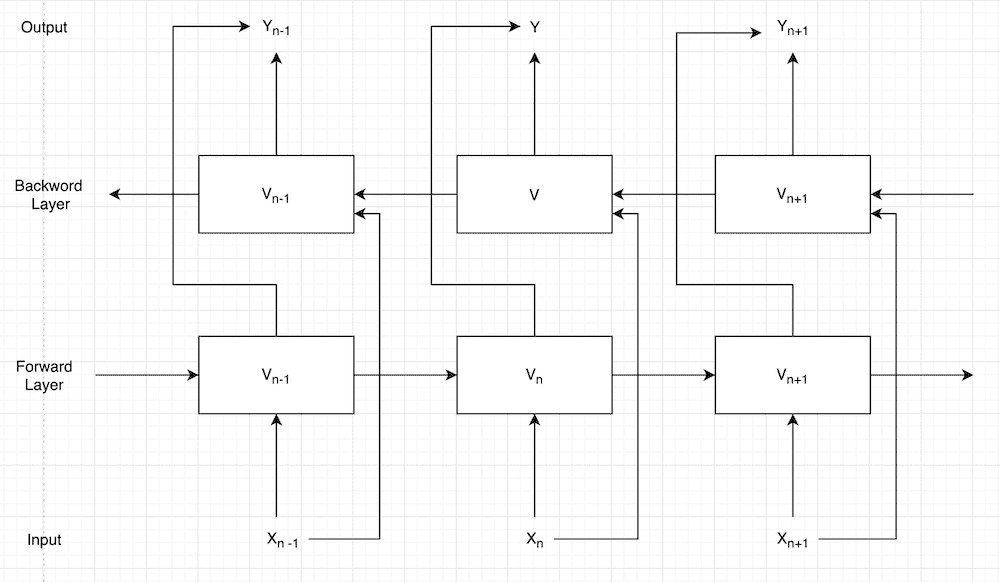

# 使用来自语言模型(ELMo)的嵌入的单词嵌入概述

> 原文:[https://www . geesforgeks . org/overview-of-word-embedding-using-embedding-from-language-models-elmo/](https://www.geeksforgeeks.org/overview-of-word-embedding-using-embeddings-from-language-models-elmo/)

### 什么是单词嵌入？

它是将单词表示成向量。这些向量捕捉关于单词的重要信息，使得在向量空间中共享相同邻域的单词表示相似的含义。创建单词嵌入的方法有很多种，例如 [Word2Vec](https://www.geeksforgeeks.org/python-word-embedding-using-word2vec/) 、[连续单词包(CBOW)、Skip Gram、Glove](https://www.geeksforgeeks.org/word-embeddings-in-nlp/#:~:text=Word%20Embeddings%20are%20a%20method,preserve%20syntactical%20and%20semantic%20information.) 、Elmo 等。

### 语言模型的嵌入:

*   ELMo 是 AllenNLP 开发的一个 NLP 框架。ELMo 单词向量是使用两层双向语言模型(biLM)计算的。每层包括向前和向后通过。
*   与 Glove 和 Word2Vec 不同，ELMo 使用包含单词的完整句子来表示单词的嵌入。因此，ELMo 嵌入能够捕获句子中使用的单词的上下文，并且可以为不同句子中不同上下文中使用的同一单词生成不同的嵌入。



语言模型的嵌入

### 例如:–

1.  我喜欢看电视。
2.  我戴着手表。

在第一句中，watch 用作动词，而在第二句中，watch 是名词。这些词在不同的句子中有不同的语境，称为**多义词**。ELMo 可以成功处理 GLOVE 或 FastText 无法捕获的这种性质的单词。

### 使用 ELMo 实现单词嵌入；

下面的代码是在谷歌 colab 上测试的。在终端中运行代码以安装必要的库之前，运行这些命令。

```
pip install "tensorflow>=2.0.0"
pip install --upgrade tensorflow-hub
```

**代码:**

## 蟒蛇 3

```
# import necessary libraries
import tensorflow_hub as hub
import tensorflow.compat.v1 as tf
tf.disable_eager_execution()

# Load pre trained ELMo model
elmo = hub.Module("https://tfhub.dev/google/elmo/3", trainable=True)

# create an instance of ELMo
embeddings = elmo(
    [
        "I love to watch TV",
        "I am wearing a wrist watch"
    ],
    signature="default",
    as_dict=True)["elmo"]
init = tf.initialize_all_variables()
sess = tf.Session()
sess.run(init)

# Print word embeddings for word WATCH in given two sentences
print('Word embeddings for word WATCH in first sentence')
print(sess.run(embeddings[0][3]))
print('Word embeddings for word WATCH in second sentence')
print(sess.run(embeddings[1][5]))
```

**输出:**

```
Word embeddings for word WATCH in first sentence
[ 0.14079645 -0.15788531 -0.00950466 ...  0.4300597  -0.52887094
  0.06327899]
Word embeddings for word WATCH in second sentence
[-0.08213335  0.01050366 -0.01454147 ...  0.48705393 -0.54457957
  0.5262399 ]
```

**解释:**输出显示了不同句子中不同上下文中使用的同一个单词 **WATCH** 的不同单词嵌入。