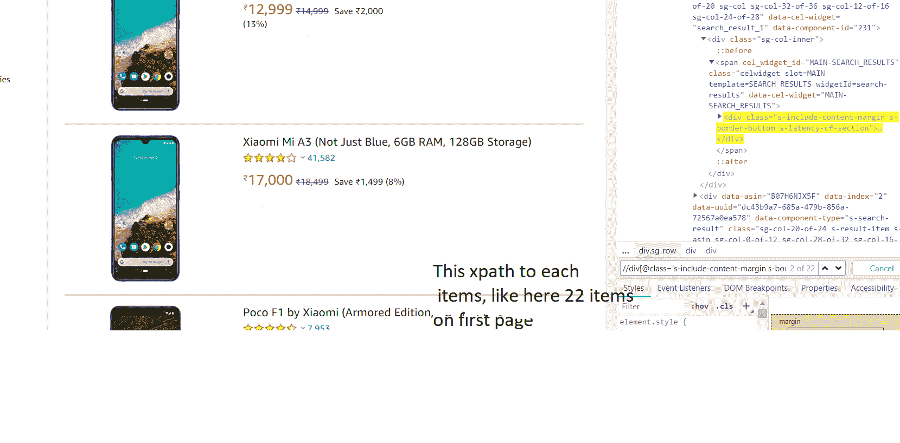
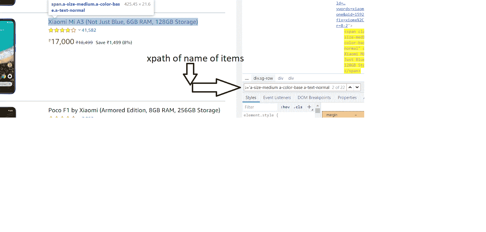
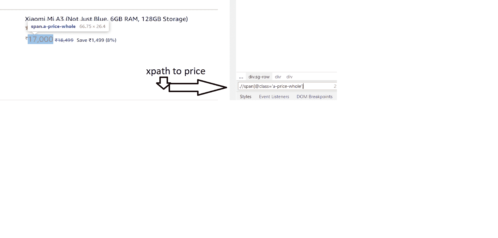
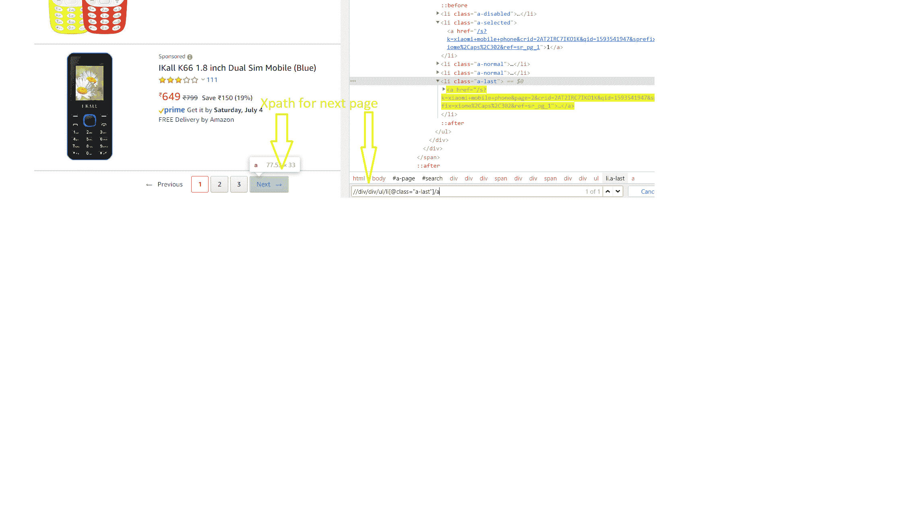
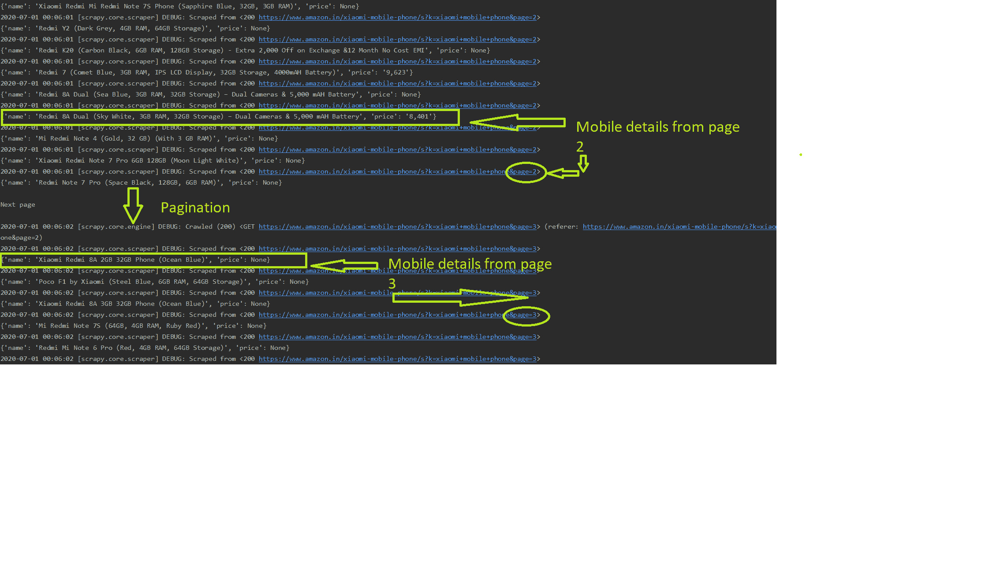

# 使用 Scrapy 分页–使用 Python 进行网页抓取

> 原文:[https://www . geeksforgeeks . org/paging-use-scrapy-web-scratch-with-python/](https://www.geeksforgeeks.org/pagination-using-scrapy-web-scraping-with-python/)

使用剪贴簿分页。网页抓取是一种从网站获取信息的技术。Scrapy 被用作网页抓取的 python 框架。从普通网站获取数据更容易，只需要拉取网站的 HTMl，通过过滤标签获取数据就可以实现。但是，万一你试图获取的数据中有分页，比如——亚马逊的产品可以有多个页面，要成功地废弃所有产品，就需要分页的概念。

**分页:**分页也称分页，是将文档划分为离散页面的过程，也就是将数据捆绑在不同的页面上。这些不同的网页有自己的网址。所以我们需要一个接一个地抓取这些网址和页面。但要记住的是何时停止分页。一般来说，页面有下一个按钮，这个下一个按钮是可以的，当页面完成时，它被禁用。这个方法是用来获取网页的网址，直到下一页按钮能够，当它得到禁用没有页面留下来刮擦。

## 使用 scrapy 应用分页的项目

从亚马逊网站抓取移动细节，并在下面的项目中应用分页。
抓取的细节包括手机的名称和价格以及分页，以抓取以下搜索到的网址的所有结果

**Logic behind pagination:**Here next_page variable gets url of next page only if next page is available but if no page is left then, this if condition get false.

```py
next_page = response.xpath("//div/div/ul/li[@class='alast']/a/@href").get()
if next_page:
    abs_url = f"https://www.amazon.in{next_page}"
yield scrapy.Request(
    url=abs_url,
    callback=self.parse
)
```

**注:**

```py
abs_url = f"https://www.amazon.in{next_page}"

```

这里需要取 https://www.amazon.in 是因为 next_page 是/page2。这是不完整的，完整的网址是 https://www.amazon.in/page2

*   **Fetch xpath of details need to be scraped –**
    Follow below steps to get xpath –
    **xpath of items:**

    

    **名称的 XPath:**

    

    **价格路径:**

    

    **下页 XPath:**

    

*   **蜘蛛代码:**从亚马逊网站抓取名称和价格，并在下面的代码中应用分页。

    ```py
    import scrapy

    class MobilesSpider(scrapy.Spider):
        name = 'mobiles'
        # create request object initially
        def start_requests(self):
            yield scrapy.Request(
                url ='https://www.amazon.in / s?k = xiome + mobile + phone&crid'\
                + '= 2AT2IRC7IKO1K&sprefix = xiome % 2Caps % 2C302&ref = nb_sb_ss_i_1_5',
                callback = self.parse
            )

        #  parse products
        def parse(self, response):
            products = response.xpath("//div[@class ='s-include-content-margin s-border-bottom s-latency-cf-section']")
            for product in products:
                yield {
                    'name': product.xpath(".//span[@class ='a-size-medium a-color-base a-text-normal']/text()").get(),
                    'price': product.xpath(".//span[@class ='a-price-whole']/text()").get()
                }

            print()
            print("Next page")
            print()
            next_page = response.xpath("//div / div / ul / li[@class ='a-last']/a/@href").get()
            if next_page:
                abs_url = f"https://www.amazon.in{next_page}"
                yield scrapy.Request(
                    url = abs_url,
                    callback = self.parse
                )
            else:
                print()
                print('No Page Left')
                print()
    ```

**刮取结果:**
