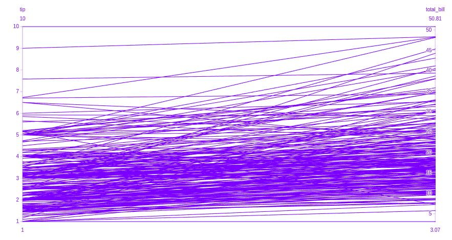
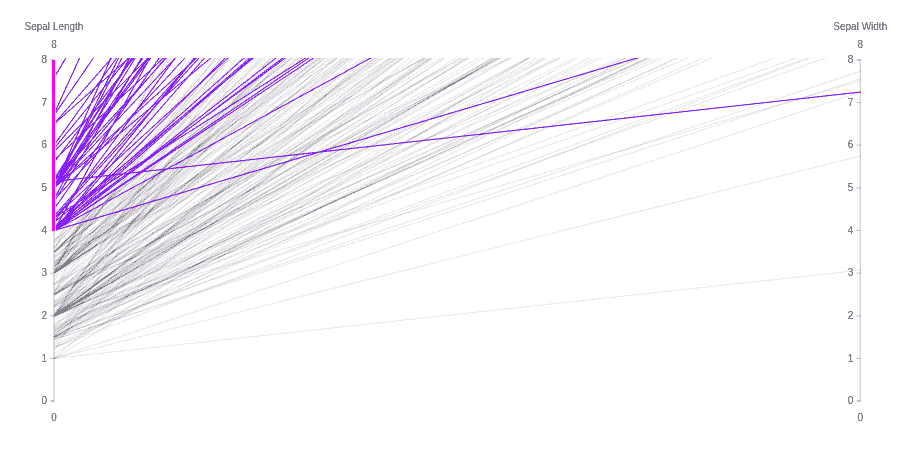

# 使用 Python 中的 Plotly 绘制平行坐标图

> 原文:[https://www . geesforgeks . org/parallel-coordinates-plot-use-plot-in-python/](https://www.geeksforgeeks.org/parallel-coordinates-plot-using-plotly-in-python/)

Plotly 是一个 Python 库，用于设计图形，尤其是交互式图形。它可以绘制各种图形和图表，如直方图、条形图、箱线图、展开图等。它主要用于数据分析以及财务分析。Plotly 是一个交互式可视化库。

## 平行坐标图

平行坐标图是可视化和分析高维数据集的常用方法。n 维空间中的点表示为顶点位于平行轴上的折线，顶点的位置对应于点的坐标。

> **语法:**平行 _ 坐标(data _ frame =无，尺寸=无，标签={}，range _ color =无)
> 
> **参数:**
> 
> **data_frame:** 需要传递此参数才能使用列名(而不是关键字名)。
> 
> **维度:**data _ frame 中的列名，或 pandas Series，或 array_like 对象这些列中的值用于多维可视化。
> 
> **标签:**默认情况下，图中的列名用于轴标题、图例条目和悬停。此参数允许对此进行覆盖。这个字典的键应该对应于列名，值应该对应于需要显示的标签。
> 
> **range_color:** 如果提供，覆盖连续色标上的自动缩放。

**例 1:**

## 蟒蛇 3

```
import plotly.express as px

df = px.data.tips()
fig = px.parallel_coordinates(
    df, dimensions=['tip', 'total_bill', 'day','time'],)

fig.show()
```

**输出:**



**示例 2:** 显示带有 **go 的平行坐标图。Parcoords()**

## 蟒蛇 3

```
import plotly.graph_objects as go

fig = go.Figure(data=go.Parcoords(
    line_color='green',
    dimensions=list([
        dict(range=[4, 9],
             label='A', values=[5, 8]),
        dict(range=[2, 7],
             label='B', values=[3, 6]),
    ])
)
)

fig.show()
```

**输出:**


**例 3:**

## 蟒蛇 3

```
import plotly.graph_objects as go
import plotly.express as px

df = px.data.tips()

fig = go.Figure(data=go.Parcoords(
    dimensions=list([
        dict(range=[0, 8],
             constraintrange=[4, 8],
             label='Sepal Length', values=df['tip']),
        dict(range=[0, 8],
             label='Sepal Width', values=df['total_bill']),
    ])
)
)

fig.show()
```

**输出:**

