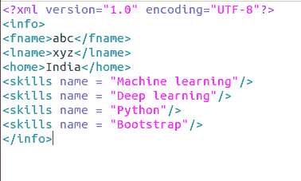

# 使用 Python 中的 Minidom 解析 XML

> 原文:[https://www . geesforgeks . org/parse-XML-using-minidom-in-python/](https://www.geeksforgeeks.org/parse-xml-using-minidom-in-python/)

**DOM(文档对象模型)**是来自 W3C 即万维网联盟的跨语言 API，用于访问和修改 [XML](https://www.geeksforgeeks.org/xml-basics/) 文档。Python 使您能够在 **xml.dom.minidom** 的帮助下解析 XML 文件，这是 dom 接口的最小实现。它比完整的 DOM API 更简单，应该被认为更小。

**解析 XML 的步骤是–**

*   导入模块

```py
import xml.dom.minidom

```

假设您的 XML 文件包含以下内容，



*   使用解析函数加载和解析 XML 文件。在下面的例子中，文档存储解析函数的结果

```py
docs = xml.dom.minidom.parse("test.xml")

```

*   让我们打印 XML 文件的子标记名和节点名。

## 蟒蛇 3

```py
import xml.dom.minidom

docs = xml.dom.minidom.parse("test.xml")

print(docs.nodeName)
print(docs.firstChild.tagName)
```

**输出:**

```py
#document
info
```

*   现在要从标记名中获取信息，需要调用 dom 标准函数 **getElementsByTagName** 和 **getAttribute** 来获取所需的属性。

## 蟒蛇 3

```py
import xml.dom.minidom

docs = xml.dom.minidom.parse("test.xml")

print(docs.nodeName)
print(docs.firstChild.tagName)

skills = docs.getElementsByTagName("skills")

print("%d skills" % skills.length)
for i in skills:
    print(i.getAttribute("name"))
```

**输出:**

```py
#document
info
4 skills
Machine learning
Deep learning
Python
Bootstrap

```