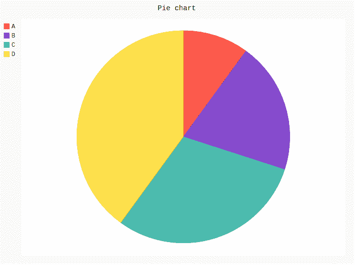
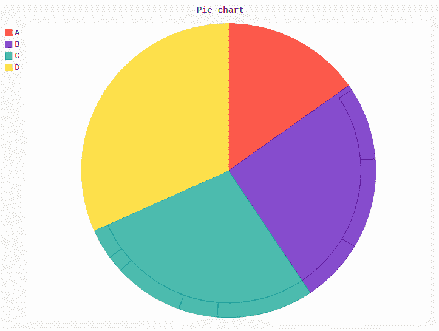

# 派加尔的饼图

> 原文:[https://www.geeksforgeeks.org/pie-chart-in-pygal/](https://www.geeksforgeeks.org/pie-chart-in-pygal/)

**Pygal** 是一个 Python 模块，主要用于构建 SVG(标量矢量图形)图形和图表。SVG 是一种基于矢量的 XML 格式的图形，可以在任何编辑器中编辑。Pygal 可以用最少的代码行创建图表，这些代码行易于理解和编写。

## 圆形分格统计图表

**饼图**或圆形图是一种圆形算术图形，根据数值进行划分，以显示每个类别所代表的数字比例和百分比，位于相应的饼图切片旁边。饼图很好的表现了很多切片中的数据，在理解的时候非常有效。

简单饼图是以不同的百分比表示一个完整饼图中的数据系列的图表。饼图的每个部分与系列中所有数据的总和成比例不同。可以使用 pygal 模块的`Pie()`方法创建。

**语法:**

```
pie_chart = pygal.Pie()
```

**例 1:**

```
# importing pygal
import pygal

# creating line chart object
pie_chart = pygal.Pie()

# naming the title
pie_chart.title = 'Pie chart'

# random data
pie_chart.add('A', 10)
pie_chart.add('B', 20)
pie_chart.add('C', 30)
pie_chart.add('D', 40)

pie_chart
```

**输出:**



**例 2:**

```
# importing pygal
import pygal
import numpy

# creating line chart object
pie_chart = pygal.Pie()

# naming the title
pie_chart.title = 'Pie chart'

# random data
pie_chart.add('A', numpy.random.rand(5))
pie_chart.add('B', numpy.random.rand(5))
pie_chart.add('C', numpy.random.rand(5))
pie_chart.add('D', numpy.random.rand(5))

pie_chart
```

**输出:**

