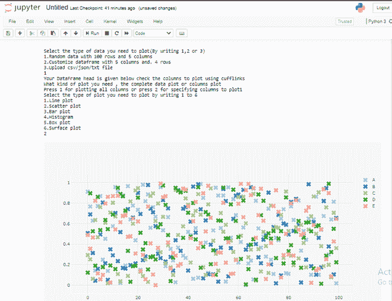
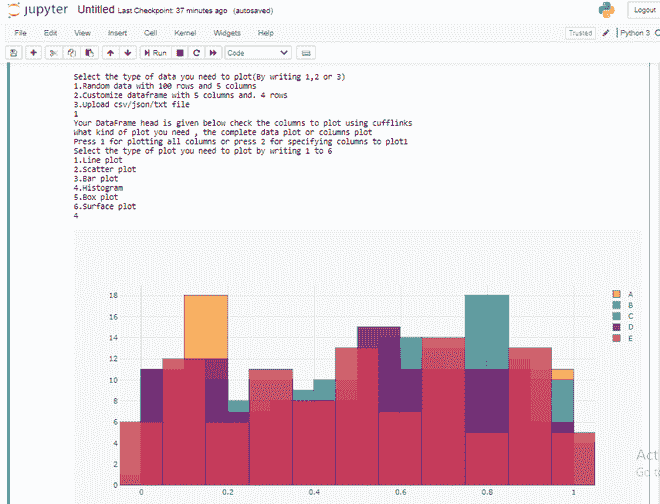

# 从一个 Python 脚本中为相同的数据绘制多个单独的图形

> 原文:[https://www . geesforgeks . org/plot-multi-separate-graph-for-同一个数据-来自一个 python 脚本/](https://www.geeksforgeeks.org/plot-multiple-separate-graphs-for-same-data-from-one-python-script/)

使用 Python 绘制不同种类的地图和不同数据的绘图非常容易。Python 中这样一个有用的库是 [**Matplotlib**](https://www.geeksforgeeks.org/python-introduction-matplotlib/) ，它对于使用相同的数据创建不同类型的图非常有用。

安装 Matplotlib 最简单的方法是使用命令行中的 **pip** 命令，如下所示:

```py
pip install matplotlib
```

此外，我们使用 **numpy** 和 **pandas** 库来创建和使用数据集。因此，安装 numpy 和 pandas 库也可以使用命令行中的 pip 命令来完成。

```py
pip install numpy 
pip install pandas
```

为了使图表更有创意，更容易找到图表中的定位数据，我们使用了**绘图**和**袖扣**库。要使用这些库，安装方法也与上述库相同。

```py
pip install chart_studio.plotly
pip install cufflinks
```

在本文中，我们将创建一个绘图仪，使我们能够使用相同的数据创建不同类型的地块。

在这个程序中，我们首先给出选择绘制图表所需数据集的选项。使用 if-elif 语句有 3 种选择。

*   使用 100 行 5 列创建随机数据
*   4 行 5 列的用户输入数据集
*   上传 CSV/JSON 文件

第二步是决定用整个数据集或特定列绘制的图。最后，我们展示了不同类型的绘图仪，用户希望绘制他们的数据并相应地绘制图表。

下面是实现:

## 蟒蛇 3

```py
# importing required libraries
import numpy as np
import pandas as pd
import chart_studio.plotly as pl
import plotly.offline as po
import cufflinks as cf
po.init_notebook_mode(connected = True)
cf.go_offline()

# define a function for creating
# data set for plotting graph
def createdata(data):

    # creating random data set
    if(data == 1):
        x = np.random.rand(100,5)
        df1 = pd.DataFrame(x, columns = ['A', 'B',
                                        'C', 'D',
                                        'E'])

    # creating user data set with input
    elif(data == 2):           
        x = [0, 0, 0, 0, 0]
        r1 = [0, 0, 0, 0, 0]
        r2 = [0, 0, 0, 0, 0]
        r3 = [0, 0, 0, 0, 0]
        r4 = [0, 0, 0, 0, 0]

        print('Enter the values for columns')
        i = 0

        for i in [0, 1, 2, 3, 4]:
            x[i] = input()
            i = i + 1
        print('Enter the values for first row')
        i = 0

        for i in [0, 1, 2, 3, 4]:
            r1[i] = int(input())
            i = i + 1

        print('Enter the values for second row')
        i = 0

        for i in [0, 1, 2, 3, 4]:
            r2[i] = int(input())
            i = i + 1

        print('Enter the values for third row')
        i = 0

        for i in [0, 1, 2, 3, 4]:
            r3[i] = int(input())
            i = i + 1

        print('Enter the values for fourth row')
        i = 0

        for i in [0, 1, 2, 3, 4]:
            r4[i] = int(input())
            i = i + 1

        df1 = pd.DataFrame([r1,r2,r3,r4] ,
                           columns = x)
    # creating data set by csv file  
    elif(data == 3):           
        file = input('Enter the file name')
        x = pd.read_csv(file)
        df1 = pd.DataFrame(x)

    else:
        print('DataFrame creation failed please' +
              'enter in between 1 to 3 and try again')

    return df1

# define a function for
# types of plotters
def plotter(plot):

    if(plot == 1):
        finalplot = df1.iplot(kind = 'scatter')

    elif(plot == 2):
        finalplot = df1.iplot(kind = 'scatter', mode = 'markers',
                              symbol = 'x', colorscale = 'paired')
    elif(plot == 3):
        finalplot = df1.iplot(kind = 'bar')

    elif(plot == 4):
        finalplot = df1.iplot(kind = 'hist')

    elif(plot == 5):
        finalplot = df1.iplot(kind = 'box')

    elif(plot == 6):
        finalplot = df1.iplot(kind = 'surface')

    else:
        finalplot = print('Select only between 1 to 7')

    return finalplot

# define a function for allowing
# to plot for specific rows and columns
def plotter2(plot):           

    col = input('Enter the number of columns you' +
                'want to plot by selecting only 1 , 2 or 3')

    col = int(col)

    if(col==1):

        colm = input('Enter the column you want to plot' +
                     'by selecting any column from dataframe head')
        if(plot == 1):
            finalplot = df1[colm].iplot(kind = 'scatter')

        elif(plot == 2):
            finalplot = df1[colm].iplot(kind = 'scatter', mode = 'markers',
                                        symbol = 'x', colorscale = 'paired')
        elif(plot == 3):
            finalplot = df1[colm].iplot(kind = 'bar')

        elif(plot == 4):
            finalplot = df1[colm].iplot(kind = 'hist')

        elif(plot == 5):
            finalplot = df1[colm].iplot(kind = 'box')

        elif(plot == 6 or plot == 7):
            finalplot = print('Bubble plot and surface plot require' +
                              'more than one column arguments')
        else:
            finalplot = print('Select only between 1 to 7')

    elif(col == 2):

        print('Enter the columns you want to plot' +
              'by selecting from dataframe head')

        x = input('First column')
        y = input('Second column')

        if(plot == 1):
            finalplot = df1[[x,y]].iplot(kind = 'scatter')

        elif(plot == 2):
            finalplot = df1[[x,y]].iplot(kind = 'scatter', mode = 'markers',
                                         symbol = 'x', colorscale = 'paired')
        elif(plot == 3):
            finalplot = df1[[x,y]].iplot(kind = 'bar')

        elif(plot == 4):
            finalplot = df1[[x,y]].iplot(kind = 'hist')

        elif(plot == 5):
            finalplot = df1[[x,y]].iplot(kind = 'box')

        elif(plot == 6):
            finalplot = df1[[x,y]].iplot(kind = 'surface')

        elif(plot == 7):
            size = input('Please enter the size column for bubble plot')
            finalplot = df1.iplot(kind = 'bubble', x = x,
                                  y = y, size = size)
        else:
            finalplot = print('Select only between 1 to 7')

    elif(col == 3):

        print('Enter the columns you want to plot')
        x = input('First column')
        y = input('Second column')
        z = input('Third column')

        if(plot == 1):
            finalplot = df1[[x,y,z]].iplot(kind = 'scatter')

        elif(plot == 2):
            finalplot = df1[[x,y,z]].iplot(kind = 'scatter', mode = 'markers',
                                           symbol = 'x' ,colorscale = 'paired')
        elif(plot == 3):
            finalplot = df1[[x,y,z]].iplot(kind = 'bar')

        elif(plot == 4):
            finalplot = df1[[x,y,z]].iplot(kind = 'hist')

        elif(plot == 5):
            finalplot = df1[[x,y,z]].iplot(kind = 'box')

        elif(plot == 6):
            finalplot = df1[[x,y,z]].iplot(kind = 'surface')

        elif(plot == 7):
            size = input('Please enter the size column for bubble plot')

            finalplot = df1.iplot(kind = 'bubble', x = x, y = y,
                                  z = z, size = size )
        else:
            finalplot = print('Select only between 1 to 7')
    else:
        finalplot = print('Please enter only 1 , 2 or 3')
    return finalplot

# define a main function
# for asking type of plot
# and calling respective function
def main(cat):   

    if(cat == 1):

        print('Select the type of plot you need to plot by writing 1 to 6')
        print('1.Line plot')
        print('2.Scatter plot')
        print('3.Bar plot')
        print('4.Histogram')
        print('5.Box plot')
        print('6.Surface plot')
        plot = int(input())
        output = plotter(plot)

    elif(cat == 2):

        print('Select the type of plot you need to plot by writing 1 to 7')
        print('1.Line plot')
        print('2.Scatter plot')
        print('3.Bar plot')
        print('4.Histogram')
        print('5.Box plot')
        print('6.Surface plot')
        print('7.Bubble plot')
        plot = int(input())
        output = plotter2(plot)

    else:
        print('Please enter 1 or 2 and try again') 

print('Select the type of data you need to plot(By writing 1,2 or 3)')
print('1.Random data with 100 rows and 5 columns')
print('2.Customize dataframe with 5 columns and. 4 rows')
print('3.Upload csv/json/txt file')

data = int(input())
df1 = createdata(data)
print('Your DataFrame head is given below check the columns to plot using cufflinks')

df1.head()
print('What kind of plot you need , the complete data plot or columns plot')
cat = input('Press 1 for plotting all columns or press 2 for specifying columns to plot')
cat = int(cat)

main(cat)
```

**输出:**

**散点图:**



散点图

**直方图:**



直方图

**箱式打印:**


箱线图