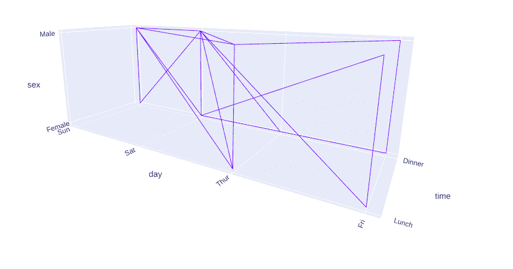
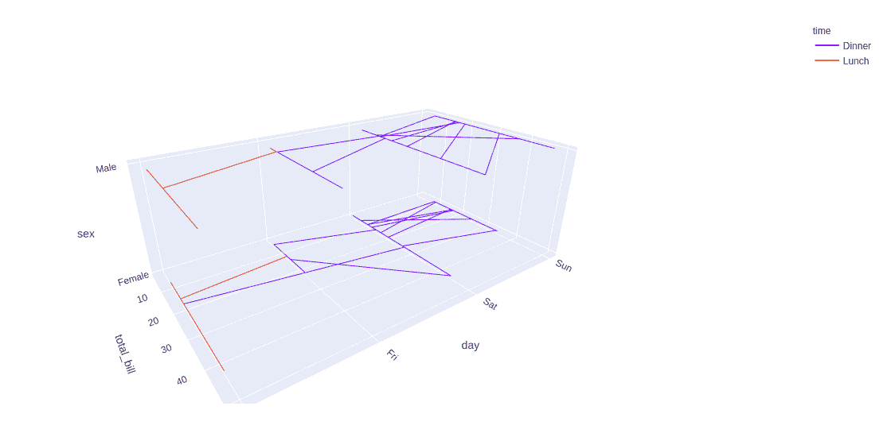

# Python 中 plot . express . line _ 3d()函数

> 原文:[https://www . geesforgeks . org/plotly-express-line _ 3d-python 中的函数/](https://www.geeksforgeeks.org/plotly-express-line_3d-function-in-python/)

Python 的 Plotly 库对于数据可视化和简单容易地理解数据非常有用。Plotly graph 对象是易于使用的高级绘图界面。

## plotly.express.line_3d()函数

该功能用于创建三维线图，并可用于熊猫数据帧。数据框的每一行都由线图中三维空间的符号标记表示。

> **语法:**plot . express . line _ 3d(data _ frame =无，x =无，y =无，z =无，color =无，line _ dash =无，text =无，line _ group =无，hover _ name =无，hover _ data =无，title =无，模板=无，宽度=无，高度=无)
> 
> **参数:**
> 
> **data_frame:** 列名需要传递 DataFrame 或类似数组或 dict。
> 
> **x，y，z:** 这些参数要么是 data_frame 中某列的名称，要么是 pandas Series 或 array_like 对象。来自该列或 array_like 的值分别用于在笛卡尔坐标中沿 x、y 和 z 轴定位标记。
> 
> **颜色:**该参数为标记指定颜色。
> 
> **线划线:**该参数用于为线指定划线图案。
> 
> **line_group:** 此参数用于将 data_frame 的行分组为行。
> 
> **悬停 _ 名称:**此列或类似数组的值以粗体显示在悬停工具提示中。
> 
> **悬停 _ 数据:**此参数用于在悬停工具提示或元组中以 bool 或格式字符串作为第一个元素出现，列表状数据作为第二个元素出现在悬停中这些列的值作为额外数据出现在悬停工具提示中。

**例 1:**

## 蟒蛇 3

```
import plotly.express as px

df = px.data.tips()

plot = px.line_3d(df, x = 'time', 
                     y = 'day',
                     z = 'sex')
plot.show()
```

**输出:**



**例 2:**

## 蟒蛇 3

```
import plotly.express as px

df = px.data.tips()

plot = px.line_3d(df, x = 'time', 
                  y = 'day',
                  z = 'sex',
                  color = 'time')
plot.show()
```

**输出:**


**例 3:**

## 蟒蛇 3

```
# Python program to demonstrate scatter
# plot

import plotly.express as px

df = px.data.tips()

plot = px.line_3d(df, x = 'day', 
                     y = 'total_bill', 
                     z = 'sex', 
                     color = 'time',
                     line_group = 'sex')
plot.show()
```

**输出:**

