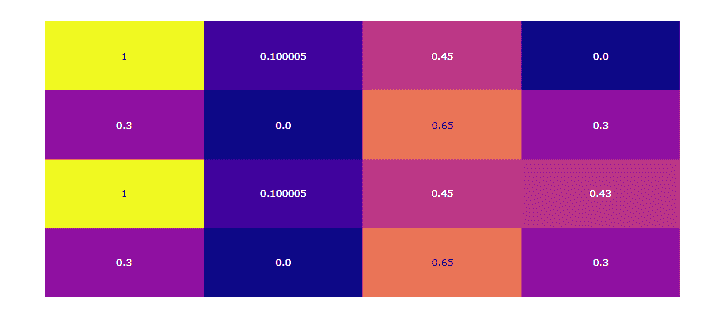
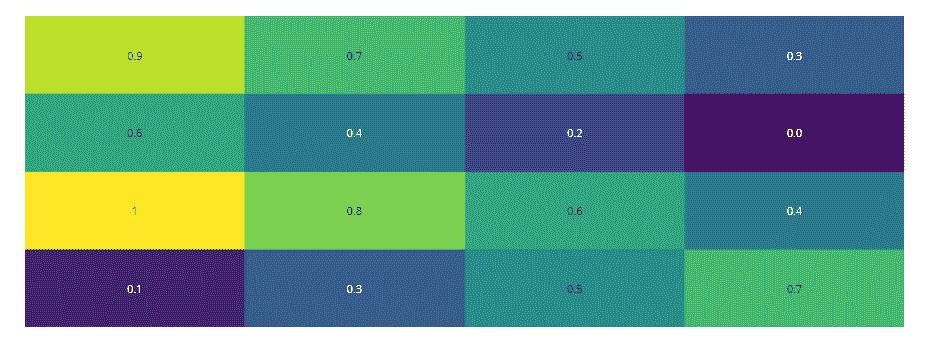

# Python 中的 plot . figure _ factory . create _ annoted _ heat map()函数

> 原文:[https://www . geesforgeks . org/plotly-figure _ factory-create _ annoted _ heat map-python 中的函数/](https://www.geeksforgeeks.org/plotly-figure_factory-create_annotated_heatmap-function-in-python/)

Python 的 Plotly 库对于数据可视化和简单容易地理解数据非常有用。

## **plot . figure _ factory . create _ annoted _ heat map**

创建带注释的热图并将注释添加到热图的每个单元的函数。

> **语法:**plot . figure _ factory . create _ annoted _ heat map(z，x=None，y=None，annotation_text=None，colorscale='Plasma '，font_colors=None，showscale=False，reversescale = False，**kwargs)
> 
> **参数:**
> 
> **z((list[list]| ndarray))–**它描述了创建热图的 z 矩阵。
> 
> **x((列表))–**描述 x 轴标签。
> 
> **y((列表))–**它描述 y 轴标签. annotation_text((列表[列表]| ndarray))–用于注释的文本字符串。应该与 z 矩阵具有相同的维度。如果没有添加文本，z 矩阵的值将被注释。默认值= z 矩阵值。
> 
> **色标((list | str))–**它描述热图色标。
> 
> **font_colors** **((列表))–**它描述了两个颜色字符串的列表:[min_text_color，max_text_color]
> 
> **显示刻度** **((布尔))**–显示默认为假的色标
> 
> **反转** **((布尔))–**它反转色阶，默认值为假

**示例 1:** 带默认配置的简单注释热图

## 蟒蛇 3

```
import plotly.figure_factory as ff

z = [[0.300000, 0.00000, 0.65, 0.300000],
     [1, 0.100005, 0.45, 0.4300],
     [0.300000, 0.00000, 0.65, 0.300000],
     [1, 0.100005, 0.45, 0.00000]]
fig = ff.create_annotated_heatmap(z)
fig.show()
```

**输出:**



**示例 2:** 定义的色标

## 蟒蛇 3

```
import plotly.figure_factory as ff

z = [[.1, .3, .5, .7],
     [1, .8, .6, .4],
     [.6, .4, .2, .0],
     [.9, .7, .5, .3]]

fig = ff.create_annotated_heatmap(z, colorscale='Viridis')
fig.show()
```

**输出:**

