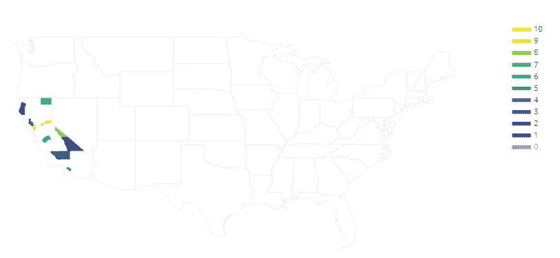

# Python 中 plotly . figure _ factory . create _ cholopleth()函数

> 原文:[https://www . geeksforgeeks . org/plotly-figure _ factory-create _ cholopleth-python 中的函数/](https://www.geeksforgeeks.org/plotly-figure_factory-create_choropleth-function-in-python/)

Python 的 Plotly 库对于数据可视化和简单容易地理解数据非常有用。

## plotly . figure _ factory . create _ cholopleth

地图是由彩色多边形组成的地图。它用于表示一个量的空间变化。

> **语法:**plotly . fig _ factory . create _ cholopleth(FIPS，values，scope=['usa']，宁滨 _endpoints=None，colorscale=None，order=None，legend_title= "，**layout_options)
> 
> **参数:**
> 
> **fips** **((列表))–**它描述了对应于州和县身份证号码的 fips 值列表。
> 
> **值((列表))–**这些值将决定各县的颜色。
> 
> **作用域((列表))–**它描述了状态和/或状态缩写的列表。紧密适合相机中的所有状态。
> 
> **宁滨端点((列表))–**它描述了隐式定义实数区间的升序数字，实数区间用作箱。
> 
> **色阶((列表))–**是长度等于颜色类别数的颜色列表。

**例:**加州有几个县

## 蟒蛇 3

```
import plotly.figure_factory as ff

fips = ['06021', '06023', '06027',
        '06029', '06033', '06059',
        '06047', '06049', '06051',
        '06055', '06061']
values = range(len(fips))

fig = ff.create_choropleth(fips=fips, values=values)
fig.layout.template = None
fig.show()
```

**输出:**

