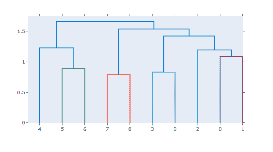
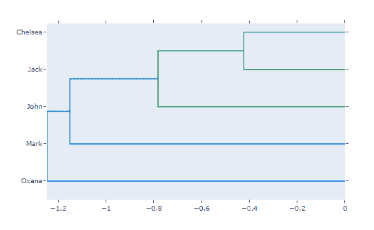

# Python 中的 plot . figure _ factory . create _ trendgram()函数

> 原文:[https://www . geesforgeks . org/plotly-figure _ factory-create _ trendgram-function-in-python/](https://www.geeksforgeeks.org/plotly-figure_factory-create_dendrogram-function-in-python/)

Python 的 Plotly 库对于数据可视化和简单容易地理解数据非常有用。

## plotly . figure _ factory . create _ trend gram

树形图是表示一棵树的图表。名为 create _ tread gram 的图形工厂对数据执行分层聚类，并表示生成的树。树深度轴上的值对应于聚类之间的距离。

> **语法:**plotly . figure _ factory . create _ trendgram(X，方位= '底部'，标签=无，colorscale =无，distfun =无，linkagefun= <函数< lambda > >，悬停文本=无，color _ threshold =无)
> 
> **参数:**
> 
> **X((ndarray))–**它将观测矩阵描述为数组的数组
> 
> **方位((str))–**在这里，我们使用“顶部”、“右侧”、“底部”或“左侧”
> 
> **标签((列表))–**描述轴类别标签(观察标签)的列表
> 
> **色标((列表))–**它描述了树形图树的可选色标
> 
> **distfun((函数))–**它描述了从观测值计算成对距离的函数
> 
> **linkagefun((函数))–**它描述了根据两两距离计算连接矩阵的函数
> 
> **悬停文本((列表[list])-**它描述了树图聚类的组成轨迹的悬停文本列表
> 
> **color _ threshold((double))–**它描述将进行聚类分离的值

**实施例 1:** 简单的底部定向树形图

## 蟒蛇 3

```py
from plotly.figure_factory import create_dendrogram
import numpy as np

X = np.random.rand(10,10)
fig = create_dendrogram(X)
fig.show()
```

**输出:**



**示例 2:** 放在热图左侧的树形图

## 蟒蛇 3

```py
from plotly.figure_factory import create_dendrogram
import numpy as np

X = np.random.rand(5,5)
names = ['Jack', 'Oxana', 'John', 'Chelsea', 'Mark']

dendro = create_dendrogram(X, orientation='right', labels=names)
dendro.update_layout({'width':700, 'height':500}) 
dendro.show()
```

**输出:**

