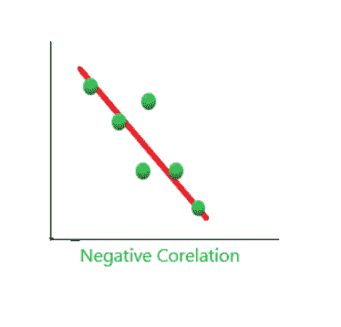
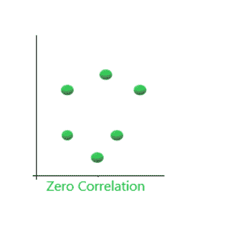

# 使用 Python 绘制相关矩阵

> 原文:[https://www . geeksforgeeks . org/标绘-关联-矩阵-使用-python/](https://www.geeksforgeeks.org/plotting-correlation-matrix-using-python/)

相关性意味着一种关联，它是对两个变量相关程度的度量。

**1。正相关:**当两个变量一起增加，一起减少时。它们是正相关的。“1”是完美的正相关。例如，需求和利润正相关，对产品的需求越多，利润越多，因此正相关。


**2。负相关:**当一个变量增加，另一个变量一起减少，反之亦然。它们是负相关的。例如，如果磁铁之间的距离增加，它们的吸引力就会降低，反之亦然。因此，负相关。“1”不相关



**3。零相关性(无相关性):**当两个变量似乎完全没有联系时。“0”是完美的负相关。比如你喝茶的量和智力水平。



## **使用 Python 绘制相关矩阵**

**步骤 1:** 导入库。

## 蟒蛇 3

```
import sklearn
import numpy as np
import matplotlib.pyplot as plt
import pandas as pd
```

**第二步:**找出两个变量之间的相关性。

## 蟒蛇 3

```
y = pd.Series([1, 2, 3, 4, 3, 5, 4])
x = pd.Series([1, 2, 3, 4, 5, 6, 7])
correlation = y.corr(x)
correlation 
```