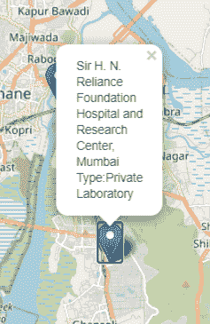

# 使用叶包

在谷歌地图上绘制 ICMR 批准的测试中心

> 原文:[https://www . geeksforgeeks . org/ploging-icmr-approved-test-centers-on-Google-maps-use-leaf-package/](https://www.geeksforgeeks.org/plotting-icmr-approved-test-centers-on-google-maps-using-folium-package/)

**leaf**是 Python 中一个强大的数据可视化库，主要是为了帮助人们可视化地理空间数据而构建的。有了叶，只要知道它的纬度和经度值，就可以创建世界上任何位置的地图。此外，由 leaf 创建的地图本质上是交互式的，因此您可以在渲染地图后放大和缩小，这是一个非常有用的功能。leaf 建立在 Python 生态系统的数据争论能力和 Leaflet.js 库的映射能力之上。在 Python 中，数据被操纵，然后通过小叶图可视化。

#### **安装**

在使用 leaf 之前，您可能需要使用以下两种方法之一将其安装到系统上。

```py
$ pip install folium

```

或者

```py
$ conda install -c conda-forge folium

```

我们将使用 ICMR 数据集，它有 7 列:实验室、地址、密码、城市、州、类型、纬度和经度。我们将在数据集中使用“ICMRTestingLabsWithCoords.csv”文件。要下载数据集，点击这里的。

## 入门指南

#### **导入所需库**

```py
import folium
import pandas as pd

```

#### **导入数据集**

```py
df = pd.DataFrame(pd.read_csv(‘ICMRTestingLabsWithCoords.csv’))

```

因为我只关注印度。我们把印度的坐标和缩放参数传递给叶。地图()。

```py
phone_map = folium.Map(location = [20.5937, 78.9629], 
                            zoom_start=4.4)

```

#### **制作标记**

显示实验室的名称和类型，无论是私人实验室还是政府实验室。此外，为了传递标记的坐标，我们将为其编写 Python 代码。

```py
locate = {}
for i, j, k, l in zip(df['latitude'], 
                      df['longitude'], 
                      df['lab'], 
                      df['type']):

    temp=[]
    temp.extend((i, j))
    locate['loc']=temp
    marker = folium.Marker(location = locate['loc'], 
                           popup = str(k)+' Type:'+str(l))
    marker.add_to(phone_map)

```

我们将通过 4 列“纬度”、“经度”、“实验室”和“类型”运行 for 循环。首先，我们创建一个“临时”列表，其中保存了我们遍历所有实验室时特定实验室的纬度和经度。这个特定的纬度和经度列表然后被传递给字典定位。现在我们通过调用创建一个标记。“标记”从 leaf 传入 locate dictionary 到 location 和 popup，以字符串格式获取实验室名称和实验室类型。标记的类型是“叶图标记”。最后我们称之为。标记外的 add _ to’并传入 phone_map。现在我们的管脚已经准备好了，是时候显示绘制的管脚了。我们通过拨打 phone_map 来实现。

```py
phone_map

```

**完整代码:**

## 蟒蛇 3

```py
import folium

import pandas as pd

phone_map = folium.Map(location=[20.5937, 78.9629],
                       zoom_start=4.4)
df = pd.DataFrame(pd.read_csv('ICMRTestingLabsWithCoords.csv'))

locate = {}

for i, j, k, l in zip(df['latitude'], df['longitude'],
                      df['lab'], df['type']):

    temp = []
    temp.extend((i, j))
    locate['loc'] = temp
    marker = folium.Marker(location=locate['loc'],
                           popup=str(k)+' Type:'+str(l))

    marker.add_to(phone_map)

phone_map
```

**输出:**


