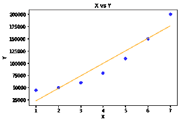
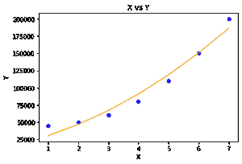

# 多项式回归(使用 Python 从头开始)

> 原文:[https://www . geesforgeks . org/多项式-从头回归-使用-python/](https://www.geeksforgeeks.org/polynomial-regression-from-scratch-using-python/)

#### 先决条件

1.  线性回归
2.  梯度下降

#### 介绍

线性回归找出因变量(或目标变量)和自变量(或特征)之间的相关性。简而言之，线性拟合数据是一种线性模型。但它无法在非线性数据中拟合和捕捉模式。

让我们首先将线性回归应用于非线性数据，以了解多项式回归的必要性。本文使用的线性回归模型是从 sklearn 导入的。您可以参考单独的文章从头开始实现线性回归模型。

## 蟒蛇 3

```
# Importing libraries

import numpy as np

import pandas as pd

from sklearn.model_selection import train_test_split

import matplotlib.pyplot as plt

from sklearn.linear_model import LinearRegression

# driver code

def main() :

    # Create dataset

    X = np.array( [ [1], [2], [3], [4], [5], [6], [7] ] )

    Y = np.array( [ 45000, 50000, 60000, 80000, 110000, 150000, 200000 ] )

    # Model training

    model = LinearRegression()

    model.fit( X, Y )

    # Prediction

    Y_pred = model.predict( X )

    # Visualization

    plt.scatter( X, Y, color = 'blue' )

    plt.plot( X, Y_pred, color = 'orange' )

    plt.title( 'X vs Y' )

    plt.xlabel( 'X' )

    plt.ylabel( 'Y' )

    plt.show()

if __name__ == "__main__" :

    main()
```

#### 输出:



形象化

如输出可视化所示，线性回归甚至未能很好地拟合训练数据(或者未能解码 Y 方向相对于 X 方向的模式)。因为它的假设函数本质上是线性的，而 Y 是数据中 X 的非线性函数。

```
For univariate linear regression : 

h( x ) = w * x

here,  x is the feature vector.
and w is the weight vector.
```

这个问题也被称为**下拟合**。为了克服欠拟合，我们引入了新的特征向量，只需在原始特征向量上加幂即可。

```
For univariate polynomial regression : 

h( x ) = w<sub>1x + w2x<sup>2  + .... + wnxn</sup></sub> 

here, w is the weight vector. 
where x2 is the derived feature from x. 
```

在将原始的 X 转换成它们的高阶项后，它将使我们的假设函数能够拟合非线性数据。这里是多项式回归模型的从头开始的实现和模型在虚拟数据集上的验证。

## 计算机编程语言

```
# Importing libraries

import numpy as np

import math

import matplotlib.pyplot as plt

# Univariate Polynomial Regression

class PolynomailRegression() :

    def __init__( self, degree, learning_rate, iterations ) :

        self.degree = degree

        self.learning_rate = learning_rate

        self.iterations = iterations

    # function to transform X

    def transform( self, X ) :

        # initialize X_transform

        X_transform = np.ones( ( self.m, 1 ) )

        j = 0

        for j in range( self.degree + 1 ) :

            if j != 0 :

                x_pow = np.power( X, j )

                # append x_pow to X_transform

                X_transform = np.append( X_transform, x_pow.reshape( -1, 1 ), axis = 1 )

        return X_transform  

    # function to normalize X_transform

    def normalize( self, X ) :

        X[:, 1:] = ( X[:, 1:] - np.mean( X[:, 1:], axis = 0 ) ) / np.std( X[:, 1:], axis = 0 )

        return X

    # model training

    def fit( self, X, Y ) :

        self.X = X

        self.Y = Y

        self.m, self.n = self.X.shape

        # weight initialization

        self.W = np.zeros( self.degree + 1 )

        # transform X for polynomial  h( x ) = w0 * x^0 + w1 * x^1 + w2 * x^2 + ........+ wn * x^n

        X_transform = self.transform( self.X )

        # normalize X_transform

        X_normalize = self.normalize( X_transform )

        # gradient descent learning

        for i in range( self.iterations ) :

            h = self.predict( self.X )

            error = h - self.Y

            # update weights

            self.W = self.W - self.learning_rate * ( 1 / self.m ) * np.dot( X_normalize.T, error )

        return self

    # predict

    def predict( self, X ) :

        # transform X for polynomial  h( x ) = w0 * x^0 + w1 * x^1 + w2 * x^2 + ........+ wn * x^n

        X_transform = self.transform( X )

        X_normalize = self.normalize( X_transform )

        return np.dot( X_transform, self.W )

# Driver code    

def main() :   

    # Create dataset

    X = np.array( [ [1], [2], [3], [4], [5], [6], [7] ] )

    Y = np.array( [ 45000, 50000, 60000, 80000, 110000, 150000, 200000 ] )

    # model training

    model = PolynomailRegression( degree = 2, learning_rate = 0.01, iterations = 500 )

    model.fit( X, Y )

    # Prediction on training set

    Y_pred = model.predict( X )

    # Visualization

    plt.scatter( X, Y, color = 'blue' )

    plt.plot( X, Y_pred, color = 'orange' )

    plt.title( 'X vs Y' )

    plt.xlabel( 'X' )

    plt.ylabel( 'Y' )

    plt.show()

if __name__ == "__main__" :

    main()
```

#### 输出:



形象化

为了避免渐变消失和爆炸问题，我们还在输入模型之前对 X 进行了归一化。

<u>输出可视化显示多项式回归通过生成曲线拟合非线性数据。</u>