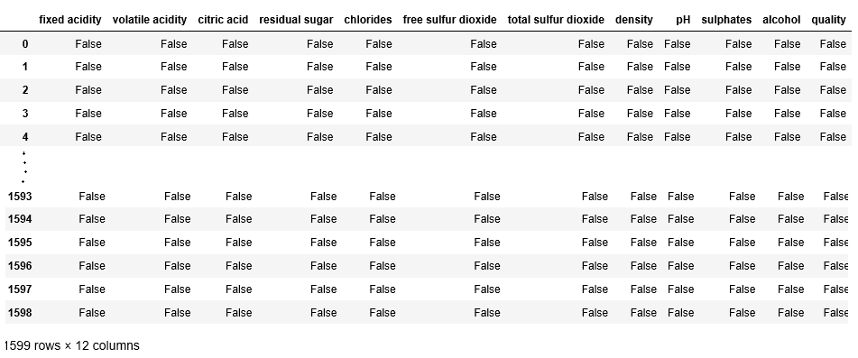
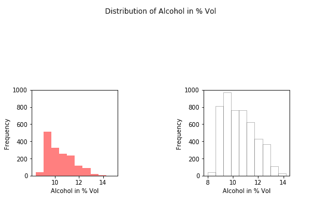

# 使用深度学习预测葡萄酒类型

> 原文:[https://www . geesforgeks . org/酒类预测-使用-深度学习/](https://www.geeksforgeeks.org/prediction-of-wine-type-using-deep-learning/)

我们对大数据集使用深度学习，但是为了理解深度学习的概念，我们使用葡萄酒质量的小数据集。您可以从免费提供的 UCI 机器学习存储库中找到葡萄酒质量数据集。本文的目的是开始学习深度学习的库，如 Keras 等，并熟悉神经网络的基础。

**关于数据集:**
在我们开始加载数据之前，了解你的数据真的很重要。数据集由包含在数据中的 12 个变量组成。很少如下所示–

1.  **固定酸度:**总酸度分为两组:*挥发性酸*和*非挥发性或固定酸*。该变量的值由数据集中的 *gm/dm3* 表示。
2.  **挥发酸度:**挥发酸度是酒变成醋的过程。在该数据集中，挥发性酸度以 gm/dm3 表示。
3.  **柠檬酸:**柠檬酸是葡萄酒中的固定酸之一。在数据集中用 g/dm3 表示。
4.  **残糖:**残糖是发酵停止，或被停止后剩余的糖。在数据集中用 g/dm3 表示。
5.  **氯化物:**它可能是葡萄酒咸味的一个重要因素。该变量的值在数据集中用 in gm/dm3 表示。
6.  **游离二氧化硫:**是二氧化硫加到葡萄酒中的部分。该变量的值在数据集中用 in gm/dm3 表示。
7.  **总二氧化硫:**是结合二氧化硫和游离二氧化硫的总和。该变量的值在数据集中用 in gm/dm3 表示。

### 第一步:了解你的数据。

**加载数据。**

```
# Import Required Libraries 
import matplotlib.pyplot as plt
import pandas as pd
import numpy as np

# Read in white wine data
white = pd.read_csv("http://archive.ics.uci.edu/ml/machine-learning-databases/wine-quality/winequality-white.csv", sep =';')

# Read in red wine data
red = pd.read_csv("http://archive.ics.uci.edu/ml/machine-learning-databases/wine-quality/winequality-red.csv", sep =';')
```

**第一排‘红’。**

```
# First rows of `red`
red.head()
```

**输出:**


**最后一排‘白色’。**

```
# Last rows of `white`
white.tail()
```

**输出:**


**取五排‘红’的样本。**

```
# Take a sample of five rows of `red`
red.sample(5)
```

**输出:**


**数据描述–**

```
# Describe `white`
white.describe()
```

**输出:**


**检查“红色”中的空值。**

```
# Double check for null values in `red`
pd.isnull(red)
```

**输出:**


### 第二步:分发酒精。

**创建直方图。**

```
# Create Histogram
fig, ax = plt.subplots(1, 2)

ax[0].hist(red.alcohol, 10, facecolor ='red',
              alpha = 0.5, label ="Red wine")

ax[1].hist(white.alcohol, 10, facecolor ='white',
           ec ="black", lw = 0.5, alpha = 0.5,
           label ="White wine")

fig.subplots_adjust(left = 0, right = 1, bottom = 0, 
               top = 0.5, hspace = 0.05, wspace = 1)

ax[0].set_ylim([0, 1000])
ax[0].set_xlabel("Alcohol in % Vol")
ax[0].set_ylabel("Frequency")
ax[1].set_ylim([0, 1000])
ax[1].set_xlabel("Alcohol in % Vol")
ax[1].set_ylabel("Frequency")

fig.suptitle("Distribution of Alcohol in % Vol")
plt.show()
```

**输出:**


**拆分数据集进行训练和验证。**

```
# Add `type` column to `red` with price one
red['type'] = 1

# Add `type` column to `white` with price zero
white['type'] = 0

# Append `white` to `red`
wines = red.append(white, ignore_index = True)

# Import `train_test_split` from `sklearn.model_selection`
from sklearn.model_selection import train_test_split
X = wines.ix[:, 0:11]
y = np.ravel(wines.type)

# Splitting the data set for training and validating 
X_train, X_test, y_train, y_test = train_test_split(
           X, y, test_size = 0.34, random_state = 45)
```

### 第三步:网络结构

```
# Import `Sequential` from `keras.models`
from keras.models import Sequential

# Import `Dense` from `keras.layers`
from keras.layers import Dense

# Initialize the constructor
model = Sequential()

# Add an input layer
model.add(Dense(12, activation ='relu', input_shape =(11, )))

# Add one hidden layer
model.add(Dense(9, activation ='relu'))

# Add an output layer
model.add(Dense(1, activation ='sigmoid'))

# Model output shape
model.output_shape

# Model summary
model.summary()

# Model config
model.get_config()

# List all weight tensors
model.get_weights()
model.compile(loss ='binary_crossentropy', 
  optimizer ='adam', metrics =['accuracy'])
```

**输出:**


### 第四步:训练和预测

```
# Training Model
model.fit(X_train, y_train, epochs = 3,
           batch_size = 1, verbose = 1)

# Predicting the Value
y_pred = model.predict(X_test)
print(y_pred)
```

**输出:**
