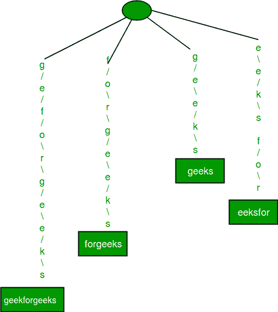

# 使用 pytrie 模块进行 Python 中的前缀匹配

> 原文:[https://www . geesforgeks . org/prefix-matching-python-using-py trie-module/](https://www.geeksforgeeks.org/prefix-matching-python-using-pytrie-module/)

给定一个字符串列表和一个前缀值子字符串，从给定的字符串列表中找到包含给定值作为前缀的所有字符串？

示例:

```
Input : arr = ['geeksforgeeks', 'forgeeks', 
               'geeks', 'eeksfor'], 
       prefix = 'geek'
Output : ['geeksforgeeks','geeks']

```

解决这个问题的简单方法是遍历完整的列表，给定的前缀与每个字符串一一匹配，打印所有包含给定值的字符串作为前缀。

我们已经有了使用 [Trie 数据结构](https://www.geeksforgeeks.org/trie-insert-and-search/)解决这个问题的解决方案。我们可以使用 **pytrie 在 python 中实现 Trie。StringTrie()** 模块。

### 在 pytrie 中创建、插入、搜索和删除。StringTrie()？

*   **<u>创造:</u>** **特里=皮特里。StringTrie()** 创建一个空的 Trie 数据结构。
*   **<u>插入:</u>****trie【key】= value**， **key** 是我们要在 trie 中插入的数据， **value** 类似于一个桶，刚好在插入的 key 的最后一个节点后追加，这个桶包含插入的 key 的实际值。
*   **<u>搜索:</u>** **trie.values(前缀)**，返回包含给定前缀的所有键的列表。
*   **<u>删除:</u>** **德尔特里[键]** ，从特里数据结构中删除指定键。



**<u>注意:</u>** 要安装 **pytrie** 包，使用这个 **pip 从 linux 中的终端安装 pytrie–user**命令。

```
# Function which returns all strings 
# that contains given prefix 
from pytrie import StringTrie 

def prefixSearch(arr,prefix): 

    # create empty trie 
    trie=StringTrie() 

    # traverse through list of strings 
    # to insert it in trie. Here value of 
    # key is itself key because at last 
    # we need to return 
    for key in arr: 
        trie[key] = key 

    # values(search) method returns list 
    # of values of keys which contains 
    # search pattern as prefix 
    return trie.values(prefix) 

# Driver program 
if __name__ == "__main__": 
    arr = ['geeksforgeeks','forgeeks','geeks','eeksfor'] 
    prefix = 'geek'
    output = prefixSearch(arr,prefix) 
    if len(output) > 0: 
        print (output) 
    else: 
        print ('Pattern not found')
```

输出:

```
['geeksforgeeks','geeks']
```

本文由 [**沙莎克·米什拉(古卢)**](https://auth.geeksforgeeks.org/profile.php?user=Shashank Mishra) 供稿。如果你喜欢 GeeksforGeeks 并想投稿，你也可以使用[contribute.geeksforgeeks.org](http://www.contribute.geeksforgeeks.org)写一篇文章或者把你的文章邮寄到 contribute@geeksforgeeks.org。看到你的文章出现在极客博客主页上，帮助其他极客。

如果你发现任何不正确的地方，或者你想分享更多关于上面讨论的话题的信息，请写评论。