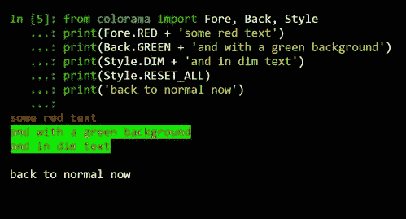
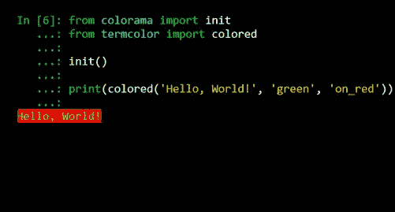
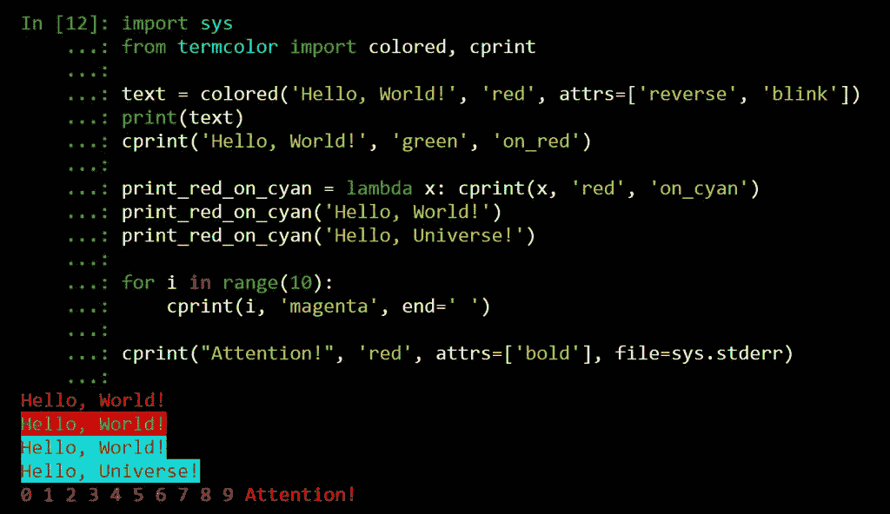
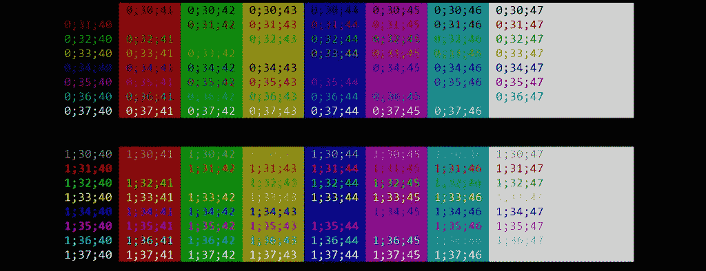

# 在 Python 终端中打印颜色

> 原文:[https://www.geeksforgeeks.org/print-colors-python-terminal/](https://www.geeksforgeeks.org/print-colors-python-terminal/)

在 Python 中，有几种方法可以将彩色文本输出到终端。最常见的方法是:

**使用内置模块**

*   **“colorama”模块:**然后可以使用 Colorama 对 ANSI 转义序列的不断简写来完成彩色文本的跨平台打印:

**例 1:**

## 计算机编程语言

```
# Python program to print
# red text with green background

from colorama import Fore, Back, Style
print(Fore.RED + 'some red text')
print(Back.GREEN + 'and with a green background')
print(Style.DIM + 'and in dim text')
print(Style.RESET_ALL)
print('back to normal now')
```

**输出:**



**例 2:**

## 计算机编程语言

```
# Python program to print
# green text with red background

from colorama import init
from termcolor import colored

init()

print(colored('Hello, World!', 'green', 'on_red'))
```

**输出:**



*   **“term Color”模块:** termcolor 是一个 python 模块，用于 ANSII Color 格式化，以便在终端中输出。

## 计算机编程语言

```
# Python program to print
# colored text and background
import sys
from termcolor import colored, cprint

text = colored('Hello, World!', 'red', attrs=['reverse', 'blink'])
print(text)
cprint('Hello, World!', 'green', 'on_red')

print_red_on_cyan = lambda x: cprint(x, 'red', 'on_cyan')
print_red_on_cyan('Hello, World!')
print_red_on_cyan('Hello, Universe!')

for i in range(10):
    cprint(i, 'magenta', end=' ')

cprint("Attention!", 'red', attrs=['bold'], file=sys.stderr)
```

**输出:**



### **使用 ANSI 转义码**

打印彩色文本最常见的方式是直接打印 [ANSI 转义序列](https://en.wikipedia.org/wiki/ANSI_escape_code#Colors)。这可以以不同的格式交付，例如:

*   **构建要调用的函数:**我们可以构建函数来调用特定颜色命名的函数来执行相关的 ANSI 转义序列。

## 计算机编程语言

```
# Python program to print
# colored text and background
def prRed(skk): print("\033[91m {}\033[00m" .format(skk))
def prGreen(skk): print("\033[92m {}\033[00m" .format(skk))
def prYellow(skk): print("\033[93m {}\033[00m" .format(skk))
def prLightPurple(skk): print("\033[94m {}\033[00m" .format(skk))
def prPurple(skk): print("\033[95m {}\033[00m" .format(skk))
def prCyan(skk): print("\033[96m {}\033[00m" .format(skk))
def prLightGray(skk): print("\033[97m {}\033[00m" .format(skk))
def prBlack(skk): print("\033[98m {}\033[00m" .format(skk))

prCyan("Hello World, ")
prYellow("It's")
prGreen("Geeks")
prRed("For")
prGreen("Geeks")
```

**输出:**


*   **建立一个颜色类:**创建一个类来分配背景色和前景色并调用它们。

## 计算机编程语言

```
# Python program to print
# colored text and background
class colors:
'''Colors class:reset all colors with colors.reset; two
sub classes fg for foreground
and bg for background; use as colors.subclass.colorname.
i.e. colors.fg.red or colors.bg.greenalso, the generic bold, disable,
underline, reverse, strike through,
and invisible work with the main class i.e. colors.bold'''
    reset='\033[0m'
    bold='\033[01m'
    disable='\033[02m'
    underline='\033[04m'
    reverse='\033[07m'
    strikethrough='\033[09m'
    invisible='\033[08m'
    class fg:
        black='\033[30m'
        red='\033[31m'
        green='\033[32m'
        orange='\033[33m'
        blue='\033[34m'
        purple='\033[35m'
        cyan='\033[36m'
        lightgrey='\033[37m'
        darkgrey='\033[90m'
        lightred='\033[91m'
        lightgreen='\033[92m'
        yellow='\033[93m'
        lightblue='\033[94m'
        pink='\033[95m'
        lightcyan='\033[96m'
    class bg:
        black='\033[40m'
        red='\033[41m'
        green='\033[42m'
        orange='\033[43m'
        blue='\033[44m'
        purple='\033[45m'
        cyan='\033[46m'
        lightgrey='\033[47m'

print(colors.bg.green, "SKk", colors.fg.red, "Amartya")
print(colors.bg.lightgrey, "SKk", colors.fg.red, "Amartya")
```

**输出:**


*   **迭代函数:**我们可以设计迭代&自生成 ANSI Escape 序列，函数。

## 计算机编程语言

```
# Python program to print
# colored text and background
def print_format_table():
    """
    prints table of formatted text format options
    """
    for style in range(8):
        for fg in range(30, 38):
            s1 = ''
            for bg in range(40, 48):
                format = ';'.join([str(style), str(fg), str(bg)])
                s1 += '\x1b[%sm %s \x1b[0m' % (format, format)
            print(s1)
        print('\n')

print_format_table()
```

**输出:**



本文由 **Amartya Ranjan Saikia** 供稿。如果你喜欢 GeeksforGeeks 并想投稿，你也可以使用[write.geeksforgeeks.org](https://write.geeksforgeeks.org)写一篇文章或者把你的文章邮寄到 contribute@geeksforgeeks.org。看到你的文章出现在极客博客主页上，帮助其他极客。
如果你发现任何不正确的地方，或者你想分享更多关于上面讨论的话题的信息，请写评论。