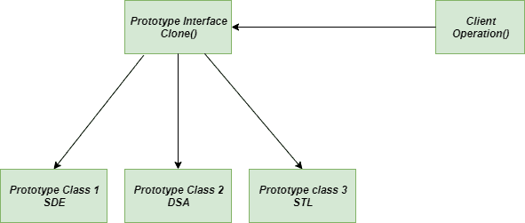

# 原型法——Python 设计模式

> 原文:[https://www . geesforgeks . org/prototype-method-python-design-patterns/](https://www.geeksforgeeks.org/prototype-method-python-design-patterns/)

**原型方法**是一种[创造性设计模式](https://www.geeksforgeeks.org/design-patterns-set-1-introduction/)，旨在减少应用程序使用的类的数量。它允许您复制现有的对象，而不依赖于它们的类的具体实现。通常，这里的对象是通过在运行时复制原型实例来创建的。
当对象创建在时间和资源使用方面是一项昂贵的任务，并且已经存在类似的对象时，强烈建议使用**原型方法**。该方法提供了一种复制原始对象，然后根据我们的需要进行修改的方法。

### 没有原型法我们面临的问题

假设我们有一个形状类，它产生不同的形状，如圆形、矩形、正方形等，并且我们已经有了它的一个对象。现在我们想要创建这个对象的精确副本。 ***一个普通的开发者会怎么走？***
他/她将创建同一类的新对象，并将应用原始对象的所有功能并复制其值。但是我们不能复制原始对象的每个字段，因为有些字段可能是私有的和受保护的，并且不能从对象本身的外部获得。
问题还没完！你也变得依赖其他类的代码，这在软件开发中肯定不是一个好的实践。

为了更好的理解，让我们来了解一下 GeeksforGeeks 的**课程的例子，它提供 SDE、DSA、STL 等课程。一次又一次地为类似的课程创建对象，并不是一个更好地利用资源的好任务。** 


问题生成器-方法

**注意:**以下代码是在没有使用原型法的情况下编写的

## 蟒蛇 3

```py
# concrete course
class DSA():
    """Class for Data Structures and Algorithms"""

    def Type(self):
        return "Data Structures and Algorithms"

    def __str__(self):
        return "DSA"

# concrete course
class SDE():
    """Class for Software development Engineer"""

    def Type(self):
        return "Software Development Engineer"

    def __str__(self):
        return "SDE"

# concrete course
class STL():
    """class for Standard Template Library of C++"""

    def Type(self):
        return "Standard Template Library"

    def __str__(self):
        return "STL"

# main method
if __name__ == "__main__":
    sde = SDE()  # object for SDE
    dsa = DSA()  # object for DSA
    stl = STL()  # object for STL

    print(f'Name of Course: {sde} and its type: {sde.Type()}')
    print(f'Name of Course: {stl} and its type: {stl.Type()}')
    print(f'Name of Course: {dsa} and its type: {dsa.Type()}')
```

### 原型法解决方案:

为了处理这样的问题，我们使用原型方法。我们将为**课程 _At_GFG** 和**课程 _ At _ GFG _ 缓存**创建单独的类，这将帮助我们创建具有相同字段属性的现有对象的精确副本。此方法将克隆过程委托给要克隆的实际对象。在这里，我们声明了一个支持对象克隆的公共接口或类，它允许我们克隆对象，而无需将我们的代码耦合到该方法的类。
支持克隆的物体被称为**原型**。

## 蟒蛇 3

```py
# import the required modules

from abc import ABCMeta, abstractmethod
import copy

# class - Courses at GeeksforGeeks
class Courses_At_GFG(metaclass = ABCMeta):

    # constructor
    def __init__(self):
        self.id = None
        self.type = None

    @abstractmethod
    def course(self):
        pass

    def get_type(self):
        return self.type

    def get_id(self):
        return self.id

    def set_id(self, sid):
        self.id = sid

    def clone(self):
        return copy.copy(self)

# class - DSA course
class DSA(Courses_At_GFG):
    def __init__(self):
        super().__init__()
        self.type = "Data Structures and Algorithms"

    def course(self):
        print("Inside DSA::course() method")

# class - SDE Course
class SDE(Courses_At_GFG):
    def __init__(self):
        super().__init__()
        self.type = "Software Development Engineer"

    def course(self):
        print("Inside SDE::course() method.")

# class - STL Course
class STL(Courses_At_GFG):
    def __init__(self):
        super().__init__()
        self.type = "Standard Template Library"

    def course(self):
        print("Inside STL::course() method.")

# class - Courses At GeeksforGeeks Cache
class Courses_At_GFG_Cache:

    # cache to store useful information
    cache = {}

    @staticmethod
    def get_course(sid):
        COURSE = Courses_At_GFG_Cache.cache.get(sid, None)
        return COURSE.clone()

    @staticmethod
    def load():
        sde = SDE()
        sde.set_id("1")
        Courses_At_GFG_Cache.cache[sde.get_id()] = sde

        dsa = DSA()
        dsa.set_id("2")
        Courses_At_GFG_Cache.cache[dsa.get_id()] = dsa

        stl = STL()
        stl.set_id("3")
        Courses_At_GFG_Cache.cache[stl.get_id()] = stl

# main function
if __name__ == '__main__':
    Courses_At_GFG_Cache.load()

    sde = Courses_At_GFG_Cache.get_course("1")
    print(sde.get_type())

    dsa = Courses_At_GFG_Cache.get_course("2")
    print(dsa.get_type())

    stl = Courses_At_GFG_Cache.get_course("3")
    print(stl.get_type())
```

### 原型设计模式的 UML 图



原型-方法-UML-图

### 优势

1.  **更少的子类数量:**所有其他的创造性设计模式提供了很多新的子类，当我们在一个大项目中工作时，这些子类肯定不容易处理。但是使用原型设计模式，我们摆脱了这一点。
2.  **为新对象提供不同的值:**所有高度动态的系统都允许您通过对象组合来定义新行为，方法是为对象的变量指定值，而不是定义新的类。
3.  **为新对象提供不同的结构:**通常所有的应用程序都是从部件和子部件构建对象。为了方便起见，这样的应用程序通常允许您实例化复杂的、用户定义的结构，以便一次又一次地使用特定的子电路。

### 不足之处

1.  **抽象:**它通过隐藏类的具体实现细节来帮助实现抽象。
2.  **较低层次的资源浪费:**对于一个使用很少对象的项目来说，这可能被证明是资源的过度消耗

### 适应性

1.  **独立于具体类:**原型方法提供了实现新对象的方法，而不依赖于类的具体实现。
2.  **反复出现的问题:**原型法也用于解决软件开发中反复出现的复杂问题。

**进一步阅读–**[Java 中的原型设计模式](https://www.geeksforgeeks.org/prototype-design-pattern/)