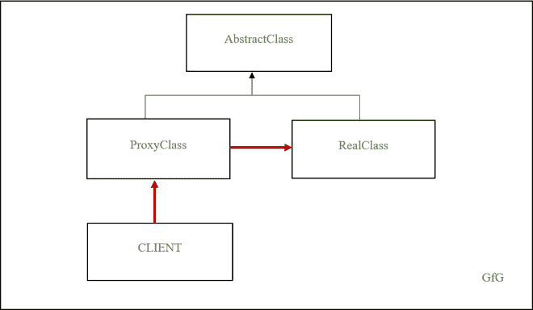

# Python 中对象通信的代理设计模式

> 原文:[https://www . geesforgeks . org/proxy-design-pattern-for-object-communication-in-python/](https://www.geeksforgeeks.org/proxy-design-pattern-for-object-communication-in-python/)

内存和时间是处理大型对象时的两个主要挑战。因此，重要的是重用这些对象来生成新的引用，而不是在每次新请求时创建它们。最重要的是，内存必须在代码的所有部分完成后释放。

一个[代理设计模式](https://www.geeksforgeeks.org/proxy-method-python-design-patterns/)是实现大对象初始化的最佳可能方式。它通过创建一个行为类似于真实对象的代理对象，将客户端代码与对象分开。这里，客户端代码与代理类交互——它有一个实对象实例。除了对象初始化，它还为日志记录、网络连接、访问共享对象、引用计数等提供了最佳解决方案。

使用代理设计模式的一些优点是:

1.  它通过使用额外的间接级别来确保分布式、受控或智能访问
2.  它通过添加包装来保护真实对象免受不必要的复杂性。
3.  避免不恰当的对象实例化，并可以优化应用程序的性能

然而，有时代理模式会增加对象的响应时间——当第一次请求对象时，对象初始化需要更多的时间。

## 履行

让我们实现一个 Python 代码来实例化一个大对象，它包含 1000 万个数字–*real class*。由于它容纳了一个大对象，因此最好使用代理–*proxylass*与该对象进行交互，而不是启动直接通信。



代理设计模式

首先，让我们创建一个抽象类——抽象类——它为 RealClass 和 ProxyClass 提供了一个接口。抽象类有一个名为 sort_digits 的方法，而真实类继承自抽象类。代理类使用 *RealClass* 的实例，方便客户端通信。

## 蟒蛇 3

```py
import abc
import random

class AbstractClass(metaclass=abc.ABCMeta):
    """ interface for real and proxy object """
    @abc.abstractmethod
    def sort_digits(self, reverse=False):
        pass

class RealClass(AbstractClass):
    """ RealClass that holds a larger object """

    def __init__(self):
        self.digits = []

        for i in range(1000000):
            self.digits.append(random.random())

    def sort_digits(self, reverse=False):
        self.digits.sort()

        if reverse:
            self.digits.reverse()

class ProxyClass(AbstractClass):
    """ A proxy class that has the same interface as RealClass. """

    ref_count = 0

    def __init__(self):
        """ Creates an object if it doesn't exist and caches it otherwise """

        if not getattr(self.__class__, 'cached_object', None):
            self.__class__.cached_object = RealClass()
            print('New object generated')
        else:
            print('Using cached object')

        self.__class__.ref_count += 1
        print('Reference Count:', self.__class__.ref_count)

    def sort_digits(self, reverse=False):
        print('Sort method')
        print(locals().items())

        # invokes the sort_digits method of real class
        self.__class__.cached_object.sort_digits(reverse=reverse)

    def __del__(self):
        """ Delete the object when the number of reference is 0 """
        self.__class__.ref_count -= 1

        if self.__class__.ref_count == 0:
            print('Deleting cached object')
            del self.__class__.cached_object

        print('Reference Count:', self.__class__.ref_count)

if __name__ == '__main__':
    proxA = ProxyClass()
    print()

    proxB = ProxyClass()
    print()

    proxC = ProxyClass()
    print()

    proxA.sort_digits(reverse=True)
    print()

    print('Deleting proxA')
    del proxA

    print('Deleting proxB')
    del proxB

    print('Deleting proxC')
    del proxC
```

**输出:**

> 生成的新对象
> 参考计数:1
> 
> 使用缓存对象
> 引用计数:2
> 
> 使用缓存对象
> 引用计数:3
> 
> 排序方式
> dict_items([('reverse '，True)，(' self '，< __main__。0x7ff50f73e0b8 处的 ProxyClass 对象> )])
> 
> 删除代理
> 引用计数:2
> 删除代理
> 引用计数:1
> 删除代理
> 删除缓存对象
> 引用计数:0

让我们来看看 ProxyClass 设计。如果之前没有创建 *RealClass* ，它会创建一个实例。如果对象已经存在，代理类将增加引用计数，并返回到真实类的新链接。代理类中的排序方法使用缓存的引用调用真实类的排序方法。最后，析构函数方法会减少每次调用的引用计数，当没有剩余引用时，它会删除对象。

代理设计模式通过缓存经常使用的对象来优化应用程序的性能，并通过检查访问权限来提高应用程序的安全性。除此之外，它还促进了远程系统交互。