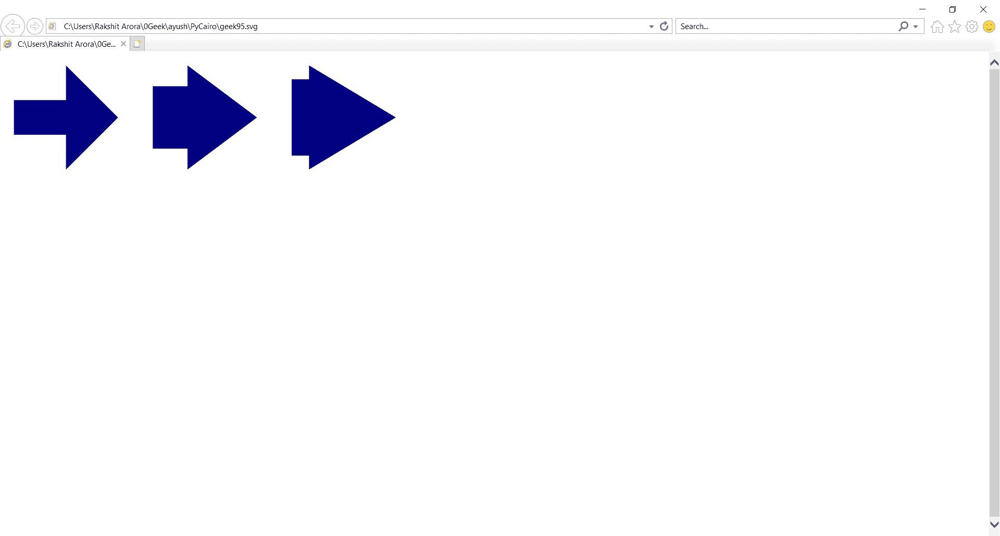

# PyCairo–一个简单的箭头形状

> 原文:[https://www.geeksforgeeks.org/pycairo-a-simple-arrow-shape/](https://www.geeksforgeeks.org/pycairo-a-simple-arrow-shape/)

在本文中，我们将学习如何使用 python 中的 PyCairo 绘制一个简单的箭头形状。

**PyCairo** : PyCairo 是一个为 cairo 图形库提供绑定的 Python 模块。这个库用于创建 SVG，即 python 中的矢量文件。打开 SVG 文件进行查看(只读)最简单快捷的方法是使用现代网络浏览器，如 Chrome、Firefox、Edge 或 Internet Explorer，几乎所有这些浏览器都应该为 SVG 格式提供某种渲染支持。

**SVG** 文件是使用由万维网联盟(W3C)创建的二维矢量图形格式的图形文件。它使用基于 XML 的文本格式描述图像。SVG 文件是作为在网络上显示矢量图形的标准格式开发的。

实施步骤:

1.  导入 Pycairo 模块。
2.  创建一个 SVG 表面对象，并向其添加上下文。
3.  创建制作箭头形状的函数
4.  用参数调用函数
5.  使用填充( )填充对象的内部颜色

**下面是实现:**

## 蟒蛇 3

```py
# importing pycairo
import cairo

# Creating function for make arrow shape

def arrow(context, x, y, width, height, a, b):
    context.move_to(x, y + b)
    context.line_to(x, y + height - b)
    context.line_to(x + a, y + height - b)
    context.line_to(x + a, y + height)
    context.line_to(x + width, y + height/2)
    context.line_to(x + a, y)
    context.line_to(x + a, y + b)
    context.close_path()

    # creating a SVG surface
    # here geek95 is file name & 700, 700 is dimension
with cairo.SVGSurface("geek95.svg", 700, 700) as surface:

    # creating a cairo context object for SVG surface
    # useing Context method
    context = cairo.Context(surface)

    context.set_source_rgb(0, 0, 0.5)
    # Call the function
    arrow(context, 20, 20, 150, 150, 75, 50)
    # Fill the color inside
    context.fill()

    # Call the function
    arrow(context, 220, 20, 150, 150, 50, 30)
    # Fill the color inside
    context.fill()
    # Call the function
    arrow(context, 420, 20, 150, 150, 25, 20)
    # Fill the color inside
    context.fill()
    # Call the function
    arrow(context, 70, 220, 75, 150, 0, 50)
    # Fill the color inside
    context.fill()
   # stroke out the color and width property
    # context.stroke()

  # printing message when file is saved
print("File Saved")
```

**输出:**

