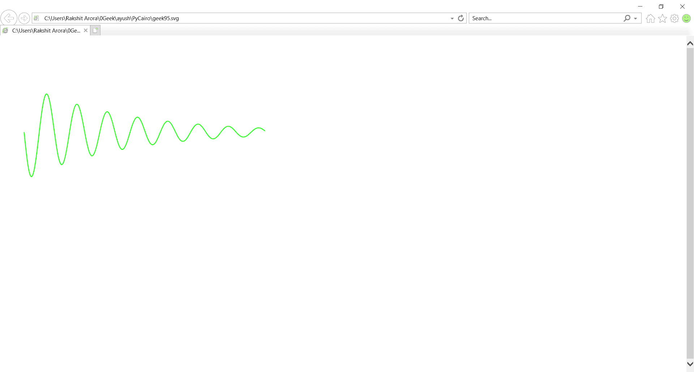

# PyCairo-绘制函数曲线

> 原文:[https://www . geesforgeks . org/py cairo-drawing-function-curve/](https://www.geeksforgeeks.org/pycairo-drawing-function-curve/)

在本文中，我们将学习如何使用 python 中的 PyCairo 绘制简单的函数曲线。在数学中，函数 f 的图是有序对的集合，其中 f(x) = y，在 x 和 f(x)是实数的常见情况下，这些对是二维空间中点的笛卡尔坐标。

**PyCairo** : PyCairo 是一个为 cairo 图形库提供绑定的 Python 模块。这个库用于创建 SVG，即 python 中的矢量文件。打开 SVG 文件进行查看(只读)最简单快捷的方法是使用现代网络浏览器，如 Chrome、Firefox、Edge 或 Internet Explorer，几乎所有这些浏览器都应该为 SVG 格式提供某种渲染支持。

**SVG** 文件是使用由万维网联盟(W3C)创建的二维矢量图形格式的图形文件。它使用基于 XML 的文本格式描述图像。SVG 文件是作为在网络上显示矢量图形的标准格式开发的。

实施步骤:

1.  导入 Pycairo & Math 模块。
2.  创建一个 SVG 表面对象并向其添加上下文。
3.  为函数曲线创建点创建列表
4.  遍历和绘制点
5.  设置上下文的颜色和线宽

**下面是实现:**

## 蟒蛇 3

```
# importing pycairo
import cairo
# importing Math to Sin & exp Function
import math

# Variable X
x = 0
# Creating list for creating points
points = []
# Creating Loop for points
while x < 5:
    # Creating point corresponding x
    y = math.sin(10*x)*math.exp(-x/2)
    # Adding points to the list
    points.append((x*100 + 50, y*100 + 200))
    # Incrementing by 0.01 Variable x
    x += 0.01

# creating a SVG surface
# here geek95 is file name & 700, 700 is dimension
with cairo.SVGSurface("geek95.svg", 700, 700) as surface:

    # creating a cairo context object for SVG surface
    # useing Context method
    context = cairo.Context(surface)

    context.move_to(*points[0])
    # Traversing Points
    for p in points[1:]:
        # Ploting point
        context.line_to(*p)

    # setting width of the context
    context.set_line_width(2)
    # setting color of the context
    context.set_source_rgb(0.2, 1, 0.2)
    # stroke out the color and width property
    context.stroke()

# printing message when file is saved
print("File Saved")
```

**输出:**

