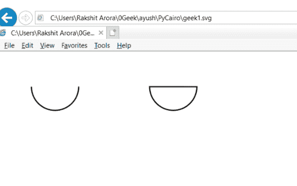

# PyCairo–如何保存剪辑？

> 原文:[https://www . geesforgeks . org/py cairo-如何保存剪辑/](https://www.geeksforgeeks.org/pycairo-how-to-preserve-the-clip/)

在本文中，我们将学习如何使用 python 中的 PyCairo 保存剪辑。保留剪辑意味着通过将当前剪辑区域与当前路径相交来建立一个新的剪辑区域，就像它将由 Context.fill()根据当前填充规则填充一样。

**PyCairo** : Pycairo 是一个为 Cairo 图形库提供绑定的 Python 模块。这个库用于创建 SVG，即 python 中的矢量文件。打开 SVG 文件进行查看(只读)最简单快捷的方法是使用现代网络浏览器，如 Chrome、Firefox、Edge 或 Internet Explorer，几乎所有这些浏览器都应该为 SVG 格式提供某种渲染支持。

**SVG** 文件是使用由万维网联盟(W3C)创建的二维矢量图形格式的图形文件。它使用基于 XML 的文本格式描述图像。SVG 文件是作为在网络上显示矢量图形的标准格式开发的。

> 为此，我们将对上下文对象使用 clip_preserve()方法
> 
> 语法:context.clip_preserve()
> 
> 论点:它不需要论点
> 
> 返回:它不返回任何内容

注意:当前剪辑区域通过有效遮蔽当前剪辑区域之外的任何曲面更改来影响所有绘图操作。

**示例:**

## 蟒蛇 3

```py
# importing pycairo
import cairo

# creating a SVG surface 
# here geek1 is file name &
# 700, 700 is dimension
with cairo.SVGSurface("geek1.svg", 700, 700) as surface:

    # creating a cairo context object
    context = cairo.Context(surface)

    #creating a arc without using closing path method
    context.arc(100, 60, 40, 0, 1*22/7)

    #stroke the context to remove the moved pen 
    context.stroke()

    #creating a arc with using close path method
    context.arc(300, 60, 40, 0, 1*22/7)

    #makeing close path
    context.close_path()

    # preserving the clip
    context.clip_preserve()

    #stroke the context to remove the moved pen 
    context.stroke()
```

**输出:**

