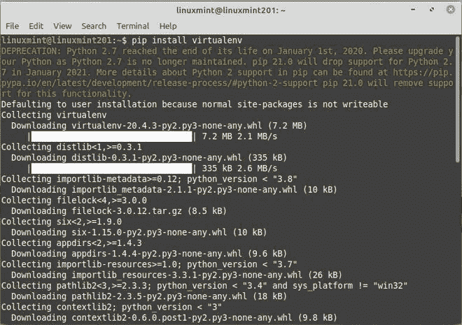
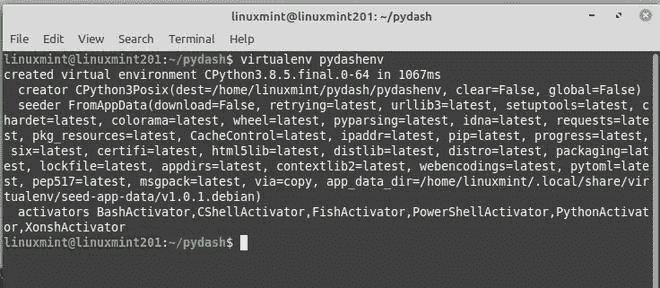
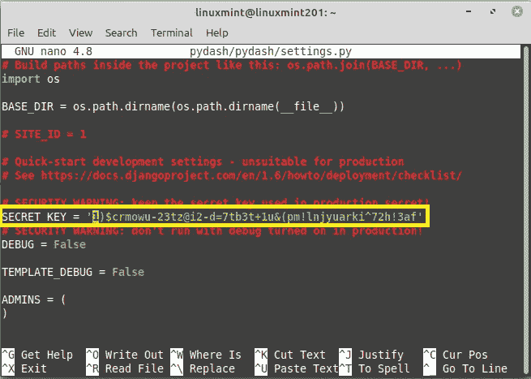
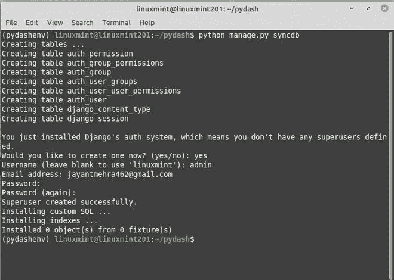
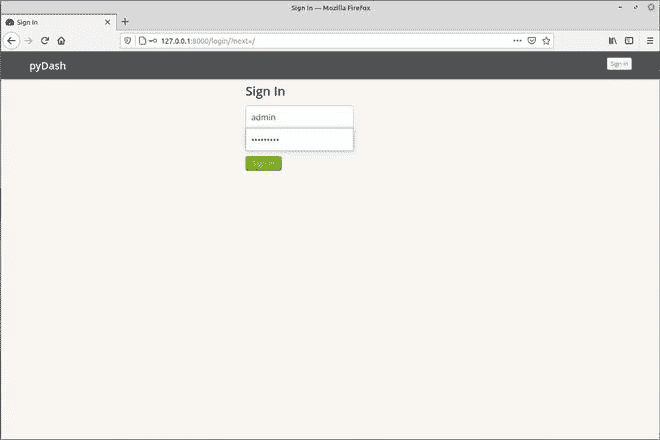
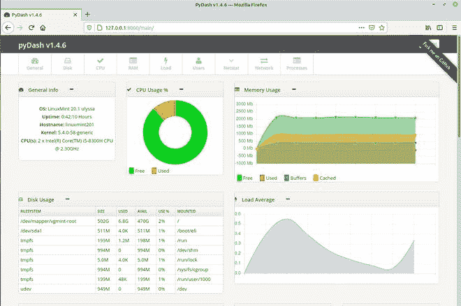

# py dash–监控 Linux 服务器的 Python 应用程序

> 原文:[https://www . geesforgeks . org/py dash-python-app-for-monitoring-Linux-server/](https://www.geeksforgeeks.org/pydash-python-app-for-monitoring-linux-server/)

Python 和带有 Chart.js 的 Django 组成了 pydash，一个轻量级的基于 web 的 Linux 监控应用程序。它已经过测试，可以在 CentOS、Fedora、Ubuntu、Debian、Arch Linux、Raspbian 和 Pidora 以及其他流行的 Linux 发行版上运行。

您可以使用它来监控您的 Linux 电脑/服务器上的资源，如中央处理器、内存、网络统计数据、进程、在线用户等。仪表板完全是用主 Python 发行版中的 Python 库构建的，所以它只有几个依赖项，不需要安装很多包或库。

### 在 Linux 中安装 Pydash

首先，我们需要安装 pip3 和 git，如果您已经安装了，您可以跳过这一步:

```
$ sudo apt-get install python-pip
```


安装 pip

**现在使用以下命令安装 git:**

```
$ sudo apt-get install git
```


安装 git

**现在我们需要安装 virtualenv:**

Virtualenv:当涉及到处理 Python 项目中的依赖关系时，virtualenv 是可以使用的工具。

```
$ pip install virtualenv
```



安装 virtualenv

**现在使用 git 命令克隆 pydash 目录:**

```
$ git clone https://gitlab.com/k3oni/pydash
```


克隆 pydash 存储库

**将目录改为 pydash:**


将目录更改为 pydash

**下一步是使用 virtualenv 命令为我们的项目创建一个虚拟环境:**

```
$ virtualenv pydashenv
```



创建虚拟环境

**现在我们需要使用下面的命令激活我们的虚拟环境:**

```
$ source /home/ubuntu/paydash/pydashenv/bin/activate
```


激活虚拟环境

现在，使用以下命令安装项目的规范。它将在您的项目中搜索一个名为 requirements.txt 的文件。在这个文件中，创建者指定了项目运行必须安装的包。

```
$ pip install -r requirements.txt
```


安装所需的依赖项

**现在我们需要将 SECRET_KEY 更改为自定义值，导航到包含 settings.py 的 pydash 目录，或者简单地运行下面的命令打开这个文件:**

```
$ nano pydash/pydash/settings.py
```


正在打开设置。py

**搜索 SECRET_KEY 字符串，并将其更改为自定义值。保存文件并退出:**



替换为自定义密钥

**使用以下命令运行 Django 命令:**

```
$ python manage.py syncdb
```

当它询问您是否要建立超级用户时，请确保选择“是”。然后，按照以下说明运行该应用程序。



运行姜戈命令

现在一切都准备好了，运行以下命令来启动 Django 开发服务器:

```
$ python manage.py runserver
```


正在运行的服务器

要访问站点仪表板登录图形用户界面，请打开您的网络浏览器，并在地址栏中键入 http://127.0.0.1:8000/使用创建数据库和安装 Django 身份验证系统时创建的超级用户名和密码登录。



现在使用用户名和密码登录

当您第一次登录 pydash 主界面时，您将看到一个部分，用于跟踪一般系统信息、CPU、内存和磁盘使用情况，以及平均系统负载。



Pydash

就目前而言，这就是全部！在这篇文章中，我们演示了如何在 Linux 中安装 pydash。请在下面的评论区告诉我们你的想法，如果你知道任何其他有用的相关资源，也请告诉我们。