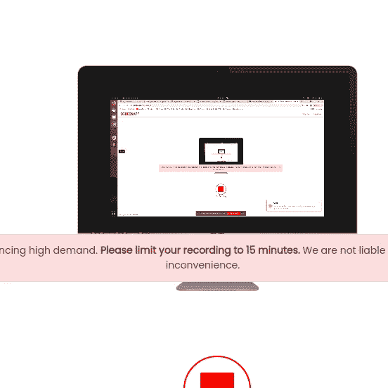

# Pygame–控制精灵

> 原文:[https://www.geeksforgeeks.org/pygame-control-sprites/](https://www.geeksforgeeks.org/pygame-control-sprites/)

在本文中，我们将讨论如何控制精灵，如向前、向后、缓慢或加速，以及精灵应该具有的一些属性。我们将在我们的程序中添加**事件处理程序**来响应击键事件，当玩家使用键盘上的箭头键时，我们将调用我们的纯方法来移动屏幕上的对象。

## 使用的功能

*   **moveRight():** 此方法采用参数像素，即一个对象应该向右移动多少像素。它基本上是向对象的当前 x 坐标添加像素。
*   **moveLeft():** 这个方法取参数 pixels，意思是一个对象应该向左移动多少像素。它基本上是从物体的当前 x 坐标中减去像素。
*   **moveForward():** 这个方法取一个自变量速度，意思是速度会增加多少个因子。它基本上是在物体的 y 方向上以 n 的因子增加速度。
*   **moveBackward():** 这个方法取一个自变量速度，也就是速度会降低多少倍**。**在物体的 y 方向上，基本上是以 n 为因子的递减速度。

让我们首先看看一个 Sprite 类的实现，它帮助我们在 PyGame 表面上创建一个对象，并添加了 4 个方法来帮助我们向前、向后、向右和向左移动。

**示例:**雪碧类

## 蟒蛇 3

```
import pygame

# GLOBAL VARIABLES
COLOR = (255, 100, 98)
SURFACE_COLOR = (167, 255, 100)
WIDTH = 500
HEIGHT = 500

# Object class
class Sprite(pygame.sprite.Sprite):
    def __init__(self, color, height, width):
        super().__init__()

        self.image = pygame.Surface([width, height])
        self.image.fill(SURFACE_COLOR)
        self.image.set_colorkey(COLOR)

        pygame.draw.rect(self.image,
                         color,
                         pygame.Rect(0, 0, width, height))

        self.rect = self.image.get_rect()

    def moveRight(self, pixels):
        self.rect.x += pixels

    def moveLeft(self, pixels):
        self.rect.x -= pixels

    def moveForward(self, speed):
        self.rect.y += speed * speed/10

    def moveBack(self, speed):
        self.rect.y -= speed * speed/10
```

现在我们将看到我们如何控制我们的主程序循环来处理精灵。当用户使用鼠标或键盘时，循环的第一部分将响应交互等事件。稍后，我们将处理对象上的上述事件处理方法。每个事件处理程序将从 Sprite 类调用相关的方法。

在这段代码中，我们控制了我们的对象，也就是说，根据我们给定的方向，我们的对象是一个对象，如果我们按下右箭头键，它将向那个方向移动，所有箭头键都是一样的。这里，我们使用 **pygame。KEYDOWN** 方法初始化方法使用箭头键来控制对象，稍后，我们必须控制相应的方法来触发特定的键来执行特定的动作。

例如，如果我们有一个右箭头键，我们必须调用 **pygame。K_RIGHT** 方法向物体方向向右移动，与**的 pyagme 类似。K_DOWN** 方法，用于向物体方向上移。

**示例:**控制精灵

## 蟒蛇 3

```
import random
import pygame

# Global Variables
COLOR = (255, 100, 98)
SURFACE_COLOR = (167, 255, 100)
WIDTH = 500
HEIGHT = 500

# Object class
class Sprite(pygame.sprite.Sprite):
    def __init__(self, color, height, width):
        super().__init__()

        self.image = pygame.Surface([width, height])
        self.image.fill(SURFACE_COLOR)
        self.image.set_colorkey(COLOR)

        pygame.draw.rect(self.image,
                         color,
                         pygame.Rect(0, 0, width, height))

        self.rect = self.image.get_rect()

    def moveRight(self, pixels):
        self.rect.x += pixels

    def moveLeft(self, pixels):
        self.rect.x -= pixels

    def moveForward(self, speed):
        self.rect.y += speed * speed/10

    def moveBack(self, speed):
        self.rect.y -= speed * speed/10

pygame.init()

RED = (255, 0, 0)

size = (WIDTH, HEIGHT)
screen = pygame.display.set_mode(size)
pygame.display.set_caption("Creating Sprite")

all_sprites_list = pygame.sprite.Group()

playerCar = Sprite(RED, 20, 30)
playerCar.rect.x = 200
playerCar.rect.y = 300

all_sprites_list.add(playerCar)

exit = True
clock = pygame.time.Clock()

while exit:
    for event in pygame.event.get():
        if event.type == pygame.QUIT:
            exit = False
        elif event.type == pygame.KEYDOWN:
            if event.key == pygame.K_x:
                exit = False

    keys = pygame.key.get_pressed()
    if keys[pygame.K_LEFT]:
        playerCar.moveLeft(10)
    if keys[pygame.K_RIGHT]:
        playerCar.moveRight(10)
    if keys[pygame.K_DOWN]:
        playerCar.moveForward(10)
    if keys[pygame.K_UP]:
        playerCar.moveBack(10)

    all_sprites_list.update()
    screen.fill(SURFACE_COLOR)
    all_sprites_list.draw(screen)
    pygame.display.flip()
    clock.tick(60)

pygame.quit()
```

**输出:**

