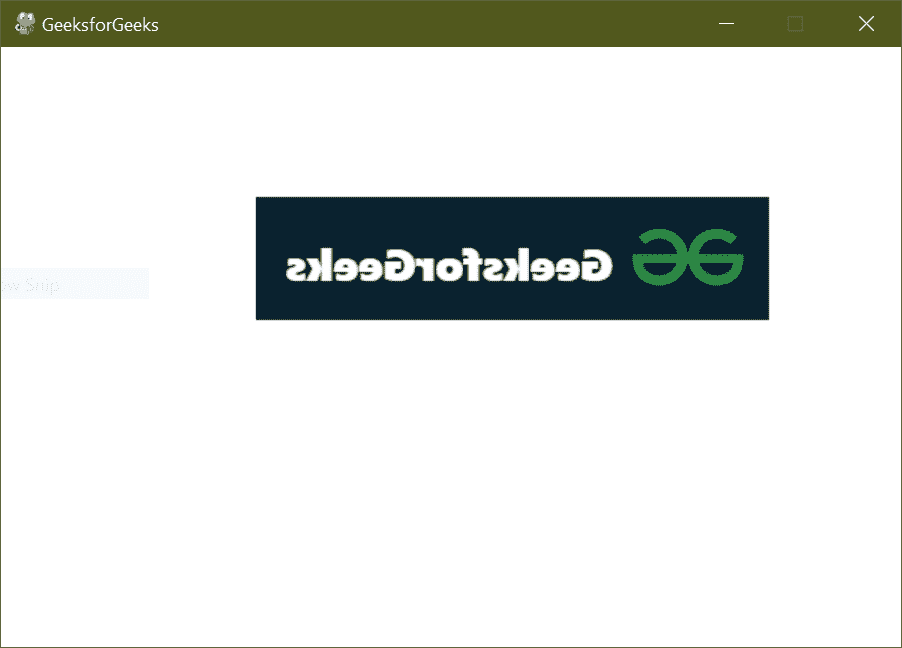
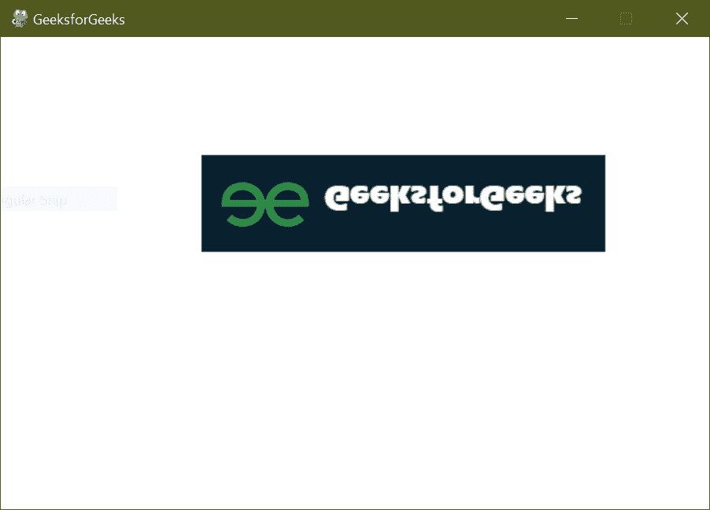

# Pygame–翻转图像

> 原文:[https://www.geeksforgeeks.org/pygame-flip-the-image/](https://www.geeksforgeeks.org/pygame-flip-the-image/)

在本文中，我们将看到如何使用 Pygame 翻转图像。

要翻转图像，我们需要使用**pygame . transform . flip(Surface，xbool，ybool)** 方法，根据我们的需要调用该方法在垂直方向或水平方向翻转图像。

**语法:**

> pygame.transform.flip(曲面、xbool、ybool)

### 在垂直方向翻转图像

在这种情况下，我们必须在垂直方向翻转图像。我们将使用 **pygame.transform.flip()** 垂直显示图像。将 xbool 作为 True 传递，将 ybool 作为 False 传递，以便图像垂直翻转。

**使用的输入:**


## 蟒蛇 3

```
# import pygame and sys
import pygame
import sys

from pygame.locals import *

# pygame.init() will initialize all
# imported module
pygame.init()
pygame.display.set_caption('GeeksforGeeks')

# screen size will display on screen
screen = pygame.display.set_mode((600, 400), 0, 32)

# pygame.image.load() will return the
# object that has image
img = pygame.image.load('image.png')

while True:

    # Background color
    screen.fill((255, 255, 255))

    # image copy
    img_copy = img.copy()

    # pygame.transform.flip() will flip the image
    img_with_flip = pygame.transform.flip(img_copy, True, False)

    # surface.blit() function draws a source 
    # Surface onto this Surface.
    screen.blit(img_with_flip, (50 + 1 * 120, 100))

    # event listener to quit screen
    for event in pygame.event.get():
        if event.type == QUIT:
            pygame.quit()
            sys.exit()

    # update the frame per second
    pygame.display.update()
```

**输出**



### 在水平方向翻转图像

在这种情况下，我们必须在水平方向翻转图像。为此，将 xbool 作为 False 传递，将 ybool 作为 True 传递，以水平翻转它。

**程序:**

## 蟒蛇 3

```
# import pygame and sys
import pygame
import sys

from pygame.locals import *

# pygame.init() will initialize all 
# imported module
pygame.init()
pygame.display.set_caption('GeeksforGeeks')

# screen size will display on screen
screen = pygame.display.set_mode((600, 400), 0, 32)

# pygame.image.load() will return the
# object that has image
img = pygame.image.load('image.png')

while True:

    # Background color
    screen.fill((255, 255, 255))

    # image copy
    img_copy = img.copy()

    # pygame.transform.flip() will flip the image
    img_with_flip = pygame.transform.flip(img_copy, False, True)

    # surface.blit() function draws a source 
    # Surface onto this Surface.
    screen.blit(img_with_flip, (50 + 1 * 120, 100))

    # event listener to quit screen
    for event in pygame.event.get():
        if event.type == QUIT:
            pygame.quit()
            sys.exit()

    # update the frame per second
    pygame.display.update()
```

**输出**

