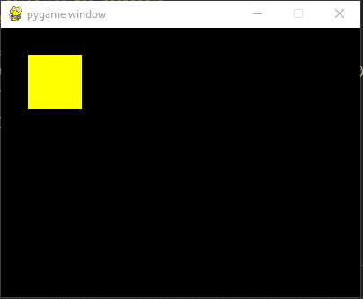
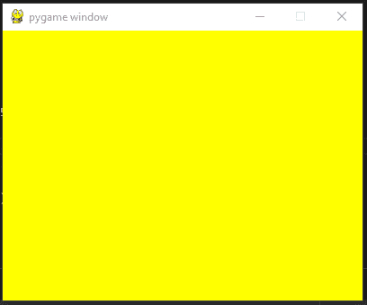
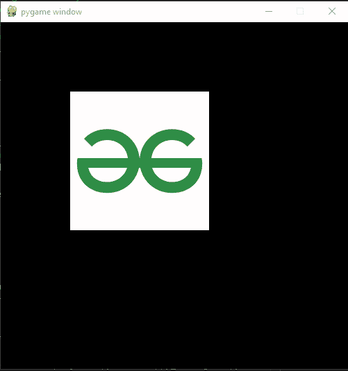
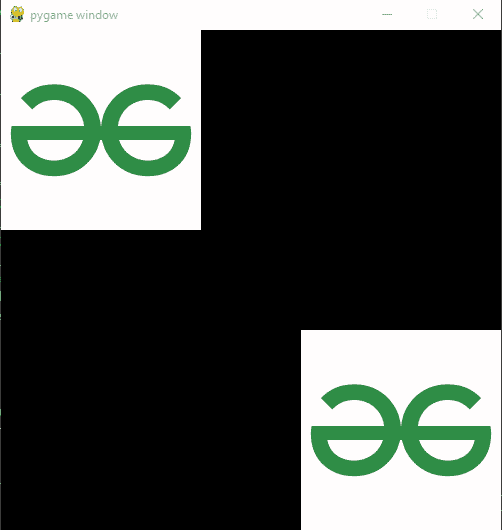
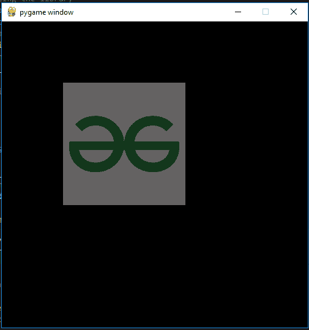

# 游戏–表面

> 哎哎哎:# t0]https://www . geeksforgeeks . org/pygame-surface/

使用 Pygame 时，曲面通常用于表示对象的外观及其在屏幕上的位置。我们在 Pygame 中创建的所有对象、文本和图像都是使用曲面创建的。

## 创建曲面

在 pygame 中创建表面非常容易。我们只需要用元组将高度和宽度传递给 **pygame。面()**法。我们可以使用各种方法来格式化我们想要的表面。比如我们可以使用 **pygame.draw()** 来绘制形状，我们可以使用 **surface.fill()** 方法在表面进行填充。现在，实现这些功能。让我们讨论语法和参数。

> **语法** : pygame.surface()
> 
> 它需要 4 个参数一组宽度和高度，标志，深度，掩码。

### **pygame.draw():**

它用来画一个物体，形状。

> **语法:** *表面矩形(表面、颜色、矩形)*

使用 pygame.draw.rect()方法绘制矩形的代码如下:

## 计算机编程语言

```
# Importing the library
import pygame
import time

# Initializing Pygame
pygame.init()

# Creating the surface
sample_surface = pygame.display.set_mode((400,300))

# Choosing red color for the rectangle
color = (255,255,0)

# Drawing Rectangle
pygame.draw.rect(sample_surface, color,
                 pygame.Rect(30, 30, 60, 60))

# The pygame.display.filp() method is used
# to update content on the display screen
pygame.display.flip()
```

**输出:**



### surface_name.fill():

**pygame。表面填充:**用于在表面填充颜色。

> **语法:** pygame.Surface. *填充(颜色，rect =无，special_flags=0)*

使用 surface_name.fill()方法在曲面中填充颜色的代码是:

## 计算机编程语言

```
# Importing the library
import pygame

# Initializing Pygame
pygame.init()

# Creating the surface
sample_surface = pygame.display.set_mode((400,300))

# Choosing yellow color to fill
color = (255,255,0)

# filling color to the surface
sample_surface.fill(color)

# updating the display
pygame.display.flip()
```

**输出:**



## 在表面上加载图像

虽然我们可以在表面上绘制形状和填充颜色，但我们仍然需要在表面上有一张图片。我们可以用 pygame.image.load()方法很容易地做出这样的曲面。此方法将图像路径相对或绝对作为输入。

> **语法:** pygame.image.load(img)

**代码:**

## 计算机编程语言

```
# Importing the library
import pygame

# Initializing Pygame
pygame.init()

# creating the display surface
display_surface = pygame.display.set_mode((500, 500 ))

# Creating the image surface
image = pygame.image.load('gfg_logo.png')

# putting our image surface on display
# surface
display_surface.blit(image,(100,100))

# updating the display
pygame.display.flip()
```

**输出:**



## 添加块传输

要显示一个表面，它需要在屏幕上显示。块传输可以被认为是将一个表面的像素复制到另一个表面。我们可以使用 [surface.blit()](https://www.geeksforgeeks.org/pygame-surface-blit-function/) 方法进行 blit，该方法将需要进行 blit 的曲面作为第一个参数，将坐标元组作为第二个坐标。

> **语法:** pygame.Surface. *blit(源，目的地，区域=无，特殊 _flags=0)*

## 计算机编程语言

```
# Importing the library
import pygame

# Initializing Pygame
pygame.init()

# creating the display surface
display_surface = pygame.display.set_mode((500, 500 ))

# Creating the first image surface
image1 = pygame.image.load('gfg_logo.png')

# Creating the second image surface
image2 = pygame.image.load('gfg_logo.png')

# putting our first image surface on
# display surface
display_surface.blit(image1,(0,0))

# putting our second image surface on
# display surface
display_surface.blit(image1,(300,300))

# updating the display
pygame.display.flip()
```

**输出:**



既然我们已经讨论了一些表面函数。blit()，。填充()，等。让我们讨论 pygame 屏幕的一些更重要的功能。

*   **pygame。Surface.convert:** 制作一个像素格式改变的曲面副本。新的像素格式可以根据现有的表面或深度来确定，可以使用标志和遮罩参数。

> **语法** : pygame。曲面.转换(曲面=无)

**代码:**

## 计算机编程语言

```
# Importing the library
import pygame

# Initializing Pygame
pygame.init()

# Creating the surface
sample_surface = pygame.display.set_mode((400,300))

# changing the pixel format of an image
pygame.Surface.convert(sample_surface)

# updating the display
pygame.display.flip()
```

**输出:**


*   **pygame。它用所需的像素格式创建一个新的表面副本。新表面的格式将适合于使用每像素 alpha 快速传送到给定的格式。如果没有给定曲面，新曲面将被优化，以便与当前显示进行块传输。**

> **语法:** pygame。曲面.转换α(曲面)

**代码:**

## 计算机编程语言

```
# Importing the library
import pygame

# Initializing Pygame
pygame.init()

# Creating the surface
sample_surface = pygame.display.set_mode((400,300))

# changing the pixel format
# of an image including per pixel alphas
pygame.Surface.convert_alpha(sample_surface)

# updating the display
pygame.display.flip()
```

**输出:**


*   **pygame。曲面复制:**它创建曲面的新副本。复制的曲面将具有与原始曲面相同的像素格式、调色板、透明度设置和类别。

> **语法:** pygame。Surface.copy()

**代码:**

## 计算机编程语言

```
# Importing the library
import pygame

# Initializing Pygame
pygame.init()

# Creating the surface
sample_surface = pygame.display.set_mode((400,300))

# creating a copy of sample_surface
# and naming it as copied_surface
copied_surface=pygame.Surface.copy(sample_surface)

# updating the display
pygame.display.flip()
```

**输出:**


*   **pygame。设置表面的当前颜色键。将此表面块传送到目标时，任何与 colorkey 颜色相同的像素都将是透明的。**

> **语法:** set_colorkey(颜色，标志=0)

**代码:**

## 计算机编程语言

```
# Importing the library
import pygame

# Initializing Pygame
pygame.init()

# creating the display surface
display_surface = pygame.display.set_mode((500, 500 ))

# Creating the image surface
image = pygame.image.load('gfg_logo.png')

# putting our image surface on display surface
# making the white colored part
# of the surface as transparent
pygame.Surface.set_colorkey (image, [255,255,255])

display_surface.blit(image,(100,100))

# updating the display
pygame.display.flip()
```

**输出:**


上述代码的输出将是黑色表面上的 geeksforgeeks 标志，白色像素变为透明。

*   **pygame。返回曲面的当前颜色键值。如果没有设置颜色键，则返回无。**

> **语法:** get_colorkey()

**代码:**

## 计算机编程语言

```
# Importing the library
import pygame

# Initializing Pygame
pygame.init()

# creating the display surface
display_surface = pygame.display.set_mode((500, 500))

# Creating the image surface
image = pygame.image.load('gfg_logo.png')

# putting our image surface on display surface
# making the white colored part of the surface
# as transparent
pygame.Surface.set_colorkey(image, [255, 255, 255])

# printing the colorkey value for the surface
print(pygame.Surface.get_colorkey(image))

display_surface.blit(image, (100, 100))

# updating the display
pygame.display.flip()
```

**输出:**


上述代码的输出将是一个窗口，显示 get_colorkey 示例中看到的各种表面，并且还将打印 colorkey 值。

*   **pygame。曲面集α:**为整个曲面图像设置的α值。传递 0 表示不可见，传递 255 表示完全不透明。

> **语法:** set_alpha(值，标志=0)或 set_alpha(无)

**代码:**

## 计算机编程语言

```
# Importing the library
import pygame

# Initializing Pygame
pygame.init()

# creating the display surface
display_surface = pygame.display.set_mode((500, 500 ))

# Creating the image surface
image = pygame.image.load('gfg_logo.png')

# putting our image surface on display surface
# making the alpha value of surface as 100
pygame.Surface.set_alpha(image, 100)

display_surface.blit(image,(100,100))

# updating the display
pygame.display.flip()
```

**输出:**



上面代码的输出将是，geeksforgeeks 标志，它将稍微透明，因为我们已经将其 alpha 值更改为 100。

*   **pygame。Surface.get_alpha:** 返回当前曲面的 alpha 值。

> **语法:** get_alpha()

**代码:**

## 计算机编程语言

```
# Importing the library
import pygame

# Initializing Pygame
pygame.init()

# creating the display surface
display_surface = pygame.display.set_mode((500, 500 ))

# Creating the image surface
image = pygame.image.load('gfg_logo.png')

# putting our image surface on display surface
# making alpha value of image surface to 100
pygame.Surface.set_alpha(image, 100)

# printing the alpha value of the surface
print(pygame.Surface.get_alpha(image))

display_surface.blit(image,(100,100))

# updating the display
pygame.display.flip()
```

**输出:**


上述代码的输出将是一个窗口，显示 set_alpha 示例中看到的各种表面，并且还将打印 alpha 值。