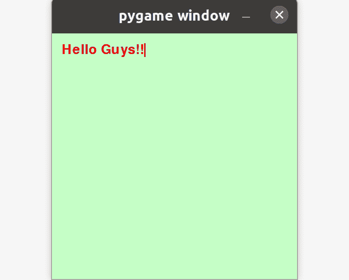
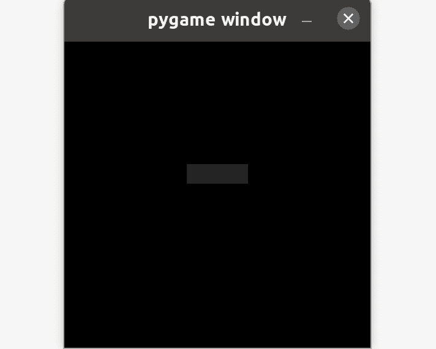

# Pygame–处理文本

> 原文:[https://www.geeksforgeeks.org/pygame-working-with-text/](https://www.geeksforgeeks.org/pygame-working-with-text/)

在本文中，我们将看到如何使用 Pygame 模块处理文本。我们将在这里处理初始化字体，渲染文本，使用键盘编辑文本，以及添加一个闪烁的光标注释。

### 装置

要安装此模块，请在终端中键入以下命令。

```py
pip install pygame
```

## **字体初始化**

现在我们可以继续字体初始化部分。使用 **pygame.font.init()** 方法初始化字体，使用 **pygame.font.get_init()** 方法检查字体是否已经初始化。这两种方法都不需要任何参数。如果字体初始化成功，那么**方法返回真。**


## 在窗口上打印文本

这里我们将看到如何在屏幕上获得定制的字体和文本。我们将使用 x 和 y 坐标设置文本在屏幕上显示的位置。首先，我们将创建字体文件，然后渲染文本。**屏幕。** **blit()** 功能用于将文本表面对象复制到显示表面对象的中心坐标。

## 蟒蛇 3

```py
# import pygame
import pygame

# initializing pygame
pygame.font.init()

# check whether font is initialized
# or not
pygame.font.get_init()

# create the display surface
display_surface = pygame.display.set_mode((500, 500))

# change the window screen title
pygame.display.set_caption('Our Text')

# Create a font file by passing font file
# and size of the font
font1 = pygame.font.SysFont('freesanbold.ttf', 50)
font2 = pygame.font.SysFont('chalkduster.ttf', 40)

# Render the texts that you want to display
text1 = font1.render('GeeksForGeeks', True, (0, 255, 0))
text2 = font2.render('GeeksForGeeks', True, (0, 255, 0))

# create a rectangular object for the
# text surface object
textRect1 = text1.get_rect()
textRect2 = text2.get_rect()

# setting center for the first text
textRect1.center = (250, 250)

# setting center for the second text
textRect2.center = (250, 300)

while True:

    # add background color using RGB values
    display_surface.fill((255, 0, 0))

    # copying the text surface objects
    # to the display surface objects
    # at the center coordinate.
    display_surface.blit(text1, textRect1)
    display_surface.blit(text2, textRect2)

    # iterate over the list of Event objects
    # that was returned by pygame.event.get()
    # method.
    for event in pygame.event.get():

        if event.type == pygame.QUIT:

            # deactivating the pygame library
            pygame.quit()

            # quitting the program.
            quit()

        # update the display
        pygame.display.update()
```

**输出:**


## 窗口上的光标输入

我们将在这里添加闪烁光标注释。每隔 0.5 秒，我们的光标就会继续闪烁。我们也可以编辑我们的文本。

## 蟒蛇 3

```py
# import pygame module
import pygame

# import time module
import time

# initialize the pygame module
pygame.init()

# set the window screen size
display_screen = pygame.display.set_mode((500, 500))

# add some text
text = 'Hello Guys!!'

# add default font style with font
# size
font = pygame.font.SysFont(None, 40)

# render the text
img = font.render(text, True, (255, 0, 0))

rect = img.get_rect()
rect.topleft = (20, 20)
cursor = pygame.Rect(rect.topright, (3, rect.height))

running = True

while running:

    for event in pygame.event.get():
        if event.type == pygame.QUIT:
            running = False

        # detect if key is physically
        # pressed down
        if event.type == pygame.KEYDOWN:
            if event.key == pygame.K_BACKSPACE:
                if len(text) > 0:

                    # stores the text except last
                    # character
                    text = text[:-1]

            else:
                text += event.unicode

            img = font.render(text, True, (255, 0, 0))
            rect.size = img.get_size()
            cursor.topleft = rect.topright

    # Add background color to the window screen
    display_screen.fill((200, 255, 200))
    display_screen.blit(img, rect)

    # cursor is made to blink after every 0.5 sec
    if time.time() % 1 > 0.5:
        pygame.draw.rect(display_screen, (255, 0, 0), cursor)

    # update display
    pygame.display.update()

pygame.quit()
```

**输出:**



## 窗口上的输入框

这里我们将看到如何在 pygame 中使用键盘阅读文本。我们将在一个矩形内显示我们的文本。当鼠标移到矩形上时，矩形的颜色会改变。为了清楚理解，代码中添加了注释。

## 蟒蛇 3

```py
# import pygame module
import pygame

# import sys library
import sys

# initializing pygame
pygame.init()

clock = pygame.time.Clock()

# Set the window screen size
display_screen = pygame.display.set_mode((500, 500))

# add font style and size
base_font = pygame.font.Font(None, 40)

# stores text taken by keyboard
user_text = ''

# set left, top, width, height in
# Pygame.Rect()
input_rect = pygame.Rect(200, 200, 140, 32)
color_active = pygame.Color("lightskyblue")
color_passive = pygame.Color("gray15")
color = color_passive

active = False

while True:

    for event in pygame.event.get():
        if event.type == pygame.QUIT:
            pygame.quit()
            sys.exit()

        # when mouse collides with the rectangle
        # make active as true
        if event.type == pygame.MOUSEBUTTONDOWN:
            if input_rect.collidepoint(event.pos):
                active = True

        # if the key is physically pressed down
        if event.type == pygame.KEYDOWN:
            if event.key == pygame.K_BACKSPACE:

                # stores text except last letter
                user_text = user_text[0:-1]
            else:
                user_text += event.unicode

    display_screen.fill((0, 0, 0))

    if active:
        color = color_active
    else:
        color = color_passive

    pygame.draw.rect(display_screen, color, input_rect)

    # render the text
    text_surface = base_font.render(user_text, True, (255, 255, 255))
    display_screen.blit(text_surface, (input_rect.x + 5, input_rect.y + 5))
    input_rect.w = max(100, text_surface.get_width() + 10)
    pygame.display.flip()
    clock.tick(60)
```

**输出:**

