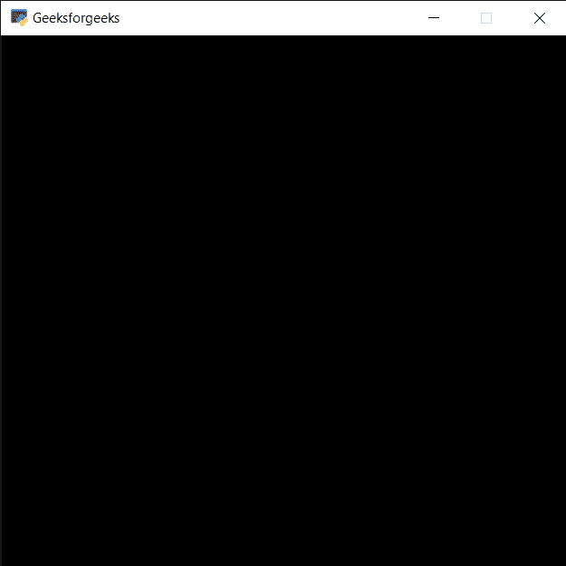

# PYGLET–清算窗口

> 原文:[https://www.geeksforgeeks.org/pyglet-clearing-window/](https://www.geeksforgeeks.org/pyglet-clearing-window/)

在本文中，我们将看到如何在 python 的 PYGLET 模块中清除一个窗口。Pyglet 是一个易于使用但功能强大的库，用于开发视觉上丰富的图形用户界面应用程序，如游戏、多媒体等。窗口是占用操作系统资源的“重量级”对象。窗口可能显示为浮动区域，或者可以设置为充满整个屏幕(全屏)。清除窗口是清除颜色和深度缓冲区的一种方便的方法，换句话说，清除会移除窗口上绘制的所有元素。

我们可以在下面命令的帮助下创建一个窗口

```py
 pyglet.window.Window(width, height, title)

```

> 为了创建窗口，我们使用`clear`方法与窗口对象
> **语法:** window.clear()
> 
> **论证:**不需要论证
> 
> **返回:**返回无

下面是实现

```py
# importing pyglet module
import pyglet

# width of window
width = 500

# height of window
height = 500

# caption i.e title of the window
title = "Geeksforgeeks"

# creating a window
window = pyglet.window.Window(width, height, title)

# text 
text = "GeeksforGeeks"

# creating a label with font = times roman
# font size = 36
# aligning it to the centre
label = pyglet.text.Label(text,
                          font_name ='Times New Roman',
                          font_size = 36,
                          x = window.width//2, y = window.height//2,
                          anchor_x ='center', anchor_y ='center')

# on draw event
@window.event
def on_draw():

    # drawing the label on the window
    label.draw()

    # clearing the window
    window.clear()

# start running the application
pyglet.app.run()
```

**输出:**
