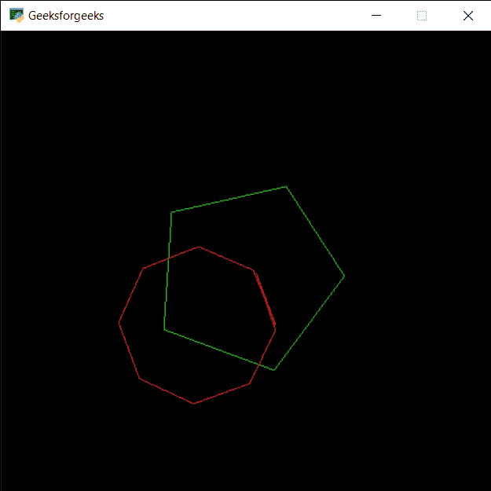

# PYGLET–绘制弧线

> 原文:[https://www.geeksforgeeks.org/pyglet-drawing-arc/](https://www.geeksforgeeks.org/pyglet-drawing-arc/)

在本文中，我们将看到如何在 python 的 PYGLET 模块中在窗口上绘制弧线。Pyglet 是一个易于使用但功能强大的库，用于开发视觉上丰富的图形用户界面应用程序，如游戏、多媒体等。窗口是占用操作系统资源的“重量级”对象。窗口可能显示为浮动区域，或者可以设置为充满整个屏幕(全屏)。圆弧是圆周的一部分。在上图中，弧线是圆的蓝色部分。严格来说，弧可以是其他曲线形状的一部分，例如椭圆，但它几乎总是指圆。借助 pyglet 中的 shapes 模块绘制弧线。
我们可以借助下面给出的命令创建一个窗口

```
# creating a window
window = pyglet.window.Window(width, height, title)
```

> 为了创建窗口，我们使用弧方法与皮格莱特形状
> **语法:**形状。
> **参数:**取前两个整数即弧位置，第三个整数为大小，第四个是整数即线段，第五个是浮点数即角度，第六个是颜色，最后一个是批次对象
> **返回:**返回 Arc 对象

下面是实现

## 蟒蛇 3

```
# importing pyglet module
import pyglet

# importing shapes from the pyglet
from pyglet import shapes

# width of window
width = 500

# height of window
height = 500

# caption i.e title of the window
title = "Geeksforgeeks"

# creating a window
window = pyglet.window.Window(width, height, title)

# creating a batch object
batch = pyglet.graphics.Batch()

# properties of circle
# co-ordinates of circle
arc_x = 250
arc_y = 250

# size of arch
size_arc = 100

# segments
segments = 5

# angle
angle = 20

# color = green
color = (50, 225, 30)

# creating a arc
arc1 = shapes.Arc(arc_x, arc_y, size_arc, segments, angle, color, batch = batch)

# changing opacity of the arc1
# opacity is visibility (0 = invisible, 255 means visible)
arc1.opacity = 250

# creating another circle with other properties
# new position = circle1_position - 50
# new size = previous radius -20
# new color = red
color = (255, 30, 30)

# increase segments
segments = 10

# decreasing angle
angle = 7

# creating another arc
arc2 = shapes.Arc(arc_x-50, arc_y-50, size_arc-20, segments, angle, color, batch = batch)

# changing opacity of the arce2
arc2.opacity = 255

# window draw event
@window.event
def on_draw():

    # clear the window
    window.clear()

    # draw the batch
    batch.draw()

# run the pyglet application
pyglet.app.run()
```

**输出:**

