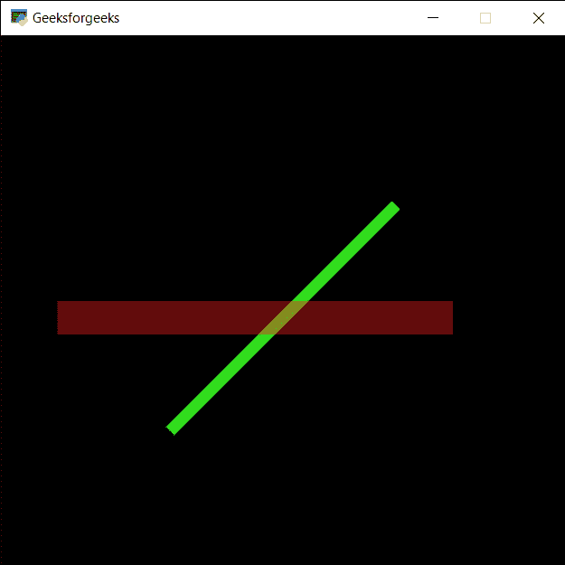

# PYGLET–画线

> 原文:[https://www.geeksforgeeks.org/pyglet-drawing-line/](https://www.geeksforgeeks.org/pyglet-drawing-line/)

在本文中，我们将看到如何在 python 的 PYGLET 模块中在窗口上画线。Pyglet 是一个易于使用但功能强大的库，用于开发视觉上丰富的图形用户界面应用程序，如游戏、多媒体等。窗口是占用操作系统资源的“重量级”对象。窗口可能显示为浮动区域，或者可以设置为充满整个屏幕(全屏)。谱线形状描述了在光谱学中观察到的特征的形式，对应于原子、分子或离子的能量变化。理想的线形包括洛伦兹函数、高斯函数和福伊特函数，它们的参数是线的位置、最大高度和半宽。线是借助 pyglet 中的 shapes 模块绘制的。

我们可以在下面命令的帮助下创建一个窗口

```
# creating a window
window = pyglet.window.Window(width, height, title)
```

> 为了创建窗口，我们使用了带有 pyglet.shapes 的 Line 方法
> **语法:**形状。Line(co_x1，co_y1，co_x2，co_y2，width，color = (50，225，30)，batch=batch)
> **引数:**取两个整数对形式的起始位置和结束位置，线宽，线条颜色，最后是 batch 对象
> **返回:**返回 Line 对象

下面是实现

## 蟒蛇 3

```
# importing pyglet module
import pyglet

# importing shapes from the pyglet
from pyglet import shapes

# width of window
width = 500

# height of window
height = 500

# caption i.e title of the window
title = "Geeksforgeeks"

# creating a window
window = pyglet.window.Window(width, height, title)

# creating a batch object
batch = pyglet.graphics.Batch()

# properties of line
# first co-ordinates of line
co_x1 = 150
co_y1 = 150

# second co-ordinates of line
co_x2 = 350
co_y2 = 350

# width of line
width = 10

# color = green
color = (50, 225, 30)

# creating a line
line1 = shapes.Line(co_x1, co_y1, co_x2, co_y2, width, color = (50, 225, 30), batch = batch)

# changing opacity of the line1
# opacity is visibility (0 = invisible, 255 means visible)
line1.opacity = 250

# creating another line with properties
# x1, y1 = 50, 250
# x2, y2 = 400, 250
# color = red
line2 = shapes.Line(50, 250, 400, 250, 30, color = (250, 30, 30), batch = batch)

# changing opacity of the line2
# opacity is visibility (0 = invisible, 255 means visible)
line2.opacity = 100

# window draw event
@window.event
def on_draw():

    # clear the window
    window.clear()

    # draw the batch
    batch.draw()

# run the pyglet application
pyglet.app.run()
```

**输出:**

