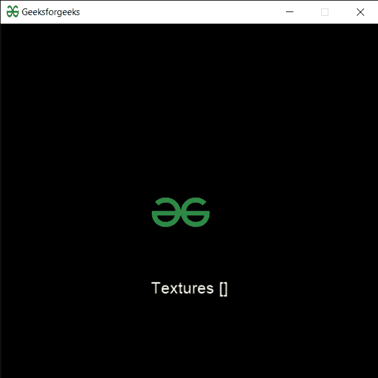

# 皮格莱特–获得切纹纹理

> 原文:[https://www . geeksforgeeks . org/pyglet-get-chachet-textures/](https://www.geeksforgeeks.org/pyglet-getting-chached-textures/)

在本文中，我们将看到如何在 python 中的 PYGLET 模块中获取纹理。Pyglet 是一个易于使用但功能强大的库，用于开发视觉上丰富的图形用户界面应用程序，如游戏、多媒体等。窗口是占用操作系统资源的“重量级”对象。窗口可能显示为浮动区域，或者可以设置为充满整个屏幕(全屏)。为了加载一个文件即资源，我们使用 pyglet 的资源模块。该模块允许应用程序指定资源的搜索路径。相对路径被认为是相对于应用程序的 __main__ 模块的。Chached 纹理是已缓存的纹理名称列表。这仅适用于调试和分析。
我们可以借助下面给出的命令
创建一个窗口对象

```py
# creating a window
window = pyglet.window.Window(width, height, title)

```

> 为了创建窗口，我们使用 get_cached_texture_names 方法和 pyglet.resource
> **语法:**resource . get _ cached _ texture _ names()
> **参数:**它不需要参数
> **返回:**它返回列表或字符串

下面是实现

## 蟒蛇 3

```py
# importing pyglet module
import pyglet
import pyglet.window.key as key

# width of window
width = 500

# height of window
height = 500

# caption i.e title of the window
title = "Geeksforgeeks"

# creating a window
window = pyglet.window.Window(width, height, title)

# text 
text = "Welcome to GeeksforGeeks"

# creating label with following properties
# font = cooper
# position = 250, 150
# anchor position = center
label = pyglet.text.Label(text,
                          font_name ='Cooper',
                          font_size = 16,
                          x = 250, 
                          y = 150,
                          anchor_x ='center', 
                          anchor_y ='center')

# creating a batch
batch = pyglet.graphics.Batch()

# loading geeksforgeeks image
image = pyglet.image.load('gfg.png')

# creating sprite object
# it is instance of an image displayed on-screen
sprite = pyglet.sprite.Sprite(image, x = 200, y = 230)

# on draw event
@window.event
def on_draw():

    # clear the window
    window.clear()

    # draw the label
    label.draw()

    # draw the image on screen
    sprite.draw()

# key press event    
@window.event
def on_key_press(symbol, modifier):

    # key "C" get press
    if symbol == key.C:

        # printing the message
        print("Key : C is pressed")

# image for icon
img = image = pyglet.resource.image("gfg.png")

# setting image as icon
window.set_icon(img)

# getting chached textures
value = pyglet.resource.get_cached_texture_names()

# setting text  of label
label.text = "Textures " + str(value)

# start running the application
pyglet.app.run()
```

**输出:**

