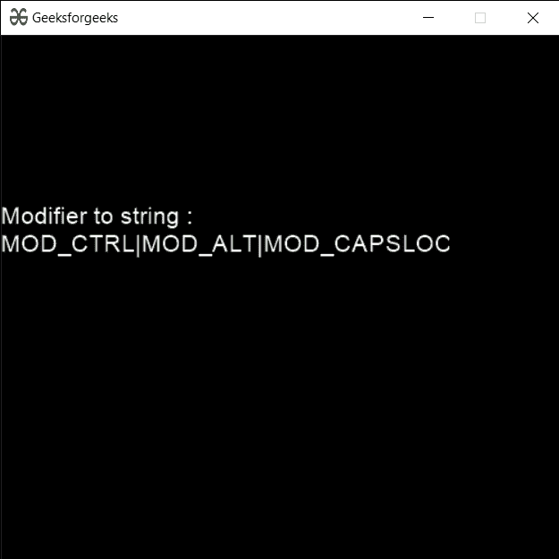

# pyglet–键修饰字符串

> 原文:[https://www.geeksforgeeks.org/pyglet-key-modifier-string/](https://www.geeksforgeeks.org/pyglet-key-modifier-string/)

在本文中，我们将看到如何在 python 的 PYGLET 模块中获取修饰符的关键字符串值。Pyglet 是一个易于使用但功能强大的库，用于开发视觉上丰富的图形用户界面应用程序，如游戏、多媒体等。窗口是占用操作系统资源的“重量级”对象。窗口可能显示为浮动区域，或者可以设置为充满整个屏幕(全屏)。按键状态处理程序类是一个简单的处理程序，它跟踪键盘上按键的状态。如果一个键被按下，那么这个处理程序为它保存一个真值。修饰符字符串返回描述一组修饰符的字符串。

我们可以在下面命令的帮助下创建一个窗口

```py
# creating a window
window = pyglet.window.Window(width, height, title) 
```

> 为了创建窗口，我们使用修饰符 _ 字符串方法与 pyglet.window.key
> **语法:** key .修饰符 _ 字符串(修饰符)
> **参数:**它采用整数，即修饰符常数的按位组合作为参数
> **返回:**它返回字符串

下面是实现

## 蟒蛇 3

```py
# importing pyglet module
import pyglet
import pyglet.window.key as key

# width of window
width = 500

# height of window
height = 500

# caption i.e title of the window
title = "Geeksforgeeks"

# creating a window
window = pyglet.window.Window(width, height, title)

# text 
text = "Welcome to GeeksforGeeks Have a nice day"

# batch object
batch = pyglet.graphics.Batch()

# creating document
document = pyglet.text.document.FormattedDocument(text)

# setting style to the document
document.set_style(0, len(document.text), dict(
                         font_name ='Arial', font_size = 16, 
                         color =(255, 255, 255, 255)))

# creating a incremental text layout
layout = pyglet.text.layout.IncrementalTextLayout(
               document, 400, 350, batch = batch)

# making layout to display multiline
layout.multiline = True

# creating a caret
caret = pyglet.text.caret.Caret(layout, color =(255, 255, 255))

# caret to window push handlers
window.push_handlers(caret)

# setting caret style
caret.set_style(dict(font_name ="Arial"))

# on draw event
@window.event
def on_draw():

    # clear the window
    window.clear()

    # draw the batch
    batch.draw()

    # caret to window push handlers
    window.push_handlers(caret)

# creating a key state handler
key_handler = pyglet.window.key.KeyStateHandler()

# key press event    
@window.event
def on_key_press(symbol, modifier):

    # key "C" get press
    if symbol == key.C:

        # printing the message
        print("Key : C is pressed")

# image for icon
img = image = pyglet.resource.image("gfg.png")

# getting modifier string
value = key.modifiers_string(10 | 20)

# creating text from the value
text = "Modifier to string : " + str(value)

# setting this text to the document
document.text = text

# setting image as icon
window.set_icon(img)

# start running the application
pyglet.app.run()
```

**输出:**

