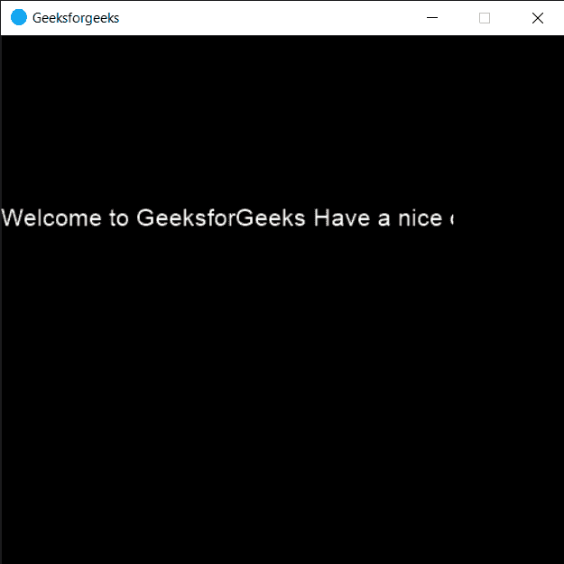

# PYGLET-On Style 文本事件格式化文档

> 原文:[https://www . geesforgeks . org/pyglet-on-style-text-event-format-document/](https://www.geeksforgeeks.org/pyglet-on-style-text-event-formatted-document/)

在本文中，我们将看到如何在 python 的 PYGLET 模块中触发 on style 文本事件。Pyglet 是一个易于使用但功能强大的库，用于开发视觉上丰富的图形用户界面应用程序，如游戏、多媒体等。窗口是占用操作系统资源的“重量级”对象。窗口可能显示为浮动区域，或者可以设置为充满整个屏幕(全屏)。格式化文档的布局通常是通过添加结构来增强其可读性，例如标题、缩进、字体变化和其他转换纯文本(未格式化)的设备，以便它们具有类似于已发布作品的外观。当用户文本样式更改时，会触发此事件。事件处理程序由文本布局绑定；应用程序不需要与此方法交互。

我们可以在下面给出的命令的帮助下创建一个窗口和格式化文档

```py
# creating a window
window = pyglet.window.Window(width, height, title)

# creating document
document = pyglet.text.document.FormattedDocument(text)
```

> 以下是 on style 文本事件
> # on style 文本事件
> @ window . event
> def on _ style _ Text(开始，结束):
> #打印文本
> 打印(“文本样式已更改”)

下面是实现

## 蟒蛇 3

```py
# importing pyglet module
import pyglet
import pyglet.window.key

# width of window
width = 500

# height of window
height = 500

# caption i.e title of the window
title = "Geeksforgeeks"

# creating a window
window = pyglet.window.Window(width, height, title)

# text
text = "Welcome to GeeksforGeeks Have a nice day"

# batch object
batch = pyglet.graphics.Batch()

# creating a formatted document
document = pyglet.text.document.FormattedDocument(text)

# setting style to the document
document.set_style(0, len(document.text), dict(font_name ='Arial', font_size = 16, color =(255, 255, 255, 255)))

# creating a incremental text layout
layout = pyglet.text.layout.IncrementalTextLayout(document, 400, 350, batch = batch)

# creating a caret
caret = pyglet.text.caret.Caret(layout, color =(150, 255, 150))

# caret to window push handlers
window.push_handlers(caret)

# setting caret style
caret.set_style(dict(font_name ="Arial"))

# on draw event
@window.event
def on_draw():

    # clear the window
    window.clear()

    # draw the batch
    batch.draw()

    # caret to window push handlers
    window.push_handlers(caret)

# key press event   
@window.event
def on_key_press(symbol, modifier):

    # key "C" get press
    if symbol == pyglet.window.key.C:

        # closing the window
        # window.close()
        pass

# on style text event
@window.event  
def on_style_text(start, end):

    # priniting text
    print("Text style changed")

# image for icon
img = image = pyglet.resource.image("logo.png")

# setting image as icon
window.set_icon(img)

# start running the application
pyglet.app.run()
```

**输出:**

