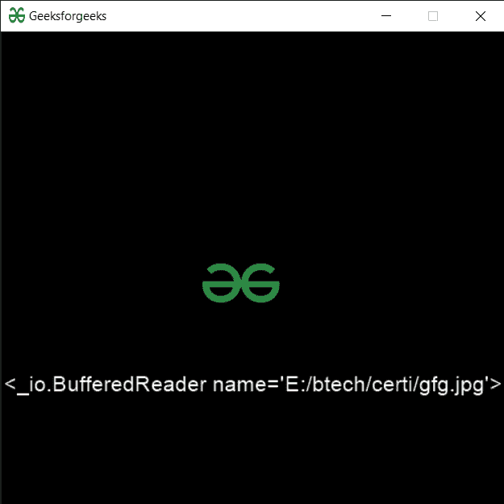

# PYGLET–使用文件位置打开文件

> 原文:[https://www . geesforgeks . org/pyglet-open-file-using-file-location/](https://www.geeksforgeeks.org/pyglet-opening-file-using-file-location/)

在本文中，我们将看到如何在 python 的 PYGLET 模块中使用文件位置对象打开文件。Pyglet 是一个易于使用但功能强大的库，用于开发视觉上丰富的图形用户界面应用程序，如游戏、多媒体等。窗口是占用操作系统资源的“重量级”对象。窗口可能显示为浮动区域，或者可以设置为充满整个屏幕(全屏)。为了创建一个文件位置对象，我们使用了 pyglet 的资源模块。该模块允许应用程序指定资源的搜索路径。相对路径被认为是相对于应用程序的 __main__ 模块的。ZIP 文件可以出现在路径上；他们将在里面被搜查。可以使用要打开的文件名打开文件所在的文件夹。
我们可以借助下面给出的命令
创建一个窗口对象

```py
# creating a window
window = pyglet.window.Window(width, height, title)
```

> 为了创建窗口，我们对文件位置对象
> **使用 open 方法语法:** file.open(name)
> **参数:**它以文件名即字符串作为参数
> **Return :** 它返回 class '_io。缓冲恐惧者

下面是实现

## 蟒蛇 3

```py
# importing pyglet module
import pyglet
import pyglet.window.key as key

# width of window
width = 500

# height of window
height = 500

# caption i.e title of the window
title = "Geeksforgeeks"

# creating a window
window = pyglet.window.Window(width, height, title)

# text 
text = "Welcome to GeeksforGeeks"

# creating label with following properties
# font = cooper
# position = 250, 150
# anchor position = center
label = pyglet.text.Label(text,
                          font_name ='Cooper',
                          font_size = 16,
                          x = 250, 
                          y = 150,
                          anchor_x ='center', 
                          anchor_y ='center')

# creating a batch
batch = pyglet.graphics.Batch()

# loading geeksforgeeks image
image = pyglet.image.load('gfg.png')

# creating sprite object
# it is instance of an image displayed on-screen
sprite = pyglet.sprite.Sprite(image, x = 200, y = 230)

# on draw event
@window.event
def on_draw():

    # clear the window
    window.clear()

    # draw the label
    label.draw()

    # draw the image on screen
    sprite.draw()

# key press event    
@window.event
def on_key_press(symbol, modifier):

    # key "C" get press
    if symbol == key.C:

        # printing the message
        print("Key : C is pressed")

# image for icon
img = image = pyglet.resource.image("gfg.png")

# setting image as icon
window.set_icon(img)

# creating a file location object
file = pyglet.resource.FileLocation("E:/btech / certi/")

# opening a file
value = file.open("gfg.jpg")

# showing value with the help of label
label.text = str(value)

# start running the application
pyglet.app.run()
```

**输出:**

