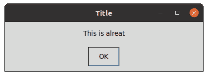
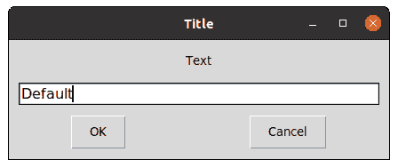
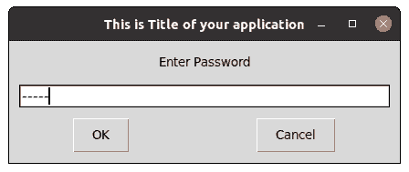

# Python 中的 PyMsgBox 模块

> 原文:[https://www.geeksforgeeks.org/pymsgbox-module-in-python/](https://www.geeksforgeeks.org/pymsgbox-module-in-python/)

PyMsgBox 是简单的、跨平台的，像 JavaScript 一样纯粹用 Python 实现消息框。它使用 Python 内置的 [Tkinter 模块](https://www.geeksforgeeks.org/python-gui-tkinter/)作为其 GUI。

### **安装**

这个模块没有内置 Python。要安装它，请在终端中键入以下命令。

```py
pip install PyMsgBox
```

PyMsgBox 中有四个函数，它们遵循 JavaScript 的消息框命名约定:

*   **警报()**
*   **提示()**
*   **确认()**
*   **超时()**
*   **密码()**

### **警报()**

此方法显示一个带有文本和单个按钮的消息框。它返回按钮的文本。

**语法:**

```py
alert(text='', title='', button='OK')
```

## 蟒蛇 3

```py
import pymsgbox as a

b = a.alert("This is alreat", 'Title')

# OK whatever you type, it will return OK
print(b)
```

**输出:**



### **确认()**

此方法显示一个带有“确定”和“取消”按钮的消息框。按钮的数量和文本可以自定义。返回单击的按钮的文本。

**语法:**

```py
confirm(text='', title='', buttons=['OK', 'Cancel'])
```

## 蟒蛇 3

```py
import pymsgbox as a

a.confirm('This is text', 'This is title', ' ')
```

**输出:**


### **提示()**

该方法显示一个带有文本输入的消息框，以及确定和取消按钮。返回输入的文本，如果单击“取消”，则返回“无”。

**语法:**

```py
prompt(text='', title='', defaultValue='')
```

## 蟒蛇 3

```py
import pymsgbox as a

a.prompt('Text', 'Title', 'Default')
```

**输出:**



### **密码()**

这个方法将显示一个屏蔽字符来代替输入的每个字符。

**语法:**

```py
password(text,title,masking-character)
```

## 蟒蛇 3

```py
import pymsgbox as a

a.password("Enter Password", 'This is Title of your application', '', '-')
```

**输出:**

