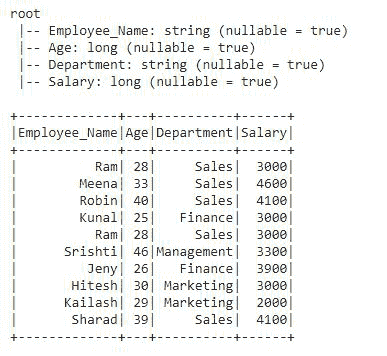
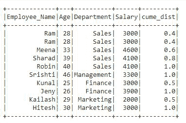
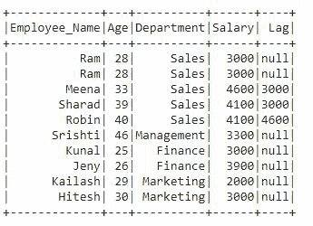
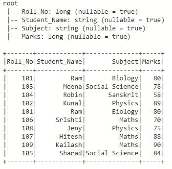
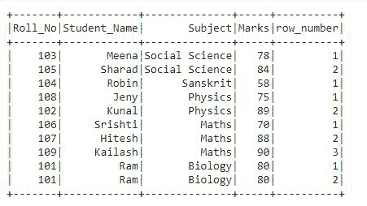
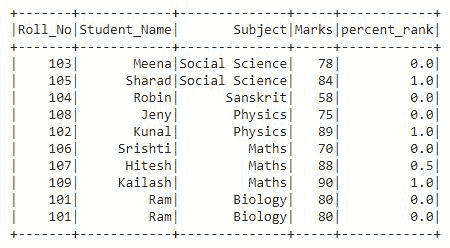
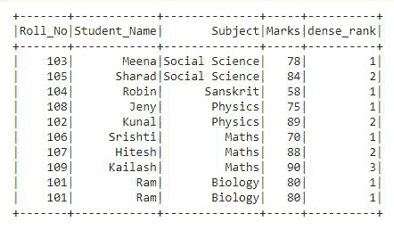
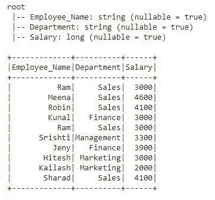
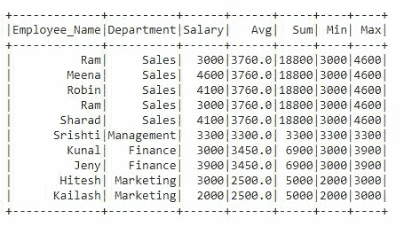

# 火花窗口功能

> 原文:[https://www.geeksforgeeks.org/pyspark-window-functions/](https://www.geeksforgeeks.org/pyspark-window-functions/)

**PySpark Window 功能**进行排名、行号等统计操作。并单独返回每行的结果。执行数据转换也越来越普遍。我们将了解窗口函数的概念、语法，以及最后如何将它们与 PySpark SQL 和 PySpark DataFrame API 一起使用。

**窗口功能主要有三种:**

*   解析函数
*   排名函数
*   聚合函数

为了首先对一组行执行窗口函数操作，我们需要进行分区，即使用 window.partition()函数定义数据行组，对于行号和秩函数，我们需要使用 order by 子句对分区数据进行额外的排序。

> 【Window.partition 语法:
> 
> window . partitionby(" column _ name ")。排序依据(“列名”)
> 
> **窗口功能语法:**
> 
> data frame . with column(" new _ col _ name "，Window_function()。覆盖(窗口分区))

让我们用例子来逐一理解和实现所有这些功能。

## **分析功能**

分析函数是对数据或由 SELECT 子句或 ORDER BY 子句划分的有限行集进行操作后返回结果的函数。它返回的结果行数与输入行数相同。例如超前()、滞后()、cume_dist()。

**创建用于演示的数据框:**

在我们开始使用这些函数之前，首先我们需要创建一个数据框架。我们将创建一个包含员工详细信息的数据框，如员工姓名、年龄、部门、工资。创建数据框后，我们将在该数据框 df 上应用每个分析函数。

## 蟒蛇 3

```
# importing pyspark
from pyspark.sql.window import Window
import pyspark

# importing sparksessio
from pyspark.sql import SparkSession

# creating a sparksession object
# and providing appName
spark = SparkSession.builder.appName("pyspark_window").getOrCreate()

# sample data for dataframe
sampleData = (("Ram", 28, "Sales", 3000),
              ("Meena", 33, "Sales", 4600),
              ("Robin", 40, "Sales", 4100),
              ("Kunal", 25, "Finance", 3000),
              ("Ram", 28, "Sales", 3000),
              ("Srishti", 46, "Management", 3300),
              ("Jeny", 26, "Finance", 3900),
              ("Hitesh", 30, "Marketing", 3000),
              ("Kailash", 29, "Marketing", 2000),
              ("Sharad", 39, "Sales", 4100)
              )

# column names for dataframe
columns = ["Employee_Name", "Age",
           "Department", "Salary"]

# creating the dataframe df
df = spark.createDataFrame(data=sampleData,
                           schema=columns)

# importing Window from pyspark.sql.window

# creating a window
# partition of dataframe
windowPartition = Window.partitionBy("Department").orderBy("Age")

# print schema
df.printSchema()

# show df
df.show()
```

**输出:**



这是我们将应用所有分析函数的数据框架。

#### 示例 1:使用 cume_dist()

cume_dist()窗口函数用于获取窗口分区内的累积分布。它类似于 SQL 中的 CUME_DIST。让我们看一个例子:

## 蟒蛇 3

```
# importing cume_dist()
# from pyspark.sql.functions
from pyspark.sql.functions import cume_dist

# applying window function with
# the help of DataFrame.withColumn
df.withColumn("cume_dist",
              cume_dist().over(windowPartition)).show()
```

**输出:**



在输出中，我们可以看到一个名为“cume_dist”的新列被添加到 df 中，它包含按年龄列排序的部门列的累积分布。

#### 示例 2:使用滞后()

lag()函数用于根据函数中定义的偏移值访问前几行的数据。这个函数类似于 SQL 中的 LAG。

## 蟒蛇 3

```
# importing lag() from pyspark.sql.functions
from pyspark.sql.functions import lag

df.withColumn("Lag", lag("Salary", 2).over(windowPartition)) \
    .show()
```

**输出:**



在输出中，我们可以看到滞后列被添加到包含滞后值的 df 中。在前 2 行中有一个空值，因为我们在 lag()函数中定义了 offset 2，后面是列 Salary。下一行包含前一行的值。

#### 示例 3:使用铅()

lead()函数用于根据函数中定义的偏移值访问下一行数据。这个函数类似于 SQL 中的 LEAD，与 SQL 中的 lag()函数或 LAG 正好相反。

## 蟒蛇 3

```
# importing lead() from pyspark.sql.functions
from pyspark.sql.functions import lead

df.withColumn("Lead", lead("salary", 2).over(windowPartition)) \
    .show()
```

**输出:**


## **排名功能**

该函数返回分区或组中每一行给定值的统计等级。该函数的目标是为结果列中的行提供连续的编号，该编号由在 OVER 子句中指定的每个分区的 Window.partition 中选择的顺序设置。例如 row_number()、rank()、dense_rank()等。

**创建用于演示的数据框:**

在我们开始使用这些函数之前，首先我们需要创建一个数据框架。我们将创建一个包含学生详细信息的数据框，如卷号、学生姓名、主题、分数。创建数据帧后，我们将在这个数据帧 df2 上应用每个排名函数。

## 蟒蛇 3

```
# importing pyspark
from pyspark.sql.window import Window
import pyspark

# importing sparksessio
from pyspark.sql import SparkSession

# creating a sparksession object and providing appName
spark = SparkSession.builder.appName("pyspark_window").getOrCreate()

# sample data for dataframe
sampleData = ((101, "Ram", "Biology", 80),
              (103, "Meena", "Social Science", 78),
              (104, "Robin", "Sanskrit", 58),
              (102, "Kunal", "Phisycs", 89),
              (101, "Ram", "Biology", 80),
              (106, "Srishti", "Maths", 70),
              (108, "Jeny", "Physics", 75),
              (107, "Hitesh", "Maths", 88),
              (109, "Kailash", "Maths", 90),
              (105, "Sharad", "Social Science", 84)
              )

# column names for dataframe
columns = ["Roll_No", "Student_Name", "Subject", "Marks"]

# creating the dataframe df
df2 = spark.createDataFrame(data=sampleData,
                            schema=columns)

# importing window from pyspark.sql.window

# creating a window partition of dataframe
windowPartition = Window.partitionBy("Subject").orderBy("Marks")

# print schema
df2.printSchema()

# show df
df2.show()
```

**输出:**



这是数据帧 df2，我们将在其上应用所有窗口排名功能。

#### 示例 1:使用 row_number()。

row_number()函数用于为表中的每一行给出一个序号。让我们看看这个例子:

## 蟒蛇 3

```
# importing row_number() from pyspark.sql.functions
from pyspark.sql.functions import row_number

# applying the row_number() function
df2.withColumn("row_number",
               row_number().over(windowPartition)).show()
```

**输出:**



在这个输出中，我们可以看到基于指定的分区，我们有每行的行号，即行号后面是主题和标记列。

#### 示例 2:使用等级()

rank 函数用于对窗口分区中指定的行进行排序。如果有联系，这个函数会在等级中留下空白。让我们看看这个例子:

## 蟒蛇 3

```
# importing rank() from pyspark.sql.functions
from pyspark.sql.functions import rank

# applying the rank() function
df2.withColumn("rank", rank().over(windowPartition)) \
    .show()
```

**输出:**


在输出中，按照窗口分区中指定的“主题”和“标记”列，为每行提供了等级。

#### 示例 3:使用 percent_rank()

这个函数类似于 rank()函数。它还为行提供排名，但采用百分制格式。让我们看看这个例子:

## 蟒蛇 3

```
# importing percent_rank() from pyspark.sql.functions
from pyspark.sql.functions import percent_rank

# applying the percent_rank() function
df2.withColumn("percent_rank",
               percent_rank().over(windowPartition)).show()
```

**输出:**



我们可以看到，在输出中，等级列包含百分比形式的值，即十进制格式的值。

#### 示例 4:使用密集秩()

此函数用于以行号的形式获取每行的排名。这类似于 rank()函数，只有一个区别，当有联系时，rank 函数会在 rank 中留下空白。让我们看看这个例子:

## 蟒蛇 3

```
# importing dense_rank() from pyspark.sql.functions
from pyspark.sql.functions import dense_rank

# applying the dense_rank() function
df2.withColumn("dense_rank",
               dense_rank().over(windowPartition)).show()
```

**输出:**



在输出中，我们可以看到行列以行号的形式给出。

## **聚合功能**

聚合函数或聚合函数是将多行的值分组以形成单个汇总值的函数。它们所操作的行组的定义是通过使用 SQL GROUP BY 子句完成的。例如平均值、总和、最小值、最大值等。

**创建用于演示的数据框:**

在开始使用这些功能之前，我们将创建一个新的数据框，其中包含员工详细信息，如员工姓名、部门和工资。创建数据框后，我们将在此数据框上应用每个聚合函数。

## 蟒蛇 3

```
# importing pyspark
import pyspark

# importing sparksessio
from pyspark.sql import SparkSession

# creating a sparksession
# object and providing appName
spark = SparkSession.builder.appName("pyspark_window").getOrCreate()

# sample data for dataframe
sampleData = (("Ram", "Sales", 3000),
              ("Meena", "Sales", 4600),
              ("Robin", "Sales", 4100),
              ("Kunal", "Finance", 3000),
              ("Ram", "Sales", 3000),
              ("Srishti", "Management", 3300),
              ("Jeny", "Finance", 3900),
              ("Hitesh", "Marketing", 3000),
              ("Kailash", "Marketing", 2000),
              ("Sharad", "Sales", 4100)
              )

# column names for dataframe
columns = ["Employee_Name", "Department", "Salary"]

# creating the dataframe df
df3 = spark.createDataFrame(data=sampleData,
                            schema=columns)

# print schema
df3.printSchema()

# show df
df3.show()
```

**输出:**



这是 DataFrame df3，我们将在其上应用所有聚合函数。

#### **示例:**让我们看看如何用这个示例应用聚合函数

## 蟒蛇 3

```
# importing window from pyspark.sql.window
from pyspark.sql.window import Window

# importing aggregate functions
# from pyspark.sql.functions
from pyspark.sql.functions import col,avg,sum,min,max,row_number

# creating a window partition of dataframe
windowPartitionAgg  = Window.partitionBy("Department")

# applying window aggregate function
# to df3 with the help of withColumn

# this is average()
df3.withColumn("Avg",
               avg(col("salary")).over(windowPartitionAgg))
    #this is sum()
  .withColumn("Sum",
              sum(col("salary")).over(windowPartitionAgg))
    #this is min()
  .withColumn("Min",
              min(col("salary")).over(windowPartitionAgg))
    #this is max()
  .withColumn("Max",
              max(col("salary")).over(windowPartitionAgg)).show()
```

**输出:**



在输出 df 中，我们可以看到有四个新列添加到 df 中。在代码中，我们已经逐一应用了所有四个聚合函数。我们在 df3 中添加了四个输出列，其中包含每行的值。这四列包含“薪资”列的平均值、总和、最小值和最大值。