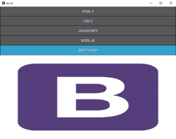
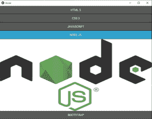
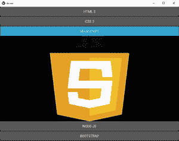
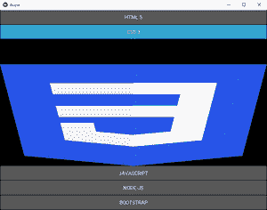
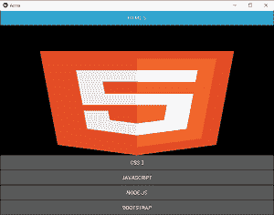

# Python |手风琴在 kivy 中使用。kv 文件

> 原文:[https://www . geesforgeks . org/python-accordion-in-kivy-using-kv-file/](https://www.geeksforgeeks.org/python-accordion-in-kivy-using-kv-file/)

Kivy 是 Python 中独立于平台的 GUI 工具。因为它可以在安卓、IOS、linux 和 Windows 等平台上运行。它基本上是用来开发安卓应用程序的，但并不意味着它不能在桌面应用程序上使用。

> ？？？？？？？？ [Kivy 教程–通过示例学习 Kivy](https://www.geeksforgeeks.org/kivy-tutorial/)。

### 手风琴:

“折叠”小部件是菜单的一种形式，其中选项垂直或水平堆叠，焦点项目(触摸时)打开以显示其内容。
它可以包含很多项实例，每个实例应该包含一个根内容小部件。它会像一棵树一样结束。

当前的实现将 AccordionItem 分为两部分:

1.  标题栏的一个容器(由 kv 模板制成)
2.  一个内容物容器

```
Basic Approach:
1) import kivy
2) import kivyApp
3) import Accordian
4) Set minimum version(optional)
5) Create Accordion class
6) Create App class
7) create .kv file (name same as the app class)
8) return Layout/widget/Class(according to requirement)
9) Run an instance of the class
```

### **实施方法:**

**。py 文件:**

## 蟒蛇 3

```
# How to use Accordion in kivy using .kv file

# Program to Show how to create a switch
# import kivy module   
import kivy 

# base Class of your App inherits from the App class.   
# app:always refers to the instance of your application  
from kivy.app import App

# this restrict the kivy version i.e 
# below this kivy version you cannot 
# use the app or software 
kivy.require('1.9.0')

# The Accordion widget is a form of menu
# where the options are stacked either vertically
# or horizontally and the item in focus
# (when touched) opens up to display its content.
from kivy.uix.accordion import Accordion

# Create the Accordion class
# Whose work is done in .kv file
class Accor(Accordion):
    pass

# Create App class
class AccorApp(App):
    def build(self):
        return Accor()

# run the App
if __name__ == '__main__':
    AccorApp().run()
```

**。千伏档:**

## 蟒蛇 3

```
# .kv file of the Accordion App file 

# Allow style to image
<MyImage@Image>:
    keep_ratio: False
    allow_stretch: True

# Use the different image to show usage of accordian
<Accor>:
    orientation: 'vertical'
    AccordionItem:
        title: 'HTML 5'
        MyImage:
            source: 'html.png'
    AccordionItem:
        title: 'CSS 3'
        MyImage:
            source: 'css.png'
    AccordionItem:
        title: 'JAVASCRIPT'
        MyImage:
            source: 'javascript.png'
    AccordionItem:
        title: 'NODE-JS'
        MyImage:
            source: 'node-js.png'
    AccordionItem:
        title: 'BOOTSTRAP'
        MyImage:
            source: 'bootstrap.png'
```

**输出:**

    

<video class="wp-video-shortcode" id="video-339699-1" width="640" height="360" preload="metadata" controls=""><source type="video/mp4" src="https://media.geeksforgeeks.org/wp-content/uploads/20210131140532/FreeOnlineScreenRecorderProject4.mp4?_=1">[https://media.geeksforgeeks.org/wp-content/uploads/20210131140532/FreeOnlineScreenRecorderProject4.mp4](https://media.geeksforgeeks.org/wp-content/uploads/20210131140532/FreeOnlineScreenRecorderProject4.mp4)</video>