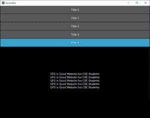
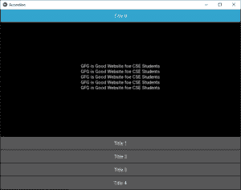
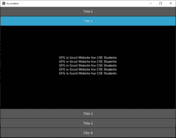
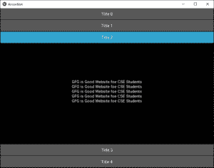
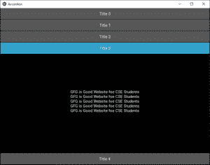

# Python | kivy 中的手风琴

> 原文:[https://www.geeksforgeeks.org/python-accordion-in-kivy/](https://www.geeksforgeeks.org/python-accordion-in-kivy/)

Kivy 是 Python 中独立于平台的 GUI 工具。因为它可以在安卓、IOS、linux 和 Windows 等平台上运行。它基本上是用来开发安卓应用程序的，但并不意味着它不能在桌面应用程序上使用。

> [Kivy 教程–通过示例学习 Kivy](https://www.geeksforgeeks.org/kivy-tutorial/)。

**手风琴:**

“折叠”小部件是一种菜单形式，其中选项垂直或水平堆叠，焦点项目(触摸时)打开以显示其内容。

它可以包含许多项实例，每个实例应该包含一个根内容小部件。你会像一棵树一样结束。
当前实现将 AccordionItem 分为两部分:

1.  标题栏的一个容器(由 kv 模板制成)
2.  一个内容物容器

您可以增加标题栏的默认大小:

> 根=手风琴(最小空间=60)

或将方向更改为垂直:

> 根=手风琴(方向= '垂直')

AccordionItem 更具可配置性，您可以在项目折叠或打开时设置自己的标题背景:

> item = AccordionItem(background _ normal = ' image _ when _ collapsed . png '，
> background _ selected = ' image _ when _ selected . png ')

```
Basic Approach:
1) import kivy
2) import kivyApp
3) import Accordian, AccordianItem
4) import Label
5) Create App class
6) return Layout/widget/Class(according to requirement)
7) Run an instance of the class
```

**实施方法:**

## 蟒蛇 3

```
# How to use Accordion in kivy using .kv file

# Program to Show how to create a switch
# import kivy module   
import kivy 

# base Class of your App inherits from the App class.   
# app:always refers to the instance of your application  
from kivy.app import App

# this restrict the kivy version i.e 
# below this kivy version you cannot 
# use the app or software 
kivy.require('1.9.0')

# The Accordion widget is a form of menu
# where the options are stacked either vertically
# or horizontally and the item in focus
# (when touched) opens up to display its content.
from kivy.uix.accordion import Accordion, AccordionItem

# Label is the text which we want
# to add on our window, give to
# the buttons and so on
from kivy.uix.label import Label

# Create the App class
class AccordionApp(App):

    def build(self):
        root = Accordion()
        root = Accordion(min_space = 60)
        # Providing the orientation
        root = Accordion(orientation ='vertical')

        # Adding text to each Accordion
        for x in range(5):
            item = AccordionItem(title ='Title % d' % x)
            item.add_widget(Label(text ='GFG is Good Website foe CSE Students\n' * 5))
            root.add_widget(item)

        # Return the root
        return root

# Run the App
if __name__ == '__main__':
    AccordionApp().run()
```

**输出:**









