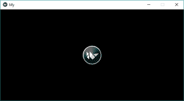
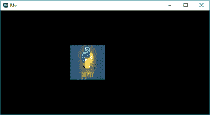

# Python |添加 Kivy 中的图像小部件

> 原文:[https://www . geesforgeks . org/python-add-image-widget-in-kivy/](https://www.geeksforgeeks.org/python-add-image-widget-in-kivy/)

Kivy 是 Python 中独立于平台的 GUI 工具。因为它可以在安卓、IOS、Linux 和视窗等平台上运行。它基本上是用来开发安卓应用的，但并不意味着它不能在桌面应用上使用。

> 👉🏽 [Kivy 教程–通过示例学习 Kivy](https://www.geeksforgeeks.org/kivy-tutorial/)。

### 图像小部件:

图像小部件用于显示图像。要使用图像小部件，您必须导入:

```
from kivy.uix.image import Image, AsyncImage
```

因为模块`**kivy.uix.image**`拥有与图像相关的所有功能。

图像可以通过两种类型加载到应用程序中:

> 1) **从系统:**
> `wimg = Image(source='mylogo.png')`
> 
> 2) **异步加载:**
> 要异步加载图像(例如从外部网络服务器)，请使用异步图像子类:
> `aimg = AsyncImage(source='http://mywebsite.com/logo.png')`

**注意:**默认情况下，图像居中并适合小部件边界框。如果您不想这样，您可以将*允许拉伸*设置为真，将*保持比例*设置为假。

```
Basic Approach to create multiple layout in one file:
1) import kivy
2) import kivyApp
3) import image
4) set minimum version(optional)
5) create App class
6) return Image/layout/widget
7) Run an instance of the class
```

以下是如何在代码中使用图像的代码:

**代码#1:**
来自系统的简单图像(必须在。保存 py 文件)

```
# Program to explain how to add image in kivy

# import kivy module   
import kivy 

# base Class of your App inherits from the App class.   
# app:always refers to the instance of your application  
from kivy.app import App

# this restrict the kivy version i.e 
# below this kivy version you cannot 
# use the app or software 
kivy.require('1.9.0')

# The Image widget is used to display an image
# this module contain all features of images
from kivy.uix.image import Image

# creating the App class
class MyApp(App):

    # defining build()

    def build(self):

        # return image
        return Image(source ='download.jpg')

# run the App
MyApp().run()
```

**输出:**


**代码#2:**

我们如何从网络服务器(外部)添加图像

```
# Simple program to show how we add AsyncImage in kivy App

# import kivy module   
import kivy 

# base Class of your App inherits from the App class.   
# app:always refers to the instance of your application  
from kivy.app import App

# this restrict the kivy version i.e 
# below this kivy version you cannot 
# use the app or software 
kivy.require('1.9.0')

# The Image widget is used to display an image
# this module contains all features of images
from kivy.uix.image import AsyncImage

# creating the App class
class MyApp(App):

    # defining build()

    def build(self):

        # return image
        return AsyncImage(source ='http://kivy.org/logos/kivy-logo-black-64.png')

# run the App
MyApp().run()
```

**输出:**


现在我想到了一件事，如何改变图像的大小、位置等，下面的代码也将解释这一点:

**代码#3:**

```
# Program to Show how to use images in kivy

# import kivy module   
import kivy 

# base Class of your App inherits from the App class.   
# app:always refers to the instance of your application  
from kivy.app import App

# this restrict the kivy version i.e 
# below this kivy version you cannot 
# use the app or software 
kivy.require('1.9.0')

# The Image widget is used to display an image
# this module contain all features of images
from kivy.uix.image import Image

# The Widget class is the base class required for creating Widgets
from kivy.uix.widget import Widget

# to change the kivy default settings we use this module config
from kivy.config import Config

# 0 being off 1 being on as in true / false
# you can use 0 or 1 && True or False
Config.set('graphics', 'resizable', True)

# creating the App class
class MyApp(App):

    # defining build()

    def build(self):

        # loading image
        self.img = Image(source ='download.jpg')

        # By default, the image is centered and fits
        # inside the widget bounding box.
        # If you don’t want that,
        # you can set allow_stretch to
        # True and keep_ratio to False.
        self.img.allow_stretch = True
        self.img.keep_ratio = False

        # Providing Size to the image
        # it varies from 0 to 1
        self.img.size_hint_x = 1
        self.img.size_hint_y = 1

        # Position set
        self.img.pos = (200, 100)

        # Opacity adjust the fadeness of the image if
        # 0 then it is complete black
        # 1 then original
        # it varies from 0 to 1
        self.img.opacity = 1

        # adding image to widget
        s = Widget()
        s.add_widget(self.img)

        # return widget
        return s

# run the app
MyApp().run()
```

**输出:**
