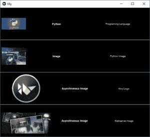

# Python |使用在 Kivy 中添加图像。kv 文件

> 原文:[https://www . geesforgeks . org/python-add-image-in-kivy-using-kv-file/](https://www.geeksforgeeks.org/python-adding-image-in-kivy-using-kv-file/)

Kivy 是 Python 中独立于平台的 GUI 工具。因为它可以在安卓、IOS、linux 和视窗等平台上运行。它基本上是用来开发安卓应用程序的，但并不意味着它不能在桌面应用程序上使用。

> [Kivy 教程–通过示例学习 Kivy](https://www.geeksforgeeks.org/kivy-tutorial/)。

### 图像小部件:

图像小部件用于显示图像。要使用图像小部件，您必须导入:

> 从 kivy.uix.image 导入 image，AsyncImage(使用时不需要。kv 文件)

因为模块 kivy.uix.image 拥有与图像相关的所有功能。
图像可以通过两种类型加载到应用程序:

> **1)同步加载:**从系统加载图像(必须从所在的文件夹。py 和。kv 文件已保存)
> 2) **异步加载:**异步加载图像(例如从外部网络服务器)

**注意:**默认情况下，图像居中并适合小部件边界框。如果您不想这样，您可以将*允许拉伸*设置为真，将*保持比例*设置为假。

```
Basic Approach to create multiple layout in one file:
1) import kivy
2) import kivyApp
3) import image
4) import BoxLayout
5) set minimum version(optional)
6) Create the Layout class
7) Create App class
8) Create .kv file:
          1) Add BoxLayout
          2) Add Label
          3) Add Image
          4) Resizing, Positioning etc of Image 
9) return instance of the layout class
10) Run an instance of the class
```

因此，在下面的代码中，我们将解释如何加载同步和异步图像。另外如何调整大小，定位，标签，等图像与一些更多的东西。
**。py 文件–**

## 蟒蛇 3

```
## Sample Python application demonstrating the 
## working with images in Kivy using .kv file 

##################################################
# import kivy module   
import kivy 

# base Class of your App inherits from the App class.   
# app:always refers to the instance of your application  
from kivy.app import App

# this restrict the kivy version i.e 
# below this kivy version you cannot 
# use the app or software 
kivy.require('1.9.0')

# BoxLayout arranges children in a vertical or horizontal box.
# or help to put the children at the desired location.
from kivy.uix.boxlayout import BoxLayout

# to change the kivy default settings we use this module config
from kivy.config import Config

# 0 being off 1 being on as in true / false
# you can use 0 or 1 && True or False
Config.set('graphics', 'resizable', True)

# creating the root widget used in .kv file
class Imagekv(BoxLayout):
    '''
        no need to do anything here as
        we are building things in .kv file
    '''
    pass

# class in which name .kv file must be named My.kv.
class MyApp(App):
    # define build() function
    def build(self):
        # returning the instance of Imagekv class
        return Imagekv()

# run the App
if __name__ == '__main__':
    MyApp().run()
```

[。kv 文件](https://www.geeksforgeeks.org/python-kivy-kv-file/)实施–

## 蟒蛇 3

```
# How to use images in kivy using .kv

# root widget od Imagekv Class
<Imagekv>:

    # Giving orientation to Box Layout
    orientation:'vertical'

###############################################

    # Adding Box Layoyt
    BoxLayout:

        padding:5

        # Adding image from the system
        Image:
            source: 'download.jpg'

            # Giving the size of image
            size_hint_x: 0.4

            # allow stretching of image
            allow_stretch: True

        # Giving Label to images
        Label:
            text:"Python"
            font_size:11
            bold:True

        Label:
            text:"Programing Language"
            font_size:10

###############################################

   # Drawing the line between the multiples
    Label:
        canvas.before:
            Color:
                rgba: (1, 1, 1, 1)
            Rectangle:
                size: self.size
                pos: self.pos
        size_hint_y: None
        height: 1

################################################

    # Another Box Layout
    BoxLayout:
        padding:5
        Image:
            source:"downloading.jpg"
            size_hint_x: 0.4
            allow_stretch: True

        Label:
            text:"Image"
            font_size:11
            bold:True

        Label:
            text:"Python Image"
            font_size:10

#############################################

    # Drawing the line between the multiples
    Label:
        canvas.before:
            Color:
                rgba: (1, 1, 1, 1)
            Rectangle:
                size: self.size
                pos: self.pos
        size_hint_y: None
        height: 1

###############################################

    # Adding next Box Layout
    BoxLayout:
        padding:5

        # To load an image asynchronously
        # (for example from an external webserver)
        AsyncImage:
            source: 'http://kivy.org/logos/kivy-logo-black-64.png'
            width: 100
            allow_stretch: True

        Label:
            text:" Asynchronous Image "
            font_size:11
            bold:True

        Label:
            text:"Kivy Logo"
            font_size:10

####################################################

    # Drawing the line between the multiples
    Label:
        canvas.before:
            Color:
                rgba: (1, 1, 1, 1)
            Rectangle:
                size: self.size
                pos: self.pos
        size_hint_y: None
        height: 1

#####################################################

    # LAst Box Layout
    BoxLayout:
        padding:5

        AsyncImage:
            size_hint_y: None
            source: 'http://kivy.org/slides/kivypictures-thumb.jpg'
            width: 100
            allow_stretch: True

        Label:
            text:"Asynchronous Image "
            font_size:11
            bold:True

        Label:
            text:" Webserver image "
            font_size:10
```

**输出:**

