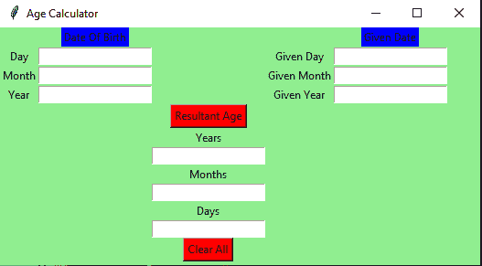

# Python:使用 Tkinter 的年龄计算器

> 原文:[https://www . geesforgeks . org/python-age-calculator-using-tkinter/](https://www.geeksforgeeks.org/python-age-calculator-using-tkinter/)

**先决条件:**[tkinter 简介](https://www.geeksforgeeks.org/python-gui-tkinter/)

Python 为开发图形用户界面提供了多种选择。在所有的 GUI 方法中，Tkinter 是最常用的方法。它是 Python 附带的 Tk 图形用户界面工具包的标准 Python 接口。Python 搭配 Tkinter 输出了创建 GUI 应用程序最快最简单的方法。现在，这取决于开发人员的想象力或必要性，他/她想使用这个工具包开发什么。

**要创建 Tkinter :**

*   导入模块–Tkit
*   创建主窗口(容器)
*   向主窗口添加任意数量的小部件。
*   在小部件上应用事件触发器。

图形用户界面如下所示:



让我们创建一个基于图形用户界面的简单年龄计算器应用程序，它可以根据用户给定的日期和出生日期来计算年龄。

**下面是实现:**

## 蟒蛇 3

```
# import all functions from the tkinter  
from tkinter import *

# import messagebox class from tkinter
from tkinter import messagebox

# Function for clearing the 
# contents of all text entry boxes
def clearAll() :

    # deleting the content from the entry box
    dayField.delete(0, END)
    monthField.delete(0, END)
    yearField.delete(0, END)
    givenDayField.delete(0, END)
    givenMonthField.delete(0, END)
    givenYearField.delete(0, END)
    rsltDayField.delete(0, END)
    rsltMonthField.delete(0, END)
    rsltYearField.delete(0, END)

# function for checking error
def checkError() :

    # if any of the entry field is empty
    # then show an error message and clear
    # all the entries
    if (dayField.get() == "" or monthField.get() == ""
        or yearField.get() == "" or givenDayField.get() == ""
        or givenMonthField.get() == "" or givenYearField.get() == "") :

        # show the error message
        messagebox.showerror("Input Error")

        # clearAll function calling
        clearAll()

        return -1

# function to calculate Age
def calculateAge() :

    # check for error
    value = checkError()

    # if error is occur then return
    if value ==  -1 :
        return

    else :

        # take a value from the respective entry boxes
        # get method returns current text as string
        birth_day = int(dayField.get())
        birth_month = int(monthField.get())
        birth_year = int(yearField.get())

        given_day = int(givenDayField.get())
        given_month = int(givenMonthField.get())
        given_year = int(givenYearField.get())

        # if birth date is greater then given birth_month
        # then donot count this month and add 30 to the date so
        # as to subtract the date and get the remaining days
        month =[31, 28, 31, 30, 31, 30, 31, 31, 30, 31, 30, 31]

        if (birth_day > given_day):
            given_month = given_month - 1
            given_day = given_day + month[birth_month-1]

        # if birth month exceeds given month, then
        # donot count this year and add 12 to the
        # month so that we can subtract and find out
        # the difference
        if (birth_month > given_month):
            given_year = given_year - 1
            given_month = given_month + 12

        # calculate day, month, year
        calculated_day = given_day - birth_day;
        calculated_month = given_month - birth_month;
        calculated_year = given_year - birth_year;

        # calculated day, month, year write back
        # to the respective entry boxes

        # insert method inserting the 
        # value in the text entry box.

        rsltDayField.insert(10, str(calculated_day))
        rsltMonthField.insert(10, str(calculated_month))
        rsltYearField.insert(10, str(calculated_year))

# Driver Code
if __name__ == "__main__" :

    # Create a GUI window
    gui = Tk()

    # Set the background colour of GUI window 
    gui.configure(background = "light green")

    # set the name of tkinter GUI window
    gui.title("Age Calculator")

     # Set the configuration of GUI window
    gui.geometry("525x260")

    # Create a Date Of Birth : label
    dob = Label(gui, text = "Date Of Birth", bg = "blue")

    # Create a Given Date : label
    givenDate = Label(gui, text = "Given Date", bg = "blue")

    # Create a Day : label
    day = Label(gui, text = "Day", bg = "light green")

    # Create a Month : label
    month = Label(gui, text = "Month", bg = "light green")

    # Create a Year : label
    year = Label(gui, text = "Year", bg = "light green")

    # Create a Given Day : label
    givenDay = Label(gui, text = "Given Day", bg = "light green")

    # Create a Given Month : label
    givenMonth = Label(gui, text = "Given Month", bg = "light green")

    # Create a Given Year : label
    givenYear = Label(gui, text = "Given Year", bg = "light green")

    # Create a Years : label
    rsltYear = Label(gui, text = "Years", bg = "light green")

    # Create a Months : label
    rsltMonth = Label(gui, text = "Months", bg = "light green")

    # Create a Days : label
    rsltDay = Label(gui, text = "Days", bg = "light green")

    # Create a Resultant Age Button and attached to calculateAge function
    resultantAge = Button(gui, text = "Resultant Age", fg = "Black", bg = "Red", command = calculateAge)

    # Create a Clear All Button and attached to clearAll function
    clearAllEntry = Button(gui, text = "Clear All", fg = "Black", bg = "Red", command = clearAll)

    # Create a text entry box for filling or typing the information. 
    dayField = Entry(gui)
    monthField = Entry(gui)
    yearField = Entry(gui)

    givenDayField = Entry(gui)
    givenMonthField = Entry(gui)
    givenYearField = Entry(gui)

    rsltYearField = Entry(gui)
    rsltMonthField = Entry(gui)
    rsltDayField = Entry(gui)

    # grid method is used for placing 
    # the widgets at respective positions 
    # in table like structure .
    dob.grid(row = 0, column = 1)

    day.grid(row = 1, column = 0)
    dayField.grid(row = 1, column = 1)

    month.grid(row = 2, column = 0)
    monthField.grid(row = 2, column = 1)

    year.grid(row = 3, column = 0)
    yearField.grid(row = 3, column = 1)

    givenDate.grid(row = 0, column = 4)

    givenDay.grid(row = 1, column = 3)
    givenDayField.grid(row = 1, column = 4)

    givenMonth.grid(row = 2, column = 3)
    givenMonthField.grid(row = 2, column = 4)

    givenYear.grid(row = 3, column = 3)
    givenYearField.grid(row = 3, column = 4)

    resultantAge.grid(row = 4, column = 2)

    rsltYear.grid(row = 5, column = 2)
    rsltYearField.grid(row = 6, column = 2)

    rsltMonth.grid(row = 7, column = 2)
    rsltMonthField.grid(row = 8, column = 2)

    rsltDay.grid(row = 9, column = 2)
    rsltDayField.grid(row = 10, column = 2)

    clearAllEntry.grid(row = 12, column = 2)

    # Start the GUI
    gui.mainloop()   
```

**输出:**

<video class="wp-video-shortcode" id="video-371866-1" width="640" height="360" preload="metadata" controls=""><source type="video/mp4" src="https://media.geeksforgeeks.org/wp-content/uploads/20210119132928/FreeOnlineScreenRecorderProject3.mp4?_=1">[https://media.geeksforgeeks.org/wp-content/uploads/20210119132928/FreeOnlineScreenRecorderProject3.mp4](https://media.geeksforgeeks.org/wp-content/uploads/20210119132928/FreeOnlineScreenRecorderProject3.mp4)</video>