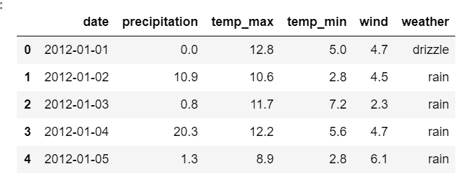

# 蟒蛇牛郎星–散点图

> 原文:[https://www.geeksforgeeks.org/python-altair-scatter-plot/](https://www.geeksforgeeks.org/python-altair-scatter-plot/)

在本文中，我们将使用 python 学习一个带有*牛郎星*的简单散点图。*牛郎星*是 python 中最新的交互式数据可视化库之一。*牛郎星*基于*织女星*和*纯素食*——一种交互图形的语法。这里我们将导入*牛郎星*库使用。然后我们将从 *vega_dataset* 加载西雅图天气数据。

### 逐步方法:

*   导入模块。

## 蟒蛇 3

```
# import required modules
import altair as alt
from vega_datasets import data
```

*   分配数据集并将其转换为数据框。

## 蟒蛇 3

```
# assign dataset
seattle_weather = data.seattle_weather()
```

*   显示数据集。

## 蟒蛇 3

```
# display dataset
seattle_weather.head(5)
```

**输出:**



*   现在让我们使用*牛郎星*库制作散点图。为此，我们使用*牛郎星*中的*图表()*功能加载数据，然后使用 *mark_point()* 功能进行散点图。然后我们使用美学 x 轴和 y 轴来*编码()*功能。因此，我们得到两个变量的简单散点图，如下所示:

## 蟒蛇 3

```
# depict scatter plot
alt.Chart(seattle_weather).mark_point().encode(
    x='temp_max',
    y='temp_min'
)
```

**输出:**


**以下是基于上述方法的完整程序:**

## 蟒蛇 3

```
# import required modules
import altair as alt
from vega_datasets import data

# assign dataset
seattle_weather = data.seattle_weather()

# display dataset
seattle_weather.head(5)

# depict scatter plot
alt.Chart(seattle_weather).mark_point().encode(
    x='temp_max',
    y='temp_min'
)
```

**输出:**

