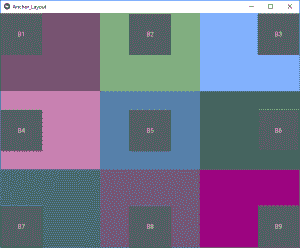

# Python | Kivy 中的 AnchorLayout 使用。kv 文件

> 原文:[https://www . geesforgeks . org/python-anchor layout-in-kivy-using-kv-file/](https://www.geeksforgeeks.org/python-anchorlayout-in-kivy-using-kv-file/)

Kivy 是 Python 中独立于平台的 GUI 工具。因为它可以在安卓、IOS、linux 和 Windows 等平台上运行。它基本上是用来开发安卓应用程序的，但并不意味着它不能在桌面应用程序上使用。

> 👉🏽 [Kivy 教程–通过示例学习 Kivy](https://www.geeksforgeeks.org/kivy-tutorial/)。

### 锚定布局:

[锚定布局](https://www.geeksforgeeks.org/python-anchorlayout-in-kivy/)将其子元素与边框(顶部、底部、左侧、右侧)或中心对齐。下面给出的类用于实现锚点布局。

```py
 kivy.uix.anchorlayout.AnchorLayout
```

锚定布局可以用参数初始化:

```py
anchor_x
Parameters can be passed: “left”, “right” and “center”.

anchor_y
Parameters can be passed:“top”,  “bottom” and “center”.

```

选择小部件在父容器中的放置位置。

> 有 9 个不同的布局区域可以放置锚定布局以获得效果:
> 
> 左上、中上、右上、中左、中右、中右、左下、中下和右下。

```py
Basic Approach:

1) import kivy
2) import kivyApp
3) import gridlayout(not necessary according to requirement)
4) import Anchorlayout
5) Set minimum version(optional)
6) create Layout class
7) create App class
8) Set up .kv file
9) Return the instance of layout class
10) Run an instance of the Appclass
```

在下面的示例代码中，我们使用了一个`GridLayout`作为我们的根小部件类。[网格布局](https://www.geeksforgeeks.org/gridlayouts-in-kivy-python/)，将是 9 个主播布局的母体。这 9 个锚定布局将被锚定在 9 个不同的锚定位置，也就是说，在 9 个[按钮](https://www.geeksforgeeks.org/python-working-with-buttons-in-kivy/)的帮助下，我们在一个程序中使用所有 9 个锚定布局位置。

**实施办法:**

**main.py file –**

```py
# Sample Python application demonstrating the
# working of AnchorLayout in Kivy using .kv file

###################################################

# base Class of your App inherits from the App class.  
# app:always refers to the instance of your application  
from kivy.app import App

# GridLayout arranges children in a matrix.
# It takes the available space and
# divides it into columns and rows, 
# then adds widgets to the resulting “cells”.
from kivy.uix.gridlayout import GridLayout

# to change the kivy default settings
# we use this module config
from kivy.config import Config

# 0 being off 1 being on as in true / false
# you can use 0 or 1 && True or False
Config.set('graphics', 'resizable', True)

# creating the root widget used in .kv file 
class Anchor_Layout(GridLayout):
    pass

# class in which name .kv file must be named Anchor_Layout.kv   
class Anchor_LayoutApp(App):
    def build(self):
        # returning the instance of root class
        return Anchor_Layout()

# run the app
if __name__=='__main__':
    Anchor_LayoutApp().run()
```

**。kv 文件–**

```py
# Implementation of .kv file of Anchor layout

################################################

# creating the features of Button
<MyButton@Button>:
    size_hint: [None, None]
    size: [100, 100]

# creating the root of .kv
<Anchor_Layout>:

    # Assigning grids
    rows: 3

    # Anchor Layout 1
    AnchorLayout:

        # position of Anchor Layout 
        anchor_x: 'left'
        anchor_y: 'top'

        # creating Canvas 
        canvas:
            Color:
                rgb: [.5, .324, .384]
            Rectangle:
                pos: self.pos
                size: self.size

        # creating Button
        MyButton:
            text: 'B1'

    # Anchor Layout 2
    AnchorLayout:
        anchor_x: 'center'
        anchor_y: 'top'
        canvas:
            Color:
                rgb: [.5, .692, .498]
            Rectangle:
                pos: self.pos
                size: self.size
        MyButton:
            text: 'B2'

    # Anchor Layout 3
    AnchorLayout:
        anchor_x: 'right'
        anchor_y: 'top'
        canvas:
            Color:
                rgb: [.5, .692, 1]
            Rectangle:
                pos: self.pos
                size: self.size
        MyButton:
            text: 'B3'

    # Anchor Layout 4
    AnchorLayout:
        anchor_x: 'left'
        anchor_y: 'center'
        canvas:
            Color:
                rgb: [.789, .5, .699]
            Rectangle:
                pos: self.pos
                size: self.size
        MyButton:
            text: 'B4'

    # Anchor Layout 5
    AnchorLayout:
        anchor_x: 'center'
        anchor_y: 'center'
        canvas:
            Color:
                rgb: [.333, .5, .673]
            Rectangle:
                pos: self.pos
                size: self.size
        MyButton:
            text: 'B5'

    # Anchor Layout 6
    AnchorLayout:
        anchor_x: 'right'
        anchor_y: 'center'
        canvas:
            Color:
                rgb: [.180, .5, .310]
            Rectangle:
                pos: self.pos
                size: self.size
        MyButton:
            text: 'B6'

    # Anchor Layout 7
    AnchorLayout:
        anchor_x: 'left'
        anchor_y: 'bottom'
        canvas:
            Color:
                rgb: [.180, .398, .5]
            Rectangle:
                pos: self.pos
                size: self.size
        MyButton:
            text: 'B7'

    # Anchor Layout 8
    AnchorLayout:
        anchor_x: 'center'
        anchor_y: 'bottom'
        canvas:
            Color:
                rgb: [.438, .329, .5]
            Rectangle:
                pos: self.pos
                size: self.size
        MyButton:
            text: 'B8'

    # Anchor Layout 9
    AnchorLayout:
        anchor_x: 'right'
        anchor_y: 'bottom'
        canvas:
            Color:
                rgb: [.611, .021, .5]
            Rectangle:
                pos: self.pos
                size: self.size
        MyButton:
            text: 'B9'      
```

**输出:**
