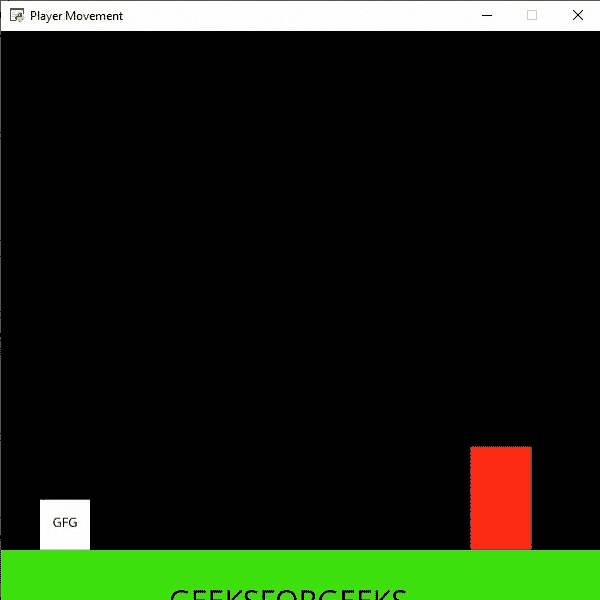

# 蟒蛇拱廊–添加梯子

> 原文:[https://www.geeksforgeeks.org/python-arcade-adding-ladders/](https://www.geeksforgeeks.org/python-arcade-adding-ladders/)

在本文中，我们将学习如何使用 Python 在 Arcade 中添加梯子。

## 添加阶梯

在这个例子中，我们将在屏幕上添加一个我们的玩家可以攀爬的梯子。为此，我们将使用一些函数:

**draw_text():** 此功能用于使用 Pyglet 的标签将文本绘制到屏幕上。

> **语法:** arcade.draw_text(text，x，y，颜色，大小，宽度，对齐，font_name)
> 
> **参数:**
> 
> *   **文本:**我们要显示的文本
> *   **x :** x 坐标
> *   **y :** y 坐标
> *   **颜色:**文字的颜色
> *   **大小:**字体的大小
> *   **宽度:**文本的宽度
> *   **对齐:**文本对齐
> *   **字体名称:**字体名称

**物理引擎平台转换器():**在平台转换器中使用的简单物理引擎。

> **语法:**街机。物理引擎平台变形器(玩家精灵、平台、重力、梯子)
> 
> **参数:**
> 
> *   **玩家 _ 精灵:**玩家的精灵
> *   **平台:**它无法通过的精灵
> *   **重力:**每帧向下加速度
> *   **梯子:**用户可以攀爬的梯子

**使用的精灵():**

 

在下面的例子中，我们将创建一个 MainGame()类。在这个类里面，首先我们要初始化一些速度、场景、阶梯精灵和玩家精灵的变量，然后我们将在这个类里面创建 4 个函数。

*   **on_draw():** 在这个功能里面，我们将在屏幕上使用我们的场景。
*   **setup():** 在这个函数中，我们将初始化我们的场景对象，然后我们将加载我们的玩家和平台的精灵，然后我们将加载我们的阶梯精灵，并初始化开始的 x 和 y 坐标。之后，我们将调用 PhysicsEnginePlatformer()函数。我们将把我们的阶梯作为一个参数传递给我们的 PhysicsEnginePlatformer()函数。
*   **on_update():** 在这个功能中，我们将更新物理引擎和玩家精灵的 x 坐标。
*   **on_key_press()和 on_key_release():** 在此功能中，我们将根据按下或释放的键盘键来更改速度变量的值。

#### 下面是实现:

## 蟒蛇 3

```py
# Importing arcade module
import arcade

# Creating MainGame class
class MainGame(arcade.Window):
    def __init__(self):
        super().__init__(600, 600,
                         title="Player Movement")

        # Initializing a variable to store
        # the velocity of the player
        self.vel_x = 0

        # Creating variable for ladder sprite
        self.ladder = None

        # Creating variable to store player sprite
        self.player = None

        # Creating variable for our game engine
        self.physics_engine = None

    # Creating on_draw() function to draw on the screen
    def on_draw(self):
        arcade.start_render()

        # Drawing our scene
        self.scene.draw()

    def setup(self):

         # Initialize Scene object
        self.scene = arcade.Scene()

        # Loading ladder sprite
        self.ladder = arcade.Sprite("Ladder.png", 1)

        # Initializing the starting coordinates
        self.ladder.center_x = 500
        self.ladder.center_y = 110

        # Adding the ladder sprite in the scene
        self.scene.add_sprite("Ladder", self.ladder)

        # Creating different sprite lists
        self.scene.add_sprite_list("Player")
        self.scene.add_sprite_list("Platforms",
                                   use_spatial_hash=True)

        # Adding player sprite
        self.player_sprite = arcade.Sprite("Player.png", 1)

        # Adding coordinates for the center of the sprite
        self.player_sprite.center_x = 64
        self.player_sprite.center_y = 90

        # Adding Sprite in our scene
        self.scene.add_sprite("Player", self.player_sprite)

        # Adding platform sprite according to level
        platform = arcade.Sprite(f"Platform.png", 1)

        # Adding coordinates for the center of the platform
        platform.center_x = 300
        platform.center_y = 32
        self.scene.add_sprite("Platforms", platform)

        # Creating Physics engine
        self.physics_engine = arcade.PhysicsEnginePlatformer(
            self.player_sprite, self.scene.get_sprite_list(
                "Platforms"), 0.5, self.scene.get_sprite_list("Ladder")
        )

    # Creating on_update function to
    # update the x coordinate
    def on_update(self, delta_time):

        # Changing x coordinate of player
        self.player_sprite.center_x += self.vel_x * delta_time

        # Updating the physics engine to move the player
        self.physics_engine.update()

    # Creating function to change the velocity
    # when button is pressed
    def on_key_press(self, symbol, modifier):

        # Checking the button pressed
        # and changing the value of velocity
        if symbol == arcade.key.LEFT:
            self.vel_x = -300
        elif symbol == arcade.key.RIGHT:
            self.vel_x = 300
        elif symbol == arcade.key.UP:
            if self.physics_engine.is_on_ladder():
                self.player_sprite.change_y = 2
            elif self.physics_engine.can_jump():
                self.player_sprite.change_y = 15
        elif symbol == arcade.key.DOWN:
            if self.physics_engine.is_on_ladder():
                self.player_sprite.change_y = -2

    # Creating function to change the velocity
    # when button is released
    def on_key_release(self, symbol, modifier):

        # Checking the button released
        # and changing the value of velocity
        if symbol == arcade.key.LEFT:
            self.vel_x = 0
        elif symbol == arcade.key.RIGHT:
            self.vel_x = 0
        elif symbol == arcade.key.UP or symbol == arcade.key.DOWN:
            if self.physics_engine.is_on_ladder():
                self.player_sprite.change_y = 0

# Calling MainGame class
game = MainGame()
game.setup()
arcade.run()
```

**输出:**

