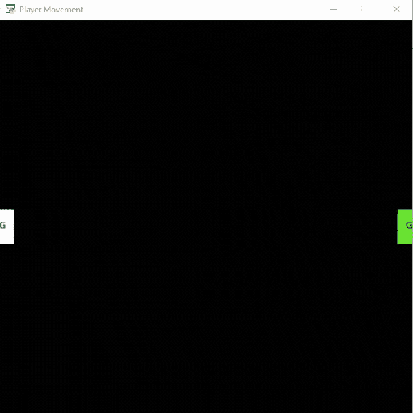

# Python 街机–碰撞检测

> 原文:[https://www . geesforgeks . org/python-arcade-碰撞检测/](https://www.geeksforgeeks.org/python-arcade-collision-detection/)

在本文中，我们将学习如何用 Python 在街机游戏中添加碰撞。

## 装置

您可以使用以下命令安装 Arcade 模块:

```py
pip install arcade
```

## 例 1:

在这个例子中，我们将使用 check _ for _ conflict()函数在两个精灵之间添加碰撞。

> **语法:**街机.检查碰撞(sprite1，sprite2)
> 
> **参数:**
> 
> *   精灵 1:-第一个精灵
> *   精灵 2:-第二个精灵
> 
> **返回:**布尔值

#### 使用的精灵:

 

下面是实现:

## 蟒蛇 3

```py
# Importing arcade module
import arcade

# Creating MainGame class
class MainGame(arcade.Window):
    def __init__(self):
        super().__init__(600, 600, title="Player Movement")

        # Initializing a variable to store
        # the velocity of Player1 and Player2
        self.vel_x1 = 380
        self.vel_x2 = 380

        self.scene = None

        # Creating variable to store player sprite
        self.player1 = None

        # Creating variable to store player sprite
        self.player2 = None

    # Creating on_draw() function to draw on the screen
    def on_draw(self):
        arcade.start_render()

        # Drawing the scene
        self.scene.draw()

    def setup(self):

        # Creating scene
        self.scene = arcade.Scene()

        # Adding player sprite
        self.player_sprite1 = arcade.Sprite("Player.png", 1)
        self.player_sprite2 = arcade.Sprite("Player2.png", 1)

        # Adding coordinates for the center of the sprite
        self.player_sprite1.center_x = 20
        self.player_sprite1.center_y = 300

        # Adding coordinates for the center of the sprite
        self.player_sprite2.center_x = 580
        self.player_sprite2.center_y = 300

        # Adding sprites in scene
        self.scene.add_sprite('Player', self.player_sprite1)
        self.scene.add_sprite('Player', self.player_sprite2)

    # Creating on_update function to
    # update the x coordinate
    def on_update(self, delta_time):

        # Changing x coordinate of players
        self.player_sprite1.center_x += self.vel_x1 * delta_time
        self.player_sprite2.center_x -= self.vel_x2 * delta_time

        # Checking if sprites are colliding or not
        colliding = arcade.check_for_collision(
            self.player_sprite1, self.player_sprite2)

        # If sprites are colliding then changing direction
        if colliding:
            self.vel_x1 *= -1
            self.vel_x2 *= -1

        # Changing the direction if sprites crosses the screen boundary
        if self.player_sprite1.center_x > 600 or self.player_sprite1.center_x < 0:
            self.vel_x1 *= -1

        if self.player_sprite2.center_x > 600 or self.player_sprite2.center_x < 0:
            self.vel_x2 *= -1

# Calling MainGame class
game = MainGame()
game.setup()
arcade.run()
```

**输出:**



## 例 2:

在这个例子中，我们将使用 PhysicsEnginePlatformer()函数来增加我们的播放器和平台之间的冲突。

> **语法:**街机。物理引擎平台(玩家精灵，平台，重力，梯子)
> 
> **参数:**
> 
> *   玩家精灵:-玩家精灵
> *   平台:-平台精灵列表
> *   重力:-重力的大小
> *   梯子:-用户可以攀爬的梯子

#### 使用的精灵:

 

下面是实现:

## 蟒蛇 3

```py
# Importing arcade module
import arcade

# Creating MainGame class
class MainGame(arcade.Window):
    def __init__(self):
        super().__init__(600, 600, title="Player Movement")

        # Initializing a variable to store
        # the velocity of the player
        self.vel_x = 0

        # Creating scene object
        self.scene = None

        # Creating variable to store player sprite
        self.player = None

        # Creating variable for our game engine
        self.physics_engine = None

    # Creating on_draw() function to draw on the screen
    def on_draw(self):
        arcade.start_render()

        # Drawing our scene
        self.scene.draw()

    def setup(self):

        # Initialize Scene object
        self.scene = arcade.Scene()

        # Creating different sprite lists
        self.scene.add_sprite_list("Player")
        self.scene.add_sprite_list("Platforms", use_spatial_hash=True)

        # Adding player sprite
        self.player_sprite = arcade.Sprite("Player.png", 1)

        # Adding coordinates for the center of the sprite
        self.player_sprite.center_x = 64
        self.player_sprite.center_y = 600

        # Adding Sprite in our scene
        self.scene.add_sprite("Player", self.player_sprite)

        # Adding platform sprite
        platform = arcade.Sprite("Platform.png", 1)

        # Adding coordinates for the center of the platform
        platform.center_x = 300
        platform.center_y = 32
        self.scene.add_sprite("Platforms", platform)

        # Creating Physics engine
        self.physics_engine = arcade.PhysicsEnginePlatformer(
            self.player_sprite, self.scene.get_sprite_list("Platforms"), 0.5
        )

    # Creating on_update function to
    # update the x coordinate
    def on_update(self, delta_time):

        # Changing x coordinate of player
        self.player_sprite.center_x += self.vel_x * delta_time

        # Updating the physics engine to move the player
        self.physics_engine.update()

    # Creating function to change the velocity
    # when button is pressed
    def on_key_press(self, symbol, modifier):

        # Checking the button pressed
        # and changing the value of velocity
        if symbol == arcade.key.LEFT:
            self.vel_x = -300
        elif symbol == arcade.key.RIGHT:
            self.vel_x = 300

    # Creating function to change the velocity
    # when button is released
    def on_key_release(self, symbol, modifier):

        # Checking the button released
        # and changing the value of velocity
        if symbol == arcade.key.LEFT:
            self.vel_x = 0
        elif symbol == arcade.key.RIGHT:
            self.vel_x = 0

# Calling MainGame class
game = MainGame()
game.setup()
arcade.run()
```

**输出:**

