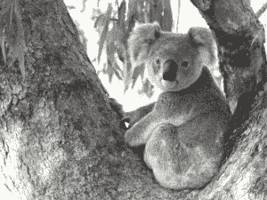

# Python–魔杖中的 blue_shift()函数

> 原文:[https://www . geesforgeks . org/python-blue _ shift-in-function-in-wand/](https://www.geeksforgeeks.org/python-blue_shift-function-in-wand/)

**蓝移**效果通过将蓝色值移动一个因子来使颜色变暗。一个夜间的场景就是用这个生成的。这只需要一个参数*因子*。很多照片编辑都用这种效果给图像一个夜间曝光的效果。

> **语法:**
> 
> ```py
> wand.image.blue_shift(factor)
> 
> ```
> 
> **参数:**
> 
> | 参数 | 输入类型 | 描述 |
> | --- | --- | --- |
> | 因素 | 数字。真实的 | 调整值的金额。 |

**来源影像:**


**例 1:**

```py
# Import Image from wand.image module
from wand.image import Image

# Read image using Image function
with Image(filename ="koala.jpeg") as img:

    # Blueshift effect using blue_shift() function
    img.blue_shift(factor = 1.25)
    img.save(filename ="bs_koala.jpeg")
```

**输出:**


**例 2:** 将因子值增加到 1.5。

```py
# Import Image from wand.image module
from wand.image import Image

# Read image using Image function
with Image(filename ="koala.jpeg") as img:

    # Blueshift effect using blue_shift() function
    img.blue_shift(factor = 1.5)
    img.save(filename ="bs_koala_2.jpeg")
```

**输出:**
