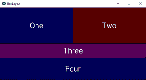
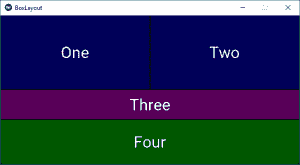

# python | kivy 中的 box layout widget

> 哎哎哎:# t0]https://www . geeksforgeeks . org/python-box layout widget-in-kivy/

Kivy 是 Python 中独立于平台的 GUI 工具。因为它可以在安卓、IOS、Linux 和视窗等平台上运行。它基本上是用来开发安卓应用程序的，但并不意味着它不能在桌面应用程序上使用。

> ？？？？？？？？ [Kivy 教程–通过示例学习 Kivy](https://www.geeksforgeeks.org/kivy-tutorial/)。

在这篇文章中，我们将学习如何在 kivy 中使用 BoxLayout 小部件，以及如何向它添加一些功能，如颜色、大小等。
 **BoxLayout 以一个在另一个之上的垂直方式或一个接一个的水平方式排列小部件。当您不提供任何大小提示时，子小部件会平均或相应地划分其父小部件的大小。** 

> ****创建按钮时要遵循的基本方法:**
> 1)导入 kivy
> 2)导入 kivyApp
> 3)导入 BoxLayout
> 4)设置最低版本(可选)
> 5)添加小部件
> 6)扩展类
> 7)返回布局
> 8)运行类的实例**

****下面是使用 BoxLayout 的代码:**** 

## **蟒蛇 3**

```
# code to show how to use nested boxlayouts.

# import kivy module
import kivy

# this restricts the kivy version i.e
# below this kivy version you cannot
# use the app or software
kivy.require("1.9.1")

# base Class of your App inherits from the App class.
# app:always refers to the instance of your application
from kivy.app import App

# creates the button in kivy
# if not imported shows the error
from kivy.uix.button import Button

# BoxLayout arranges children in a vertical or horizontal box.
# or help to put the children at the desired location.
from kivy.uix.boxlayout import BoxLayout

# class in which we are creating the button by using boxlayout
# defining the App class
class BoxLayoutApp(App):

    def build(self):

        # To position oriented widgets again in the proper orientation
        # use of vertical orientation to set all widgets 
        superBox = BoxLayout(orientation ='vertical')

        # To position widgets next to each other,
        # use a horizontal BoxLayout.
        HB = BoxLayout(orientation ='horizontal')

        btn1 = Button(text ="One")
        btn2 = Button(text ="Two")

        # HB represents the horizontal boxlayout orientation
        # declared above
        HB.add_widget(btn1)
        HB.add_widget(btn2)

        # To position widgets above/below each other,
        # use a vertical BoxLayout.
        VB = BoxLayout(orientation ='vertical')

        btn3 = Button(text ="Three")
        btn4 = Button(text ="Four")

        # VB represents the vertical boxlayout orientation
        # declared above
        VB.add_widget(btn3)
        VB.add_widget(btn4)

        # superbox used to again align the oriented widgets
        superBox.add_widget(HB)
        superBox.add_widget(VB)

        return superBox

# creating the object root for BoxLayoutApp() class 
root = BoxLayoutApp()

# run function runs the whole program
# i.e run() method which calls the
# target function passed to the constructor.
root.run()
```

****输出:**** 

****

 ****一些修改比如增加颜色，在 Box 布局小部件中固定大小:**** 

## **蟒蛇 3**

```
# code to show how to use nested boxlayouts.

# import kivy module
import kivy

# to choose the colors randomly
# every time you run it shows different color
import random 

# this restricts the kivy version i.e
# below this kivy version you cannot
# use the app or software
kivy.require("1.9.1")

# base Class of your App inherits from the App class.
# app:always refers to the instance of your application
from kivy.app import App

# creates the button in kivy
# if not imported shows the error
from kivy.uix.button import Button

# BoxLayout arranges children in a vertical or horizontal box.
# or help to put the children at the desired location.
from kivy.uix.boxlayout import BoxLayout

# declaring the colours you can use directly also
red = [1, 0, 0, 1]
green = [0, 1, 0, 1]
blue =  [0, 0, 1, 1]
purple = [1, 0, 1, 1]

# class in which we are creating the button
class BoxLayoutApp(App):

    def build(self):

        # To position oriented widgets again in the proper orientation
        # use of vertical orientation to set all widgets 
        superBox = BoxLayout(orientation ='vertical')

        # To position widgets next to each other,
        # use a horizontal BoxLayout.
        HB = BoxLayout(orientation ='horizontal')

        colors = [red, green, blue, purple]

        # styling the button boxlayout
        btn1 = Button(text ="One",
                      background_color = random.choice(colors),
                      font_size = 32,
                      size_hint =(0.7, 1))
        btn2 = Button(text ="Two",
                      background_color = random.choice(colors),
                      font_size = 32,
                      size_hint =(0.7, 1))

        # HB represents the horizontal boxlayout orientation
        # declared above
        HB.add_widget(btn1)
        HB.add_widget(btn2)

        # To position widgets above/below each other,
        # use a vertical BoxLayout.
        VB = BoxLayout(orientation ='vertical')

        btn3 = Button(text ="Three",
                      background_color = random.choice(colors),
                      font_size = 32,
                      size_hint =(1, 10))
        btn4 = Button(text ="Four",
                      background_color = random.choice(colors),
                      font_size = 32,
                      size_hint =(1, 15))

        # VB represents the vertical boxlayout orientation
        # declared above
        VB.add_widget(btn3)
        VB.add_widget(btn4)

        # superbox used to again align the oriented widgets
        superBox.add_widget(HB)
        superBox.add_widget(VB)

        return superBox

# creating the object root for BoxLayoutApp() class 
root = BoxLayoutApp()

# run function runs the whole program
# i.e run() method which calls the
# target function passed to the constructor.
root.run()
```

****输出:**
**图片 1:**** 

****

****图片 2:**** 

****

****注意:**每次运行代码时，它都会提供与图片中不同的颜色输出。**