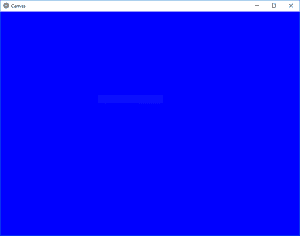
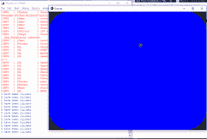
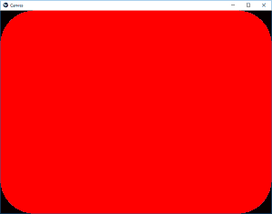

# Python | Canvas in Kivy 使用。kv 文件

> 原文:[https://www . geesforgeks . org/python-canvas-in-kivy-using-kv-file/](https://www.geeksforgeeks.org/python-canvas-in-kivy-using-kv-file/)

Kivy 是 Python 中独立于平台的 GUI 工具。因为它可以在安卓、IOS、linux 和 Windows 等平台上运行。它基本上是用来开发安卓应用程序的，但并不意味着它不能在桌面应用程序上使用。

> 👉🏽 [Kivy 教程–通过示例学习 Kivy](https://www.geeksforgeeks.org/kivy-tutorial/)。

## 画布:

画布是小部件用于绘制的根对象。画布不是你画画的地方。
默认情况下，Kivy 中的每个 Widget 都已经有一个 Canvas。创建小部件时，可以创建绘图所需的所有说明。如果自我是你当前的小部件。“颜色”和“矩形”指令会自动添加到画布对象中，并在绘制窗口时使用。

要使用画布，您必须导入:

```
from kivy.graphics import Rectangle, Color
```

```
Basic Approach -
-> import kivy
-> import kivy App
-> import widget
-> import Canvas i.e.:
      from kivy.graphics import Rectangle, Color
-> set minimum version(optional)
-> Extend the Widget class
-> Create the App Class
-> create the .kv file:
    -> create the canvas
    -> Add action/callback if needeed
-> return a Widget
-> Run an instance of the class
```

**Implementation of the Approach:**

1) **创建简单画布:**

**主. py 文件**

```
# import kivy module 
import kivy 

# this restrict the kivy version i.e 
# below this kivy version you cannot 
# use the app or software 
kivy.require("1.9.1") 

# base Class of your App inherits from the App class. 
# app:always refers to the instance of your application 
from kivy.app import App 

# A Widget is the base building block
# of GUI interfaces in Kivy.
# It provides a Canvas that
# can be used to draw on screen.
from kivy.uix.widget import Widget

# From graphics module we are importing
# Rectangle and Color as they are
# basic building of canvas.
from kivy.graphics import Rectangle, Color

# class in which we are creating the canvas
class CanvasWidget(Widget):
    pass

# Create the App Class
class CanvasApp(App):
    def build(self):
        return CanvasWidget()

# run the App
CanvasApp().run()
```

**[Canvas.kv 文件](https://www.geeksforgeeks.org/python-kivy-kv-file/) :**

```
# .kv file of canvas

<CanvasWidget@Widget>

    # creating canvas
    canvas:
        Color:
            rgba: 0, 0, 1, 1    # Blue

        # size and position of Canvas
        Rectangle:
            pos: self.pos
            size: self.size
```

**输出:**



现在我们如何通过任何动作改变画布的颜色，下面是通过点击屏幕颜色来改变的例子。

**main.py 文件:**

```
# import kivy module 
import kivy 

# this restrict the kivy version i.e 
# below this kivy version you cannot 
# use the app or software 
kivy.require("1.9.1") 

# base Class of your App inherits from the App class. 
# app:always refers to the instance of your application 
from kivy.app import App 

# From graphics module we are importing
# Rectangle and Color as they are
# basic building of canvas.
from kivy.graphics import Rectangle, Color

# The ButtonBehavior mixin class provides Button behavior.
from kivy.uix.button import ButtonBehavior

# The Label widget is for rendering text. 
from kivy.uix.label import Label

# class in which we are creating the canvas
class CanvasWidget(ButtonBehavior, Label):
    pass

# Create the App Class
class CanvasApp(App):
    def build(self):
        return CanvasWidget()

# run the App
CanvasApp().run()
```

**。kv 文件:**

```
# .kv file of canvas

<CanvasWidget>

    # Creating Canvas
    canvas:

        # Color is blue if button is pressed,
        # otherwise color is red
        Color: 
            rgb: (1, 0, 0, 1) if self.state == 'normal' else (0, 0, 1, 1)

        # Rounded rectangle canvas
        RoundedRectangle:
            size: self.size
            pos: self.pos

            # Play with these if you want smooth corners for your button
            radius: 100, 100, 100, 100

    # Print the text when touched or button pressed    
    on_release:
        print("I have been clicked")
```

**输出:**





**注意:**
Kivy 绘制指令不会自动相对于小部件的位置或大小。因此，在绘图时需要考虑这些因素。为了使您的绘图指令相对于小部件，这些指令需要在 KvLang 中声明，或者绑定到 pos 和大小更改。