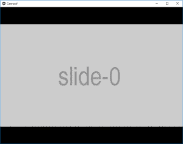

# Python | Kivy 中的轮播小部件

> 原文:[https://www . geesforgeks . org/python-carousel-widget-in-kivy/](https://www.geeksforgeeks.org/python-carousel-widget-in-kivy/)

Kivy 是 Python 中独立于平台的 GUI 工具。因为它可以在安卓、IOS、linux 和 Windows 等平台上运行。它基本上是用来开发安卓应用程序的，但并不意味着它不能在桌面应用程序上使用。

> 👉🏽 [Kivy 教程–通过示例学习 Kivy](https://www.geeksforgeeks.org/kivy-tutorial/)。

## 转盘部件:

轮播小部件提供了经典的移动友好的轮播视图，您可以在幻灯片之间滑动。您可以向转盘添加任何内容，并让它水平或垂直移动。转盘可以按顺序或循环显示页面。

需要注意的一些要点:

1)它便于遍历幻灯片集。
2)它可以保存图像、视频或任何其他内容
3)移动可以是垂直或水平滑动
4) Kivy 为转盘提供了多种定制，包括:

*   从一张幻灯片过渡到另一张幻灯片时的动画效果，过渡期间的持续时间
*   指定滑动的方向
*   禁用垂直滑动
*   转盘是否应该无限循环
*   指定接受刷卡时要考虑的最小距离
*   指定接受刷卡时要考虑的最短持续时间
*   指定当前、上一张和下一张幻灯片

要使用此小部件，您必须导入:

```py
from kivy.uix.carousel import Carousel
```

```py
Basic Approach:
1) import kivy
2) import kivy App
3) import Gridlayout
4) import widget
5) set minimum version(optional)
6) Create as much as widget class as needed
7) create the App class
8) return the widget/layout etc class
9) Run an instance of the class
```

**实施方法:**

```py
# Program to explain how to add carousel in kivy 

# import kivy module    
import kivy  

# base Class of your App inherits from the App class.    
# app:always refers to the instance of your application   
from kivy.app import App 

# this restrict the kivy version i.e  
# below this kivy version you cannot  
# use the app or software  
kivy.require('1.9.0') 

# The Image widget is used to display an image 
# this module contain all features of images 
from kivy.uix.image import AsyncImage

# The Carousel widget provides the
# classic mobile-friendly carousel
# view where you can swipe between slides
from kivy.uix.carousel import Carousel

# Create the App class
class CarouselApp(App):
    def build(self):

        # Add carousel
        # And add the direction of swipe
        carousel = Carousel(direction ='right')

        # Adding 10 slides
        for i in range(10):
            src = "http://placehold.it / 480x270.png&text = slide-%d&.png" %i
            # using Asynchronous image            
            image = AsyncImage(source = src, allow_stretch = True)
            carousel.add_widget(image)
        return carousel

# Run the App
CarouselApp().run()
```

**输出:**


