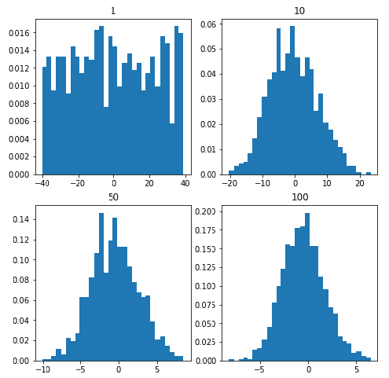

# Python–中心极限定理

> 原文:[https://www.geeksforgeeks.org/python-central-limit-theorem/](https://www.geeksforgeeks.org/python-central-limit-theorem/)

定义:

> 对于大样本量，样本均值将近似正态分布，而不管我们从中取样的分布如何。


假设我们从具有有限均值和有限标准差(σ)的总体中进行采样。那么样本均值的抽样分布的均值和标准差可以给出为:

其中分别代表样本大小 n 的样本均值的抽样分布，和分别是总体的均值和标准差。
随着样本量的增加，样本的分布趋于正态分布。
**代码:中心极限定理的 Python 实现**

## 蟒蛇 3

```py
import numpy
import matplotlib.pyplot as plt

# number of sample
num = [1, 10, 50, 100] 
# list of sample means
means = [] 

# Generating 1, 10, 30, 100 random numbers from -40 to 40
# taking their mean and appending it to list means.
for j in num:
    # Generating seed so that we can get same result
    # every time the loop is run...
    numpy.random.seed(1)
    x = [numpy.mean(
        numpy.random.randint(
            -40, 40, j)) for _i in range(1000)]
    means.append(x)
k = 0

# plotting all the means in one figure
fig, ax = plt.subplots(2, 2, figsize =(8, 8))
for i in range(0, 2):
    for j in range(0, 2):
        # Histogram for each x stored in means
        ax[i, j].hist(means[k], 10, density = True)
        ax[i, j].set_title(label = num[k])
        k = k + 1
 plt.show()
```

**输出:**



从图表中可以明显看出，随着我们不断将样本量从 1 增加到 100，直方图趋向于呈现正态分布的形状。
**经验法则:**
当然，“大”这个词是相对的。大致来说，基本分布越“不正常”，正常近似值要发挥作用，n 就必须越大。经验法则是，样本大小 n 至少为 30 就足够了。
**这为什么重要？**
这个问题的答案很简单，因为我们经常可以使用基于正态分布的发展良好的统计推断程序，如 [68-95-99.7](https://www.geeksforgeeks.org/python-68-95-99-7-rule-in-statistics/) 规则和许多其他规则，即使我们是从不正常的人群中取样，前提是我们有大的样本量。