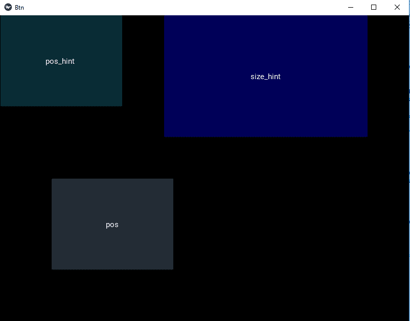

# Python–使用 kv 文件

更改 kivy 按钮的大小和位置

> 原文:[https://www . geesforgeks . org/python-change-kivy-button-size-and-position-use-kv-file/](https://www.geeksforgeeks.org/python-change-kivy-button-size-and-position-using-kv-file/)

Kivy 是 Python 中独立于平台的 GUI 工具。因为它可以在安卓、IOS、linux 和 Windows 等平台上运行。它基本上是用来开发安卓应用程序的，但并不意味着它不能在桌面应用程序上使用。
在本文中我们将看到如何在 kv 文件中更改 kivy python 中按钮的大小和位置。

> **大小**:这是用于小部件的静态大小，有两个参数(即宽度、高度)。按钮的默认大小= (100，100)。
> 
> ```
> Syntax: b1 = Button(size=(100, 100))
> ```
> 
> **pos** :这是小部件的静态放置，用于给按钮定位，默认为(0，0)，屏幕左下角。
> 
> ```
> Syntax : b1 = Button(pos=(100, 100))
> ```
> 
> **大小提示**:用于按钮的动态大小，并提供大小提示。它包含两个参数，即宽度和高度。它可以是浮点值。默认情况下，所有小部件都有它们的 size_hint=(1，1)。
> 
> ## 蟒蛇 3
> 
> ```
> button = Button(
>    text='Hello world',
>    size_hint=(.5, .25))
> ```
> 
> **pos_hint** :用于按钮的动态放置，并提供位置提示。我们最多可以定义 8 个键，也就是说，它采用字典形式的参数。
> 
> ```
> pos_hint = {“x”:1, “y”:1, “left”:1, “right”:1, “center_x”:1, 
>                  “center_y”:1, “top”:1, “bottom”:1(“top”:0)}
> ```
> 
> ## 蟒蛇 3
> 
> ```
> button = Button(text='Hello world', size_hint=(.6, .6),
>                pos_hint={'x':.2, 'y':.2})
> ```

```
Basic Approach:

1) import kivy
2) import kivyApp
3) import all neaded(like button and layouts to use them)
4) Set minimum version(optional)
5) create Layout class
6) create App class
7) Set up .kv file : Create the buttons and set up the position and size 
8) return Layout/widget/Class(according to requirement)
9) Run an instance of the class

```

> [Kivy 教程——用例子学习 Kivy。](https://www.geeksforgeeks.org/kivy-tutorial/)

**main.py 文件实现的方法–**

## 蟒蛇 3

```
## Sample Python application demonstrating the
## How to set button size and position in Kivy using .kv file

###################################################
# import modules
import kivy

# base Class of your App inherits from the App class.  
# app:always refers to the instance of your application 
from kivy.app import App

# module consist the floatlayout
# to work with FloatLayout first
# you have to import it
from kivy.uix.floatlayout import FloatLayout

# creating the root widget used in .kv file 
class FloatLayout(FloatLayout):
    pass

# creating the App class in which name
#.kv file is to be named Float_Layout.kv
class BtnApp(App):
    # defining build()
    def build(self):
        # returning the instance of root class
        return FloatLayout()

# run the app
if __name__ == "__main__":
    BtnApp().run()
```

**btn.kv 文件实施办法–**

## 蟒蛇 3

```
#.kv file implementation of setting position and size of btn  
<FloatLayout>:

    Button:
        text: "pos_hint "
        background_color: 0.1, 0.5, 0.6, 1

        # Giving size hint i.e size of button is
        # 30 % by height and width of layout .
        size_hint: 0.3, 0.3

        # positioned at 0 % right and 100 % up / top
        # from bottom left, i.e x, top = 0, 100 from bottom left:
        pos_hint: {"x":0, "top":1}

    Button:
        text:"pos"
        background_color: 0.4, 0.5, 0.6, 1
        size_hint: 0.3, 0.3
        pos: 100, 100

    Button:
        text:"size_hint"
        background_color: 0, 0, 1, 1

        # Giving size hint i.e size of button is
        # 40 % by height and  50 % width of layout .
        size_hint: 0.5, 0.4
        pos_hint: {"x":.4, "top":1}

```

**输出:**

